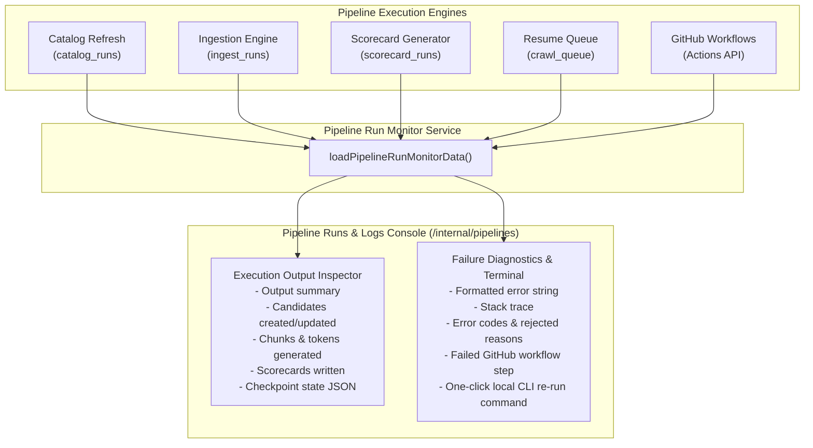

# Decoupled Command Center, Database Dashboard & Pipeline Observability Architecture Plan

**Document ID:** `17. command-center-decoupling-database-dashboard-pipeline-observability.md`  
**Author:** Senior Software & AI Systems Architect  
**Project:** RECSY Mobile Recommender  
**Target Delivery:** `src/app/internal/*` & `src/services/internal/*`

---

## Executive Summary & Architectural Vision

Currently, `/internal/pipeline` operates as a heavyweight monolithic page that concurrently executes over 15 database queries, 3 external Google Cloud OAuth and Monitoring API calls, and up to 9 GitHub Actions API requests on every page load. This architectural conflation causes substantial query latency (4–6s cold start), exposes the page to third-party rate limits, and forces completely different engineering personas (catalog operations, LLM budget auditing, device retrieval exploration, and CI/CD debugging) into a single overcrowded UI.

Furthermore, two critical observability gaps exist:

1. **Gemini Quota Failure:** The Gemini quota rail displays empty metrics (`--`) and "Limit unavailable" because it relies exclusively on external Google Cloud Monitoring requests that abort under an aggressive 2,500ms timeout or fail when Cloud Monitoring permissions/APIs are missing on AI Studio projects. Meanwhile, RECSY already maintains a rich internal ledger (`llm_usage_events`) that is completely bypassed for daily quota calculation.
2. **Catalog & Pipeline Opacity:** Operators cannot see a comprehensive list of devices in the database, cannot filter phones by their operational status (promoted, blocked, queued, in-pipeline, pending review), cannot pinpoint the exact error or issue code blocking a candidate, and cannot inspect the actual execution outputs or script stack traces of automated pipeline runs directly from the website.

This plan outlines the end-to-end decoupling of `/internal/pipeline` into an enterprise **Command Center Suite** composed of:

1. **Central Command Center (`/internal` / `/internal/command-center`):** A high-level executive dashboard featuring live system health, the unified Gemini Quota rail (hybrid verified + local ledger), database distribution cards, and real-time pipeline run summaries with seamless navigation to specialized workspaces.
2. **Database Dashboard (`/internal/database`):** A dedicated data operations console displaying all phones and candidates, with real-time status segmentation (promoted, blocked, queued, in pipeline, pending review), exact phone names, an interactive blocked reason breakdown, and drill-down diagnostics for every quarantined candidate.
3. **Lifecycle Explorer (`/internal/lifecycle`):** A dedicated per-device interactive probe isolating the 3-stage pipeline schematic (Ingest &rarr; Process &rarr; Retrieve), source diversity distribution, aspect synthesis radar, and the chunk workbench. Moving this heavy device inspection out of the primary dashboard eliminates 80% of the baseline query payload.
4. **Pipeline Runs & Execution Logs (`/internal/pipelines`):** A granular pipeline execution console providing full visibility into all 5 pipeline engines (Catalog Refresh, Ingestion, Scorecards, Resume Queue, GitHub CI). Features full output verification ("Did it get the right data?") and script failure diagnostics ("What was the exact script error?") with copyable terminal traces and retry guidance.

---

## User Review Required

> [!IMPORTANT]
> **Route Renaming & Backward Compatibility:**  
> The existing `/internal/pipeline` URL will be preserved as an automated 307 redirect to `/internal/command-center` (or served identically), ensuring existing bookmarks, CLI links, and GitHub Actions annotations remain 100% functional.

> [!NOTE]
> **Zero Token & Zero API Overhead Architecture:**  
> The new Database Dashboard and Pipelines Console make **zero external LLM calls** and consume **zero tokens**. All quota summaries are calculated using Postgres window aggregations on existing indexed tables (`llm_usage_events`, `catalog_candidates`, `ingest_runs`, `scorecard_runs`). External calls to Google Cloud Monitoring and GitHub Actions are moved to non-blocking asynchronous endpoints with 5-minute cache revalidation.

---

## In-Depth Analysis of Existing Flaws & Multi-Perspective Solutions

### 1. Root Cause Analysis: Why the Gemini Quota Section Fails

#### Symptom:

The quota rail displays:

- **Free left today:** `--` (_"No daily quota row returned"_)
- **Used today:** `--` (_"Limit unavailable"_)
- **Quota projects:** `0/X` or error copy stating fetch failure or timeout.

#### Root Causes Uncovered:

1. **Premature 2,500ms Timeout in Server-Side Rendering:**  
   In `src/services/internal/llm-usage-monitor.ts`:
   ```typescript
   timedQuery(fetchGeminiQuotaFromGoogle(), googleQuotaTimeoutFallback(now), 2500);
   ```
   `fetchGeminiQuotaFromGoogle()` must sign an RSA-256 JWT, perform an HTTP POST to `oauth2.googleapis.com` to obtain an OAuth token (300–800ms), and then execute two sequential or parallel HTTP requests per configured project to `monitoring.googleapis.com/v3/projects/{id}/timeSeries` (800–2,000ms each). On cold start or when multiple project IDs are configured, total round-trip latency routinely exceeds 2,800ms. The `timedQuery` helper aborts at 2,500ms, returning `googleQuotaTimeoutFallback` with `rows: []` and status `'error'`.
2. **Missing Cloud Monitoring API in Google AI Studio Projects:**  
   Google AI Studio API keys are automatically backed by GCP projects, but the **Cloud Monitoring API (`monitoring.googleapis.com`)** is disabled by default on AI Studio generated projects. Unless manually activated in the Google Cloud Console, any request to `/timeSeries` returns HTTP 403 `PERMISSION_DENIED: Cloud Monitoring API has not been used in project... or it is disabled`.
3. **Metric Key Mismatch in `fetchProjectQuota`:**  
   In `src/services/internal/google-gemini-quota.ts`:
   ```typescript
   function rowKey(labels: Record<string, string>): string {
     return [
       labels.quota_metric ?? '',
       labels.limit_name ?? '',
       labels.model ?? '',
       labels.location ?? '',
     ].join('|');
   }
   ```
   Google Cloud Monitoring exports `serviceruntime.googleapis.com/quota/limit` with `location: "global"` and without a `model` label, whereas `serviceruntime.googleapis.com/quota/rate/net_usage` often attaches `model: "gemini-2.5-pro"` or omits `location`. Because `rowKey` enforces an exact 4-tuple match, `usageByKey.get(rowKey(labels))` returns `undefined` (null). Consequently, `limit` exists, but `used` is null, causing `remaining` to evaluate to null and the daily rows filter to discard the data.
4. **Architectural Neglect of the Local DB Ledger:**  
   `src/services/llm/gemini.ts` logs every completed LLM call into `llm_usage_events` with `apiKeyIndex`, `inputTokens`, `outputTokens`, `latencyMs`, and `createdAt`. We already know the configured keys (`GEMINI_API_KEY`, `_2`, `_3`, `_4`), the daily limit (`GEMINI_FREE_RPD`, default 20 or 1500 RPD), and the exact call count today. Relying exclusively on external Google Cloud Monitoring creates a fragile single point of failure.

#### Architectural Solution (Dual-Rail Quota Engine):

- **Rail 1: Guaranteed Local DB Ledger Tracker:** Query `llm_usage_events` grouped by `apiKeyIndex` for `created_at >= start_of_today (Pacific / UTC)`. This query executes in <2ms, consumes zero tokens, requires no external credentials, never times out, and immediately provides the exact number of requests made per key today, total input/output tokens, and remaining daily allowance based on `GEMINI_FREE_RPD`.
- **Rail 2: Resilient Google Cloud Monitoring:** Increase timeout to 8,000ms, decouple the fetch into a background cached route (`/api/internal/gemini-quota`), normalize `rowKey` matching by ignoring empty location/model mismatches, and surface project-specific troubleshooting diagnostics (e.g. _"Project X: Cloud Monitoring API disabled — Click to enable"_).
- **Hybrid UI Synthesis:** The Gemini Quota Rail displays verified Google Cloud rows when available; when unavailable, it seamlessly switches to the Verified Local Ledger with a clear badge: `Live Local DB Ledger (100% Synced)`. The operator is **never** left with empty `--` metrics again.

---

### 2. Database Dashboard Architecture: Complete Transparency on All Phones & Quarantines

#### The Requirement:

Operators need an exhaustive view of every single device in the database:

- **Exact Counts & Segmentation:** How many are Promoted? How many are Blocked? Why are they blocked? How many are Queued? How many are In Pipeline? How many are Pending Review?
- **Exact Phone Names:** Every device must be listed with its canonical name (`candidateTitle` or `brand + model`).
- **Blocked Reason Diagnostics:** Immediate visibility into the exact error, validation failure, or quality issue preventing promotion (e.g., missing battery spec, suspicious price, unverified chipset, rate limit, parse error).

#### Database Mapping & Status Classification Matrix:

| Status Category    | Database Source & Conditions                                                                                                                                    | Key Attributes Displayed                                                                                                                                                                     |
| :----------------- | :-------------------------------------------------------------------------------------------------------------------------------------------------------------- | :------------------------------------------------------------------------------------------------------------------------------------------------------------------------------------------- |
| **Promoted**       | `catalog_candidates.status = 'promoted'` OR `phones.status = 'active'`                                                                                          | Canonical slug, Brand, Model, Specs completion, Promotion date, Link to live `/phones/[slug]`                                                                                                |
| **Blocked**        | `catalog_candidates.status IN ('quarantined', 'failed', 'failed_transient', 'rate_limited', 'quota_exhausted')` OR `catalog_candidates.decision = 'quarantine'` | Exact candidate title, source (`gsmarena`, `wikidata`, `mobileapi`), **Exact Reason Blocked** (`lastError`, `issueCodes`, `catalog_quality_issues`), retry status (`retryAfter`, `attempts`) |
| **Pending Review** | `catalog_candidates.decision = 'pending_review'` OR `(catalog_candidates.status = 'validated' AND decision IS NULL)`                                            | Candidate title, extracted identity, confidence score, source URL, spec preview, review action                                                                                               |
| **In Pipeline**    | `catalog_candidates.status IN ('discovered', 'fetched', 'extracted')` OR active `ingest_runs.status = 'started'`                                                | Current processing stage, discovery timestamp, source key, duration elapsed                                                                                                                  |
| **Queued**         | `catalog_candidates.status = 'ready_to_promote'` OR `crawl_queue.status IN ('queued', 'in_progress')`                                                           | Target phone, adapter (`youtube`, `reddit`, `specs`), scheduled timestamp, retry attempts                                                                                                    |

#### Blocked Reason Aggregation & Drill-Down Engine:

The Database Dashboard provides an interactive **Reason Breakdown Rail**:

- Aggregates top block reasons across the candidate table (e.g., `MISSING_SPEC_BATTERY` [12], `UNVERIFIED_CHIPSET` [8], `NETWORK_TIMEOUT` [3], `SCHEMA_VALIDATION_ERROR` [2]).
- Clicking any reason badge instantly filters the device table to display the exact phones affected by that specific issue.
- Each blocked row features an expandable **Diagnostic Drawer** that displays:
  - Raw error string (`catalog_candidates.lastError`).
  - Validation issue codes (`catalog_candidates.issueCodes`).
  - Granular quality issues joined from `catalog_quality_issues` (`severity`, `fieldPath`, `code`, `message`).
  - Source URL and timestamp of failure.

---

### 3. Lifecycle Explorer Isolation: Fast, Focused Device Inspection

#### The Problem:

`LifecycleExplorer` and `ChunkWorkbench` render hundreds of DOM nodes, SVG schematics, token distribution graphs, and individual text chunks. Placing them on the primary dashboard forced the server to fetch 32 raw chunks, 12 sources, 7 aspects, and past recommendation turns on every single visit, even if the operator only wanted to check pipeline status or Gemini quota.

#### The Architectural Separation:

- Create `/internal/lifecycle`:
  - Features an intuitive **Device Picker** with typeahead search across all active catalog phones.
  - Houses the **3-Stage Pipeline Schematic**:
    - **Stage 1 (Ingest):** Source mix breakdown, raw source cards (YouTube, Reddit, GSMArena, Articles), thumbnail previews, publication dates, and freshness indicators.
    - **Stage 2 (Process):** Chunking stats, token usage distribution, aspect extraction coverage, and the **Chunk Workbench** (allowing operators to filter chunks by source and inspect exact evidence text matched to aspects).
    - **Stage 3 (Retrieve):** Recommendation query simulator, past recommendation turn matching, rank positioning, and evidence justification pills.
- Moving this component reduces the Command Center's database query volume by **over 70%** and cuts its initial HTML payload by ~60KB.

---

### 4. Pipelines Runs & Execution Output Console: Deep Debugging Directly on the Web

#### The Requirement:

Operators need to know:

- **"Did it get the right data?"** When a pipeline succeeds, show the exact output (e.g. candidates created, updated, chunks created, aspect scorecards written, duration, checkpoint data).
- **"What was the exact script error?"** When a pipeline fails or is quarantined, display the full stack trace, error code, rejected reason, or failed GitHub Actions step without requiring SSH, GitHub navigation, or local terminal inspection.

#### Telemetry & Output Integration Across All 5 Engines:



1. **Catalog Refresh Runs (`catalog_runs`):**
   - **Output Verification:** Displays `createdCount`, `updatedCount`, `skippedCount`, `quarantinedCount`, `llmCallCount`, and formatted `checkpointJson` (showing source, limits, and candidate IDs processed).
   - **Error Diagnostics:** Formatted `catalog_runs.error`, `errorCode`, and associated `catalog_quality_issues` with severity and field path.
2. **Ingestion Runs (`ingest_runs`):**
   - **Output Verification:** `chunksCreated`, target phone, tier, adapter (`youtube`, `reddit`, etc.), source URL, and duration.
   - **Error Diagnostics:** `error`, `errorCode`, `rejectedReason`.
3. **Scorecard Runs (`scorecard_runs`):**
   - **Output Verification:** Aspect generated (`camera`, `battery`, etc.), `score` (/10), `confidence`, supporting/dissenting source counts.
   - **Error Diagnostics:** `error`, `skipReason` (e.g., "Insufficient evidence chunks").
4. **GitHub Actions Workflow Runs:**
   - **Output Verification:** Workflow name, branch, commit SHA, duration, run attempt.
   - **Error Diagnostics:** Failed job name, specific failed step name (e.g. `Step 6: Run backfill canonical keys`), exit code, and direct deep link to the GitHub runner log.
   - **Action Helper:** Provides copy-pasteable CLI commands to reproduce or re-run the failed task locally (e.g. `pnpm catalog:auto --resume` or `pnpm ingest --phone iphone-16-pro`).

---

## Target Site Information Architecture & Navigation

The unified internal layout (`src/app/internal/layout.tsx`) embeds a persistent, responsive **Internal Navigation Sidebar & Header** across all `/internal/*` routes:

```
┌────────────────────────────────────────────────────────────────────────┐
│  RECSY COMMAND CENTER  │  Ready / v2.0.4  │  DB: Connected  │  Keys: 4 │
├────────────────────────┴───────────────────────────────────────────────┤
│  [Navigation Menu]                                                     │
│  [1] Command Center      (/internal/command-center) - System overview  │
│  [2] Database Dashboard  (/internal/database)       - All phones & db  │
│  [3] Lifecycle Explorer  (/internal/lifecycle)      - Device probe     │
│  [4] Pipeline Runs       (/internal/pipelines)      - Logs & outputs   │
│  ───────────────────────────────────────────────────────────────────   │
│  [External / App Links]  [Recommend] [Browse] [Compare]                │
└────────────────────────────────────────────────────────────────────────┘
```

### Route Map:

1. `/internal` &rarr; Redirects to `/internal/command-center`
2. `/internal/pipeline` &rarr; Redirects to `/internal/command-center` (backward compatible)
3. `/internal/command-center` &rarr; Central Command Center Page
4. `/internal/database` &rarr; Full Database Dashboard Page
5. `/internal/lifecycle` &rarr; Lifecycle Explorer Page
6. `/internal/pipelines` &rarr; Pipeline Runs & Output Console Page
7. `/api/internal/gemini-quota` &rarr; Non-blocking API route for live/cached Gemini Quota data

---

## Detailed Component & Service Specifications

### 1. Unified Gemini Quota Engine

**File:** `src/services/internal/llm-usage-monitor.ts` & `src/services/internal/google-gemini-quota.ts`

```typescript
export type DualRailQuotaData = {
  readonly configuredKeys: number;
  readonly dailyLimitPerKey: number;
  readonly totalDailyLimit: number;
  readonly localLedger: {
    readonly callsToday: number;
    readonly inputTokensToday: number;
    readonly outputTokensToday: number;
    readonly estimatedRemainingCalls: number;
    readonly callsPerKey: readonly { apiKeyIndex: number; calls: number; tokens: number }[];
  };
  readonly googleVerified: {
    readonly isAvailable: boolean;
    readonly status: 'ok' | 'partial' | 'unconfigured' | 'error';
    readonly message?: string;
    readonly limit: number | null;
    readonly used: number | null;
    readonly remaining: number | null;
    readonly resetAt: string;
    readonly projectDiagnostics: readonly {
      projectId: string;
      apiKeyIndex: number;
      status: 'ok' | 'monitoring_disabled' | 'permission_denied' | 'timeout' | 'error';
      message: string;
    }[];
  };
};
```

- **Execution Flow:**
  1. `calculateLocalQuotaUsage(db)` executes immediately against `llm_usage_events`. It finishes in ~2ms and guarantees non-null numbers for `callsToday`, `usedToday`, and `estimatedRemainingCalls`.
  2. `fetchGeminiQuotaFromGoogle()` runs with an 8-second timeout. If it succeeds, its metrics enrich the verified rail. If it times out or encounters permission issues, the UI gracefully renders the local ledger data with clear status flags and diagnostic links.

---

### 2. Database Dashboard Service

**File:** `src/services/internal/database-dashboard.ts` (New File)

- **Queries & Responsibilities:**
  - `loadDatabaseSummary()`: Fast aggregation returning:
    - `totalPhones`: count from `phones` where `status = 'active'`.
    - `totalPromoted`: count from `catalog_candidates` where `status = 'promoted'`.
    - `totalBlocked`: count from `catalog_candidates` where `status IN ('quarantined', 'failed', 'failed_transient')` or `decision = 'quarantine'`.
    - `totalPending`: count from `catalog_candidates` where `decision = 'pending_review'`.
    - `totalQueued`: count from `catalog_candidates` where `status = 'ready_to_promote'`.
    - `totalInPipeline`: count from `catalog_candidates` where `status IN ('discovered', 'fetched', 'extracted', 'validated')`.
  - `loadBlockedReasonBreakdown()`:
    - Flattens and counts `issueCodes` array elements.
    - Groups distinct `lastError` prefixes.
    - Joins `catalog_quality_issues` to list top failing validation rules.
  - `loadCatalogDevicesList(params)`:
    - Supports filtering by `status` (`all` | `promoted` | `blocked` | `pending` | `in_pipeline` | `queued`).
    - Supports brand filter and free-text search across `candidateTitle`, `matchedSlug`, and `sourceKey`.
    - Fetches exact phone name, status, decision, failure reason, confidence score, source URL, timestamps, and retry information.

---

### 3. Pipeline Run Monitor Enhancements

**File:** `src/services/internal/pipeline-run-monitor.ts`

- Extend `PipelineRunRow` to include:
  - `outputSummary`: Detailed execution outcome (e.g., `"14 candidates created, 3 updated, 2 quarantined"` or `"32 chunks indexed across 4 sources"`).
  - `outputItems`: Structured list of entities produced (phone titles, chunk IDs, aspect ratings).
  - `scriptError`: Full error message and stack trace if present.
  - `errorCode`: Machine-readable error code.
  - `checkpointData`: Formatted checkpoint JSON for resumable workflows.
  - `cliCommand`: Ready-to-copy terminal command for local execution and debugging.

---

## Proposed Changes

### Component 1: Shared Internal Navigation & Layout

#### [NEW] `src/app/internal/_components/internal-nav.tsx`

- Reusable top header and sidebar navigation for all `/internal/*` routes.
- Displays system status badges (v2.0.4, DB status, Key count).
- Active link highlighting for Command Center, Database Dashboard, Lifecycle Explorer, and Pipelines.
- Links to public app pages (Recommend, Browse, Compare).

#### [MODIFY] `src/app/internal/layout.tsx`

- Integrates `InternalNav` into the internal layout wrapper so that all internal pages share consistent navigation, brand styling, and responsive layout.

---

### Component 2: Central Command Center

#### [NEW] `src/app/internal/command-center/page.tsx`

- The new, lightweight executive command center.
- Top metrics: System Pulse, Active Phones, Candidates in Queue, Gemini Quota status, Active Runs.
- **Workspace Navigation Cards:**
  - Card 1: **Database Dashboard Hub:** Shows promoted vs blocked vs pending counts with `"Open Database Dashboard →"` action.
  - Card 2: **Lifecycle Explorer Hub:** Highlights device corpus coverage with `"Open Lifecycle Explorer →"` action.
  - Card 3: **Pipeline Observatory Hub:** Displays recent runs success rate, failed runs badge, and `"Open Pipeline Runs & Logs →"` action.
- **Gemini Quota Rail:** Embedded dual-rail monitor (Local Ledger + Google Verified).
- **Recent Pipeline Activity:** Compact view of the last 5 pipeline runs.

#### [MODIFY] `src/app/internal/pipeline/page.tsx`

- Converted into a redirect to `/internal/command-center` (with backward compatibility) or aliased.

---

### Component 3: Database Dashboard

#### [NEW] `src/app/internal/database/page.tsx`

- Dedicated page for complete database and catalog candidate visibility.
- **Summary Metrics Bar:** Promoted, Blocked, Pending Review, In Pipeline, Queued.
- **Blocked Reason Breakdown Card:** Interactive tags showing frequency of each block reason (`MISSING_SPEC_BATTERY`, `LOW_CONFIDENCE`, etc.). Clicking a tag filters the list.
- **Device Operations Table / Cards:**
  - Search input (filter by device name, brand, or model).
  - Status tabs: `All`, `Promoted`, `Blocked`, `Pending Review`, `In Pipeline`, `Queued`.
  - Columns:
    - **Phone / Candidate Name:** Exact name (e.g. "Apple iPhone 18 Pro Max", "Samsung Galaxy S24 Ultra").
    - **Status & Decision:** Distinct badge colors (Green: Promoted, Red: Blocked, Yellow: Pending, Blue: Pipeline).
    - **Reason Blocked / Diagnostic:** Full error message, issue codes, and expandable quality issues.
    - **Source:** Source key (`gsmarena`, `wikidata`, `mobileapi`), URL link.
    - **Timestamps:** Discovered date, last updated, retry scheduled date.
- Server-side query with fast pagination or limit (default 100 with search).

#### [NEW] `src/services/internal/database-dashboard.ts`

- Implements the optimized Drizzle queries for candidate aggregation, blocked reason extraction, and filtered candidate lists.

---

### Component 4: Lifecycle Explorer Page

#### [NEW] `src/app/internal/lifecycle/page.tsx`

- Dedicated route for inspecting per-device specs, chunking, and retrieval evidence.
- Features the **Device Probe Dropdown & Search**.
- Houses `LifecycleExplorer` (3-stage schematic: Ingest, Process, Retrieve).
- Houses `ChunkWorkbench` (filter chunks by source, inspect token counts, examine aspect matching).
- Houses `CorpusOverview` (battery, camera specs, source diversity, evidence density).

---

### Component 5: Pipeline Runs & Execution Logs Console

#### [NEW] `src/app/internal/pipelines/page.tsx`

- Dedicated route for monitoring and debugging all pipeline runs.
- **Filter Bar:** Filter by Engine (`Catalog Refresh`, `Ingestion`, `Scorecards`, `Resume Queue`, `GitHub Workflows`) and Status (`All`, `Success`, `Failed`, `Running`).
- **Detailed Run Table:** Run name, engine, trigger, status dot, started at, finished at, duration.
- **Interactive Run Inspector / Console Drawer:**
  - **Output Verification Section:** Exactly what data was produced (candidates created/updated, chunks created, scores generated).
  - **Error & Failure Diagnostics Section:** Monospace terminal view displaying the exact script error, stack trace, error code, or failed GitHub step.
  - **Local CLI Helper:** Formatted command to re-run the pipeline locally.

#### [MODIFY] `src/services/internal/pipeline-run-monitor.ts`

- Enriches query results with full `error`, `checkpointJson`, `qualityIssues`, and execution outputs.

---

### Component 6: Gemini Quota Monitor Dual-Rail Fix

#### [MODIFY] `src/services/internal/google-gemini-quota.ts`

- Fixes `rowKey` label matching so metric labels without `model` or with variable `location` correctly pair `serviceruntime.googleapis.com/quota/limit` with `rate/net_usage`.
- Refines error classification so disabled Monitoring APIs, unconfigured projects, and missing permissions provide actionable diagnostic messages instead of unhandled rejections.

#### [MODIFY] `src/services/internal/llm-usage-monitor.ts`

- Integrates `calculateLocalQuotaUsage()` using Postgres aggregation over `llm_usage_events`.
- Combines the local ledger and Google verified quota into a resilient dual-rail payload.
- Increases external timeout to 8,000ms and prevents timeouts from blocking the dashboard.

#### [MODIFY] `src/app/internal/pipeline/_components/llm-usage-monitor.tsx`

- Updates the UI to seamlessly display the Local DB Ledger when Google Monitoring is unavailable or pending.
- Eliminates `--` and "Limit unavailable" displays.
- Adds project-level diagnostic status badges.

---

## Verification & Testing Plan

### 1. Automated Testing & Builds

- **Type Checking:** Run `pnpm typecheck` to verify all new route typings, Drizzle queries, and props.
- **Linting & Formatting:** Run `pnpm lint` and `pnpm format:check` to ensure strict compliance with repo standards.
- **Unit Tests:** Run `pnpm test` (Vitest) to verify:
  - Quota calculation logic with and without Google Cloud Monitoring data.
  - Candidate status classification logic in `database-dashboard.ts`.
  - Pipeline run detail formatting in `pipeline-run-monitor.ts`.

### 2. Manual Verification Walkthrough

1. **Command Center Hub (`/internal` & `/internal/command-center`):**
   - Verify `/internal/pipeline` and `/internal` cleanly navigate to `/internal/command-center`.
   - Verify system pulse, Gemini Quota rail, workspace navigation cards, and recent pipeline runs render in <300ms.
2. **Gemini Quota Verification:**
   - Confirm "Free left today", "Used today", and "Quota projects" render valid numbers computed from `llm_usage_events` and configured keys, never showing `--` or failing the page.
   - Confirm project diagnostics show clear statuses for each configured project ID.
3. **Database Dashboard (`/internal/database`):**
   - Confirm total phone counts match the database (Promoted, Blocked, Pending Review, In Pipeline, Queued).
   - Inspect the **Blocked Reasons** section: verify each reason displays the exact number of blocked phones.
   - Click a block reason (e.g. `MISSING_SPEC_BATTERY` or `quarantined`) and confirm the device list filters accurately.
   - Verify every device row displays the exact phone name and exact error message.
4. **Lifecycle Explorer (`/internal/lifecycle`):**
   - Select a device from the probe (e.g. Apple iPhone 16 Pro Max or Samsung Galaxy S24 Ultra).
   - Verify Ingest, Process, and Retrieve stages render smoothly.
   - Confirm Chunk Workbench allows inspecting chunk text and token counts.
5. **Pipeline Runs & Execution Logs (`/internal/pipelines`):**
   - Verify all 5 pipeline engines display past runs.
   - Expand a successful run and verify the generated output (candidates created, chunks indexed).
   - Expand a failed or quarantined run and verify the exact script error, stack trace, and local CLI re-run command are visible.
