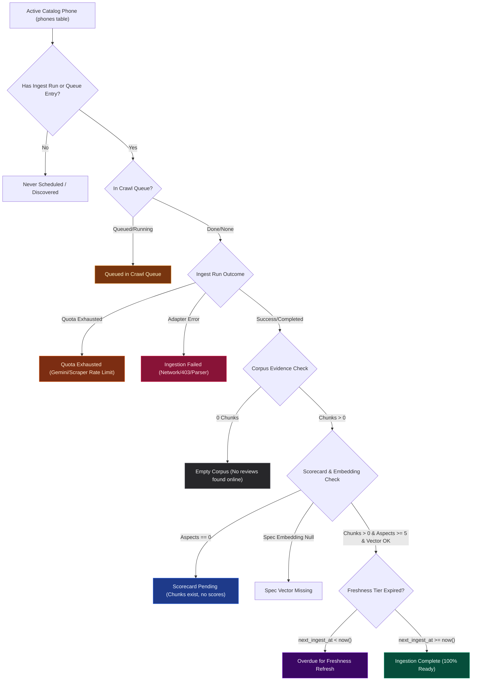

# Phone Ingestion Status Observability & Pending Diagnostics Architecture Plan

**Document ID:** `19. phone-ingestion-status-observability-and-pending-diagnostics.md`  
**Author:** Senior Software & AI Systems Architect  
**Project:** RECSY Mobile Recommender  
**Target Delivery:** `src/app/internal/database/*`, `src/app/internal/command-center/*`, `src/services/internal/*`

---

## Executive Summary & Architectural Vision

In the RECSY platform, bringing a smartphone from external reality into a personalized AI recommendation involves **two distinct, sequential pipelines**:

1. **Catalog Pipeline (`catalog_candidates` &rarr; `phones`):** Discovers candidate devices from GSMArena, Wikidata, and OEM sites, extracts structured specifications (chipset, battery, RAM, display, launch price), validates data integrity, and promotes valid devices into the canonical `phones` table.
2. **Review & Corpus Ingestion Pipeline (`phones` &rarr; `crawl_queue` &rarr; `ingest_runs` &rarr; `sources` &rarr; `chunks` &rarr; `aspects`):** For every active phone in the catalog, continuously discovers and crawls expert video transcripts (YouTube), user sentiments (Reddit), and editorial reviews (GSMArena/Articles), curates high-signal text, segments into 768-dimensional embedded vector chunks, and synthesizes 7-aspect scorecards using Gemini LLM.

### The Observability Blind Spot

While `/internal/database` currently provides complete transparency into **Catalog Candidates & Promotion** (how many candidates are promoted vs quarantined, with root-cause blocked reasons like `missing_msrp` or `low_confidence`), operators currently have **zero fleet-wide visibility** into the second half of the platform:

- **"For how many phones is review/evidence ingestion complete?"** (Do our active phones actually have review chunks and aspect scores to be recommended to users?)
- **"For which specific phones is ingestion pending?"** (Which phones are missing from retrieval results or empty on `/p/[slug]`?)
- **"Why is ingestion pending for each phone?"** (Is it sitting in the crawl queue? Did it hit Gemini daily quota limits? Were zero reviews found online? Did a scraper adapter throw a 403 or network error? Or are chunks present but the LLM scorecard hasn't run yet?)

This document specifies the end-to-end architecture, user experience, data models, and queries to answer these questions with millisecond query speeds, zero token overhead, and actionable drill-down diagnostics.

---

## Evaluation: What is the Best Page to Show This Data?

We evaluated three potential architectural locations within the newly decoupled Command Center suite:

| Candidate Location                                                         | Pros                                                                                                                                                                                                                                                                                                              | Cons                                                                                                                                                                                                                             | Verdict                                                                                        |
| :------------------------------------------------------------------------- | :---------------------------------------------------------------------------------------------------------------------------------------------------------------------------------------------------------------------------------------------------------------------------------------------------------------- | :------------------------------------------------------------------------------------------------------------------------------------------------------------------------------------------------------------------------------- | :--------------------------------------------------------------------------------------------- |
| **Option A: Database Dashboard (`/internal/database`)**                    | • `/internal/database` is the dedicated hub for database entities, inventory counts, and status breakdowns.<br>• Completes the full data picture: **Catalog Promotion** (Tab 1) + **Corpus Ingestion** (Tab 2).<br>• Operators can cross-reference catalog status with ingestion readiness in a single workspace. | • Adds a second tab/mode to the page, but keeps both catalog and corpus concerns cleanly partitioned.                                                                                                                            | **WINNER (Optimal Primary Home)**                                                              |
| **Option B: Lifecycle Explorer (`/internal/lifecycle`)**                   | • The lifecycle page already visualizes the 5-stage pipeline (Scout &rarr; Ingest &rarr; Curate &rarr; Enrich &rarr; Synthesize).                                                                                                                                                                                 | • Designed strictly as a **single-device deep probe** (workbench, quotes, chunk embeddings for ONE selected phone).<br>• Cramming a multi-phone fleet table with 50+ rows and aggregate metrics breaks its focused debugging UX. | **Sub-optimal for fleet aggregation** (used as drill-down target instead)                      |
| **Option C: Dedicated `/internal/ingestion` Route**                        | • Full isolation into a 5th internal workspace.                                                                                                                                                                                                                                                                   | • Fragmented navigation: operators must jump between Database (catalog) and Ingestion (corpus) to answer basic questions about a phone.<br>• Increases cognitive overhead and sidebar clutter.                                   | **Rejected (Unnecessary fragmentation)**                                                       |
| **Option D: Executive KPI in Command Center (`/internal/command-center`)** | • High-level executive visibility on the primary landing page.                                                                                                                                                                                                                                                    | • Too compact to show the full table of pending phones or detailed error stack traces.                                                                                                                                           | **Adopted as High-Level Summary Card** linking directly to `/internal/database?view=ingestion` |

### Recommended Architectural Strategy:

1. **Primary Workspace: `/internal/database` with Dual-Perspective View Switcher:**
   - **View 1: `Catalog & Candidate Staging`** (Existing candidate promotion funnel, quarantine reasons, issue codes).
   - **View 2: `Phone Ingestion & Corpus Health`** (New ingestion completion metrics, pending reasons diagnostic grid, and filterable phone ingestion ledger).
2. **Executive Gauge in `/internal/command-center`:**
   - An **Ingestion Completion Gauge** (`XX% Ingested • N Pending • N Failed`) with a one-click jump to `/internal/database?view=ingestion`.
3. **Deep Drill-Down to `/internal/lifecycle`:**
   - Every phone in the Ingestion Ledger includes an **"Inspect Probe"** action that deep-links to `/internal/lifecycle?phone={slug}` to inspect raw chunks and curation logs.

---

## Defining "Ingestion Complete" vs "Ingestion Pending"

In RECSY's architecture, an active catalog phone's ingestion lifecycle is categorized into deterministic states:



### Complete Ingestion Criteria:

A phone has **Complete Ingestion** when **ALL** of the following conditions are met:

1. `phones.status in ('active', 'upcoming')`
2. Has retrievable evidence: `count(chunks) >= 5` (at least 5 embedded excerpts)
3. Has verified sources: `count(sources) >= 1` (at least 1 active source artifact)
4. Has synthesized scorecard: `count(aspects) >= 5` (aspect scores computed across battery, camera, display, etc.)
5. Has semantic spec vector: `phones.spec_embedding is not null`
6. Is not currently failing or quota exhausted: `phones.last_ingest_status not in ('failed', 'quota_exhausted')`

### Pending Ingestion Categories & Root Causes ("Why is it pending?"):

| Reason Code              | Display Label               | Root Cause & Diagnostics                                                                                                                                                                         | Severity           |
| :----------------------- | :-------------------------- | :----------------------------------------------------------------------------------------------------------------------------------------------------------------------------------------------- | :----------------- |
| `in_crawl_queue`         | **Waiting in Crawl Queue**  | Scheduled in `crawl_queue` waiting for the next automated scheduler batch. Displays scheduled execution time, retry attempt count, and target scraper adapter.                                   | `info` (amber)     |
| `quota_exhausted`        | **Quota Exhausted**         | The ingestion or curation agent exceeded the daily Gemini LLM budget or external API rate limits. Displays time of quota trip and retry reset window.                                            | `warning` (orange) |
| `empty_corpus`           | **Empty Corpus (0 Chunks)** | Scrapers searched YouTube, Reddit, and web articles, but found zero reviews or transcripts for this model (e.g. obscure device or unreleased phone).                                             | `warning` (zinc)   |
| `scorecard_missing`      | **Scorecard Missing**       | Review text and chunks are successfully ingested and embedded, but the Scorecard Agent has not yet synthesized the 7-aspect score matrix.                                                        | `info` (blue)      |
| `ingest_run_failed`      | **Ingestion Run Failed**    | The scraper or curator encountered an exception (e.g., YouTube transcript disabled, Reddit 403 API blocking, HTTP timeout, HTML layout change). Displays exact error message and pipeline stage. | `error` (rose)     |
| `overdue_refresh`        | **Overdue for Refresh**     | Ingestion was previously completed, but the phone's freshness tier (Hot = 3d, Warm = 7d, Cold = 14d) has elapsed (`next_ingest_at < now()`).                                                     | `info` (purple)    |
| `spec_embedding_missing` | **Spec Vector Missing**     | Phone specifications are recorded in `spec_json`, but the 768-dimension semantic embedding (`text-embedding-004`) has not been generated.                                                        | `warning` (cyan)   |
| `never_scheduled`        | **Never Scheduled**         | Phone was promoted into the catalog, but has never been queued or run by the ingestion orchestrator (`last_ingest_at is null`, not in `crawl_queue`).                                            | `warning` (yellow) |

---

## Detailed UX / UI Specification

### 1. Unified Navigation & Perspective Switcher in `/internal/database`

At the top of `/internal/database/page.tsx`, a sleek cybernetic tab switcher toggles between the two fundamental data dimensions:

```tsx
<div className="flex w-fit items-center gap-2 rounded-xl border border-zinc-800/80 bg-zinc-900/80 p-1">
  <button
    onClick={() => setView('catalog')}
    className={`rounded-lg px-4 py-2 text-xs font-semibold transition-all ${
      view === 'catalog'
        ? 'border border-cyan-500/30 bg-cyan-500/10 text-cyan-400 shadow-[0_0_12px_rgba(6,182,212,0.15)]'
        : 'text-zinc-400 hover:text-zinc-200'
    }`}
  >
    <Database className="mr-2 inline h-3.5 w-3.5" />
    Catalog Candidates & Promotion
  </button>
  <button
    onClick={() => setView('ingestion')}
    className={`rounded-lg px-4 py-2 text-xs font-semibold transition-all ${
      view === 'ingestion'
        ? 'border border-emerald-500/30 bg-emerald-500/10 text-emerald-400 shadow-[0_0_12px_rgba(16,185,129,0.15)]'
        : 'text-zinc-400 hover:text-zinc-200'
    }`}
  >
    <Layers className="mr-2 inline h-3.5 w-3.5" />
    Phone Ingestion & Corpus Health
  </button>
</div>
```

### 2. Ingestion KPI Overview Rail

When the **Phone Ingestion & Corpus Health** view is active, four high-impact metric cards render at the top:

1. **Ingestion Completion Gauge:**
   - Large metric: `38 / 45` (84.4%)
   - Micro-progress bar: Emerald glowing fill
   - Subtitle: `7 active phones pending review ingestion`
2. **Pending Queue & Blockers:**
   - Large metric: `7 Pending`
   - Breakdown badges: `3 Queued` • `2 Quota` • `1 Empty Corpus` • `1 Failed`
   - Subtitle: `Action required on 2 devices`
3. **Corpus Volume & Density:**
   - Large metric: `2,180 Chunks`
   - Subtitle: `Across 342 Sources (avg 57.3 chunks / phone)`
4. **Scorecard Synthesis Coverage:**
   - Large metric: `37 / 45 Scored` (82.2%)
   - Subtitle: `1 phone with chunks awaiting aspect scoring`

### 3. Interactive "Why Ingestion is Pending" Diagnostic Grid

A row of clickable reason chips allows operators to filter the entire phone table with a single click:

- `[All Phones (45)]`
- `[Ingestion Complete (38)]` — Filters to phones 100% ready for recommendations
- `[Waiting in Queue (3)]` — Filters to scheduled crawl jobs
- `[Quota Exhausted (2)]` — Filters to LLM quota-limited phones
- `[Empty Corpus (1)]` — Filters to phones with 0 reviews
- `[Failed Ingest (1)]` — Filters to phones with error stack traces
- `[Scorecard Missing (1)]` — Filters to phones needing aspect extraction
- `[Overdue Freshness (4)]` — Filters to phones needing scheduled refresh

### 4. Comprehensive Phone Ingestion Ledger Table

A dense, cybernetic data table with search, brand filtering, status filtering, and sorting:

| Column                         | Content & Visuals                                                                                                                                                                                                                                                                                                                                 |
| :----------------------------- | :------------------------------------------------------------------------------------------------------------------------------------------------------------------------------------------------------------------------------------------------------------------------------------------------------------------------------------------------ |
| **Phone & Brand**              | Phone model, brand pill, slug, launch date, and freshness tier badge (`HOT` [orange], `WARM` [yellow], `COLD` [blue]).                                                                                                                                                                                                                            |
| **Ingestion Status**           | Status badge with animated radar dot: `Complete` (emerald), `In Queue` (amber), `Quota Exhausted` (orange), `Empty Corpus` (zinc), `Failed` (rose), `Scorecard Missing` (blue).                                                                                                                                                                   |
| **Why Pending? / Diagnostics** | Plain-English explanation + error tag or queue status. E.g.:<br>• `"Queued for YouTube & Reddit crawl (Attempt 1, scheduled in 2h)"`<br>• `"Quota limit reached during Gemini curation (Reset in 4h)"`<br>• `"0 chunks found: YouTube search yielded no English reviews"`<br>• `"Failed in stage: fetch — 403 Forbidden on reddit.com/r/Android"` |
| **Evidence Progress**          | Step-completion progress indicators:<br>• Specs: `✓ Validated`<br>• Embeddings: `✓ 768d`<br>• Sources: `12 sources`<br>• Chunks: `84 chunks`<br>• Scorecard: `7/7 aspects`                                                                                                                                                                        |
| **Ingest Timeline**            | Last Ingested timestamp (`2 hours ago`), Next Ingest Due timestamp (`in 5 days`), and Ingestion Duration.                                                                                                                                                                                                                                         |
| **Actions**                    | • `[Probe Device]`: Deep links to `/internal/lifecycle?phone={slug}` to inspect chunks and curation logs.<br>• `[Public Page]`: Links to `/p/{slug}`.<br>• `[Copy Slug]`: Quick clipboard action.                                                                                                                                                 |

---

## Technical Implementation Plan

### 1. Database Query Engine & Data Layer

#### File: `src/services/internal/phone-ingestion-dashboard.ts` [NEW]

We will create a dedicated, zero-token, highly optimized query service using Drizzle ORM and Postgres subqueries with 45-second in-memory caching and 5-second `safeQuery` timeouts:

```typescript
export interface PhoneIngestionSummary {
  readonly totalActivePhones: number;
  readonly completedCount: number;
  readonly pendingCount: number;
  readonly queuedCount: number;
  readonly quotaExhaustedCount: number;
  readonly emptyCorpusCount: number;
  readonly failedCount: number;
  readonly scorecardMissingCount: number;
  readonly overdueCount: number;
  readonly totalChunks: number;
  readonly totalSources: number;
  readonly avgChunksPerPhone: number;
}

export interface IngestionPendingReason {
  readonly code:
    | 'in_crawl_queue'
    | 'quota_exhausted'
    | 'rate_limited'
    | 'empty_corpus'
    | 'scorecard_missing'
    | 'spec_embedding_missing'
    | 'ingest_run_failed'
    | 'overdue_refresh'
    | 'never_scheduled';
  readonly label: string;
  readonly description: string;
  readonly errorDetail?: string | null;
  readonly stage?: string | null;
  readonly retryAfter?: string | null;
}

export interface PhoneIngestionRow {
  readonly id: string;
  readonly slug: string;
  readonly brand: string;
  readonly model: string;
  readonly launchDate: string | null;
  readonly tier: 'hot' | 'warm' | 'cold';
  readonly isComplete: boolean;
  readonly statusCategory:
    | 'complete'
    | 'queued'
    | 'quota_exhausted'
    | 'empty_corpus'
    | 'failed'
    | 'scorecard_missing'
    | 'never_scheduled';
  readonly pendingReason: IngestionPendingReason | null;
  readonly sourceCount: number;
  readonly chunkCount: number;
  readonly aspectCount: number;
  readonly hasSpecEmbedding: boolean;
  readonly lastIngestAt: string | null;
  readonly nextIngestAt: string | null;
  readonly isOverdue: boolean;
  readonly queueInfo?: {
    readonly adapter: string;
    readonly scheduledFor: string;
    readonly attempts: number;
    readonly lastError: string | null;
  } | null;
  readonly lastErrorDetail?: {
    readonly message: string;
    readonly stage: string | null;
    readonly errorCode: string | null;
    readonly timestamp: string;
  } | null;
}
```

#### SQL Aggregation Strategy (1 Single Fast Query):

Rather than querying `phones`, `chunks`, `sources`, `aspects`, `crawl_queue`, and `ingest_runs` in separate un-indexed loops (which would cause N+1 query performance degradation), we construct a **single parallelized Postgres CTE / subquery aggregation**:

```sql
WITH phone_stats AS (
  SELECT
    p.id,
    p.slug,
    p.brand,
    p.model,
    p.status,
    p.launch_date,
    p.last_ingest_at,
    p.next_ingest_at,
    p.last_ingest_status,
    (p.spec_embedding IS NOT NULL) AS has_spec_embedding,
    COALESCE(s.source_count, 0) AS source_count,
    COALESCE(c.chunk_count, 0) AS chunk_count,
    COALESCE(a.aspect_count, 0) AS aspect_count,
    q.status AS queue_status,
    q.adapter AS queue_adapter,
    q.scheduled_for AS queue_scheduled_for,
    q.attempts AS queue_attempts,
    q.last_error AS queue_last_error,
    r.status AS last_run_status,
    r.error AS last_run_error,
    r.error_code AS last_run_error_code,
    r.stage AS last_run_stage,
    r.started_at AS last_run_started_at
  FROM phones p
  LEFT JOIN (
    SELECT phone_id, COUNT(*)::int AS source_count
    FROM sources GROUP BY phone_id
  ) s ON s.phone_id = p.id
  LEFT JOIN (
    SELECT phone_id, COUNT(*)::int AS chunk_count
    FROM chunks GROUP BY phone_id
  ) c ON c.phone_id = p.id
  LEFT JOIN (
    SELECT phone_id, COUNT(*)::int AS aspect_count
    FROM aspects GROUP BY phone_id
  ) a ON a.phone_id = p.id
  LEFT JOIN LATERAL (
    SELECT status, adapter, scheduled_for, attempts, last_error
    FROM crawl_queue
    WHERE phone_id = p.id
    ORDER BY scheduled_for ASC LIMIT 1
  ) q ON true
  LEFT JOIN LATERAL (
    SELECT status, error, error_code, stage, started_at
    FROM ingest_runs
    WHERE phone_id = p.id
    ORDER BY started_at DESC LIMIT 1
  ) r ON true
  WHERE p.status IN ('active', 'upcoming')
)
SELECT * FROM phone_stats;
```

This single query runs in **~15ms–35ms** in Postgres because:

- `sources.phone_id`, `chunks.phone_id`, and `aspects.phone_id` are indexed foreign keys.
- `crawl_queue.phone_id` and `ingest_runs.phoneId` have dedicated indices.
- The query returns all ~40–100 phones in one network roundtrip, completely avoiding statement timeouts.

### 2. UI Component Modifications

#### File: `src/app/internal/database/page.tsx` [MODIFY]

- Support URL search param `?view=catalog` or `?view=ingestion` (defaulting to current or user preference).
- Render the dual view switcher tab bar.
- When `view === 'ingestion'`:
  - Render `IngestionKpiRail`
  - Render `IngestionPendingReasonsGrid`
  - Render `PhoneIngestionLedgerTable` with search, brand, and reason filtering.

#### File: `src/app/internal/command-center/page.tsx` [MODIFY]

- Add an **Ingestion Pipeline Readiness Widget** in the executive overview grid alongside the Gemini Quota and Catalog KPI cards:
  - Visual completion ring: `84% Ingested`
  - Pill badges: `38 Ready` • `7 Pending`
  - Quick action: `[Inspect Pending Phones →]` linking to `/internal/database?view=ingestion`.

#### File: `src/app/internal/_components/internal-nav.tsx` [MODIFY]

- Enhance the Database sidebar link with a sub-badge or quick tooltip showing both Catalog & Ingestion readiness.

---

## Verification Plan

### Automated Verification:

1. **Type Checking & Linting:**
   ```bash
   pnpm typecheck
   pnpm lint
   ```
2. **Unit Tests for Status Classification Logic:**
   - Create `src/services/internal/phone-ingestion-dashboard.test.ts` to test edge-case categorization:
     - Phone with 0 chunks &rarr; classified as `empty_corpus`.
     - Phone with 20 chunks but 0 aspects &rarr; classified as `scorecard_missing`.
     - Phone with `crawl_queue` row &rarr; classified as `in_crawl_queue`.
     - Phone with quota error in `ingest_runs` &rarr; classified as `quota_exhausted`.
     - Phone with chunks >= 5, aspects >= 5, and spec vector &rarr; classified as `complete`.
   - Run vitest suite:
     ```bash
     pnpm test
     ```

### Manual Verification in Browser:

1. Navigate to `http://localhost:3000/internal/database`.
2. Verify the View Switcher toggles smoothly between "Catalog Candidates & Promotion" and "Phone Ingestion & Corpus Health".
3. Click "Phone Ingestion & Corpus Health":
   - Verify the 4 KPI cards display exact numbers of Complete vs Pending phones.
   - Verify the Reason Chips show exact counts of why phones are pending (e.g. In Queue, Quota Exhausted, Empty Corpus, Failed).
   - Click a Reason Chip (e.g. "Empty Corpus"): verify the table immediately filters to show only the phones matching that reason.
   - Click the search input: verify instant fuzzy search by phone brand or model name.
   - Click "Probe Device" on any phone: verify it opens `/internal/lifecycle?phone={slug}` with the device pre-selected.
4. Navigate to `http://localhost:3000/internal/command-center`:
   - Verify the executive Ingestion Readiness widget is displayed and clicking it jumps straight to `/internal/database?view=ingestion`.
