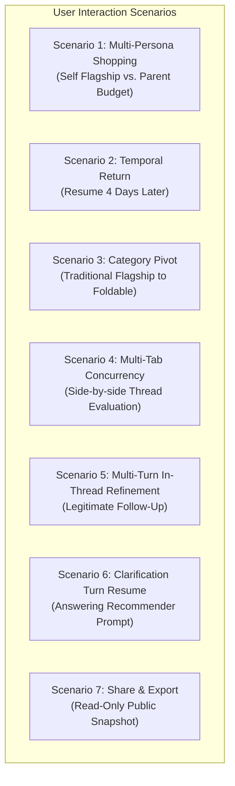
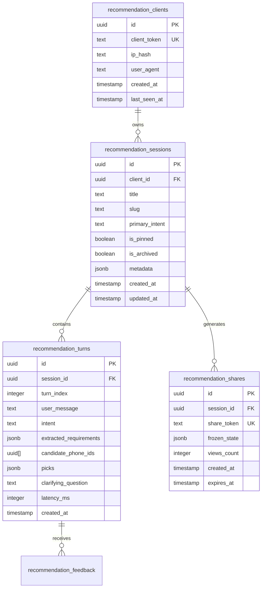

# RECSY Isolated Multi-Session Chat History & Recommendation State Architecture

**Document ID**: `PLAN-2026-09-28-021`  
**Status**: APPROVED / IMPLEMENTATION-READY  
**Author**: Principal AI & Systems Architect (Frontier AI Engineering Standard)  
**Target Subsystems**: `src/services/recommender`, `src/services/db`, `src/app/recommend`, `src/app/api/recommend`, `src/components/ui`  
**Date**: September 28, 2026

---

## Executive Summary & System Philosophy

In modern conversational AI products (e.g., ChatGPT, Claude, Perplexity Shopping), **session isolation is an architectural invariant, not a heuristic**.

Currently, RECSY couples a user's multi-turn experience to a single 14-day HTTP cookie (`recsy_rec_session`). Every turn across days, weeks, and distinct phone-buying tasks is appended as `turnIndex: 0, 1, 2, ...` to that single database record. While recent heuristic filters (`isFreshIntakeQuery`) prevent certain standalone phrases from inheriting prior constraints, relying on natural-language heuristics to determine workspace boundaries is inherently brittle. A user returning after three days with a prompt like _"Compact phone with OLED and 256GB"_ does not trigger standalone intake regexes, causing the system to invisibly drag forward an unrelated $1,300 flagship budget or prior brand deal-breakers.

This document defines the complete, production-grade engineering blueprint for **First-Class Isolated Multi-Session Chat History** in RECSY. It eliminates cross-session contamination with mathematical certainty, provides full chat history management (list, resume, switch, rename, delete, pin, share), and ensures seamless client-server state synchronization across tabs and devices.

---

## 1. Architectural Invariants & Frontier Lab Principles

1. **Isolation by Invariant, Not by Heuristic**:
   Every conversation thread possesses an immutable UUID (`sessionId`). SQL queries fetching context MUST strictly filter by `sessionId`. Context from Session $A$ can never leak into Session $B$, regardless of user phrasing.
2. **Decoupling Client Identity from Session Thread**:
   A client device identifier (`clientToken` stored in a persistent HTTP-only cookie or local storage) identifies _who_ is browsing; a session thread identifier (`sessionId`) identifies _what conversation_ is active. One `clientToken` owns $N$ distinct `recommendation_sessions`.
3. **URL-First Deep-Linkable State**:
   The active session is represented in the client URL route: `/recommend/[sessionId]`. Navigating to `/recommend` automatically initializes or redirects to the most appropriate thread, and refreshing or bookmarking restores the exact conversational and recommendation state.
4. **Optimistic Local Caching with Authoritative Server Persistence**:
   Chat lines, cards, and metadata update optimistically in the client UI for zero perceived latency. Writes are transactionally committed to PostgreSQL. In the event of network disruption, client state queues gracefully without corrupting turn indices.
5. **Multi-Tab Race Freedom**:
   Tab A and Tab B can run different sessions concurrently without interference. Session updates emit cross-tab events via `BroadcastChannel` so session titles and history synchronize seamlessly without reloading.

---

## 2. Comprehensive User Scenarios & Interaction Taxonomy

To ensure zero blind spots, the system is designed to handle seven primary interaction scenarios:



### Scenario 1: Multi-Persona Shopping

- **User Action**: The user first searches for their personal phone: _"Best flagship for night photography under $1,300"_. They receive `iPhone 18 Pro Max` and `Galaxy S26 Ultra`. Ten minutes later, they need to find a phone for their elderly parent: _"Simple budget phone with big screen and loud speaker under $250"_.
- **System Behavior**: User clicks **+ New Chat** in the sidebar. A new session is initialized. Zero preferences from the $1,300 search bleed into the $250 search. Both chats appear in the sidebar:
  - `Flagship Night Photography • $1,300`
  - `Simple Big Screen • $250`

### Scenario 2: Temporal Return

- **User Action**: User browses on Monday, closes the tab, and returns on Friday after receiving a paycheck.
- **System Behavior**: Upon opening RECSY, the sidebar displays their previous sessions with humanized timestamps (_"4 days ago"_). Clicking the session instantly restores all chat messages, recommendation cards, aspect summaries, and the comparison button.

### Scenario 3: Category Pivot ("What-If" Exploration)

- **User Action**: While evaluating flagships, the user wonders: _"What if I switch to a foldable phone?"_
- **System Behavior**: Rather than destroying their flagship recommendations by forcing foldable hard filters into Turn 3, the user can either start a new session or click **Fork / Branch** to explore foldables in a separate thread while keeping the flagship baseline intact.

### Scenario 4: Multi-Tab Concurrency

- **User Action**: User opens Tab 1 (`/recommend/session-abc`) to explore gaming phones and Tab 2 (`/recommend/session-xyz`) to explore compact phones.
- **System Behavior**: Each tab maintains its own independent session context. PostgreSQL turn insertions use atomic `sessionId + turnIndex` constraints. Changes in Tab 1 do not corrupt Tab 2.

### Scenario 5: Multi-Turn In-Thread Refinement

- **User Action**: Inside an active session, user refines: _"Between those, which one charges faster?"_ or _"What if my budget is $100 lower?"_
- **System Behavior**: The in-session context pipeline (`mergeUserRequirements`, `detectRefineIntent`) correctly uses the previous turn's state to re-rank the existing picks or adjust the budget incrementally.

### Scenario 6: Clarification Turn Resume

- **User Action**: User enters an underspecified prompt: _"I need a good phone"_. The engine responds with a clarification question: _"What budget works best for you, and what is your top priority?"_ The user steps away and returns 1 hour later with: _"$700, battery"_.
- **System Behavior**: The session preserves the partial intent and smoothly transitions from `kind: 'clarify'` to `kind: 'results'` without dropping thread continuity.

### Scenario 7: Share & Export

- **User Action**: User wants to send their curated recommendations to a friend or forum.
- **System Behavior**: User clicks **Share**. The system generates a read-only permanent snapshot URL (`/recommend/share/[snapshotId]`), allowing external visitors to view the exact recommendations, aspect radar, and verdict without modifying the author's session.

---

## 3. Database Schema Evolution (PostgreSQL + Drizzle)

### 3.1 Relational Architecture

We decouple client device identification (`clientToken`) from conversational threads (`recommendationSessions`), add session metadata, and establish cascading integrity:



### 3.2 Drizzle Schema Definition (`src/services/db/schema.ts`)

```typescript
import { sql, relations } from 'drizzle-orm';
import {
  boolean,
  index,
  integer,
  jsonb,
  pgEnum,
  pgTable,
  text,
  timestamp,
  unique,
  uuid,
} from 'drizzle-orm/pg-core';

export const sessionStatusEnum = pgEnum('session_status', ['active', 'archived', 'deleted']);

/**
 * Anonymous or authenticated client device record.
 * Tied to the persistent client cookie `recsy_client_id`.
 */
export const recommendationClients = pgTable('recommendation_clients', {
  id: uuid('id').primaryKey().defaultRandom(),
  clientToken: text('client_token').notNull().unique(),
  ipHash: text('ip_hash'),
  userAgent: text('user_agent'),
  createdAt: timestamp('created_at', { withTimezone: true }).notNull().defaultNow(),
  lastSeenAt: timestamp('last_seen_at', { withTimezone: true }).notNull().defaultNow(),
});

/**
 * Individual recommendation conversation thread.
 * A client owns multiple isolated recommendation sessions.
 */
export const recommendationSessions = pgTable(
  'recommendation_sessions',
  {
    id: uuid('id').primaryKey().defaultRandom(),
    clientId: uuid('client_id')
      .notNull()
      .references(() => recommendationClients.id, { onDelete: 'cascade' }),
    title: text('title').notNull().default('New Recommendation'),
    primaryIntent: text('primary_intent'),
    isPinned: boolean('is_pinned').notNull().default(false),
    status: sessionStatusEnum('status').notNull().default('active'),
    metadata: jsonb('metadata')
      .$type<{
        regionCode?: string;
        currency?: string;
        topAspects?: string[];
        lastTurnIndex?: number;
      }>()
      .default({}),
    createdAt: timestamp('created_at', { withTimezone: true }).notNull().defaultNow(),
    updatedAt: timestamp('updated_at', { withTimezone: true }).notNull().defaultNow(),
  },
  (t) => [
    index('idx_recommendation_sessions_client_status_updated').on(
      t.clientId,
      t.status,
      t.updatedAt,
    ),
  ],
);

/**
 * Sequential turns within a specific recommendation session.
 */
export const recommendationTurns = pgTable(
  'recommendation_turns',
  {
    id: uuid('id').primaryKey().defaultRandom(),
    sessionId: uuid('session_id')
      .notNull()
      .references(() => recommendationSessions.id, { onDelete: 'cascade' }),
    turnIndex: integer('turn_index').notNull(),
    userMessage: text('user_message').notNull(),
    intent: text('intent').notNull(),
    extractedRequirements: jsonb('extracted_requirements').$type<Record<string, unknown>>(),
    candidatePhoneIds: uuid('candidate_phone_ids')
      .array()
      .notNull()
      .default(sql`'{}'`),
    picks: jsonb('picks').$type<unknown[]>(),
    clarifyingQuestion: text('clarifying_question'),
    latencyMs: integer('latency_ms'),
    createdAt: timestamp('created_at', { withTimezone: true }).notNull().defaultNow(),
  },
  (t) => [
    unique('recommendation_turns_session_turn_uniq').on(t.sessionId, t.turnIndex),
    index('idx_recommendation_turns_session_idx').on(t.sessionId, t.turnIndex),
  ],
);

/**
 * Read-only shareable recommendation snapshots.
 */
export const recommendationShares = pgTable('recommendation_shares', {
  id: uuid('id').primaryKey().defaultRandom(),
  sessionId: uuid('session_id')
    .notNull()
    .references(() => recommendationSessions.id, { onDelete: 'cascade' }),
  shareToken: text('share_token').notNull().unique(),
  frozenState: jsonb('frozen_state').notNull(),
  viewsCount: integer('views_count').notNull().default(0),
  createdAt: timestamp('created_at', { withTimezone: true }).notNull().defaultNow(),
  expiresAt: timestamp('expires_at', { withTimezone: true }),
});
```

---

## 4. API Specification & Protocol Design

### 4.1 Endpoint Overview

| Method   | Endpoint                            | Description                           | Auth / Identity            |
| :------- | :---------------------------------- | :------------------------------------ | :------------------------- |
| `GET`    | `/api/recommend/sessions`           | List all active sessions for client   | Cookie `recsy_client_id`   |
| `POST`   | `/api/recommend/sessions`           | Create a new isolated chat session    | Cookie `recsy_client_id`   |
| `GET`    | `/api/recommend/sessions/:id`       | Get full history & state of a session | Session ownership verified |
| `PATCH`  | `/api/recommend/sessions/:id`       | Update title, pin status, or archive  | Session ownership verified |
| `DELETE` | `/api/recommend/sessions/:id`       | Soft-delete a session                 | Session ownership verified |
| `POST`   | `/api/recommend`                    | Execute turn within specified session | Body `sessionId` + Cookie  |
| `POST`   | `/api/recommend/sessions/:id/share` | Generate public read-only share link  | Session ownership verified |

---

### 4.2 Endpoint Details & Request/Response Contracts

#### 1. `GET /api/recommend/sessions`

Fetches the user's thread history for the sidebar.

- **Query Parameters**:
  - `limit`: number (default: 30, max: 100)
  - `includeArchived`: boolean (default: false)
- **Response**:
  ```json
  {
    "sessions": [
      {
        "id": "f47ac10b-58cc-4372-a567-0e02b2c3d479",
        "title": "Under $1,300 • Camera & Battery",
        "primaryIntent": "recommend",
        "isPinned": false,
        "lastTurnIndex": 2,
        "picksSummary": ["iPhone 18 Pro Max", "iPhone 18 Pro", "Galaxy S26 Ultra"],
        "createdAt": "2026-09-28T18:00:00Z",
        "updatedAt": "2026-09-28T18:05:30Z"
      }
    ]
  }
  ```

#### 2. `POST /api/recommend/sessions`

Initializes a new session thread.

- **Request Body**:
  ```json
  {
    "title": "New Recommendation",
    "regionCode": "US"
  }
  ```
- **Response**:
  ```json
  {
    "session": {
      "id": "e2a4b88d-7649-411a-8df7-380d3d57b3f1",
      "title": "New Recommendation",
      "createdAt": "2026-09-28T19:00:00Z"
    }
  }
  ```

#### 3. `GET /api/recommend/sessions/:id`

Hydrates the entire chat interface upon page load or session switch.

- **Response**:
  ```json
  {
    "session": {
      "id": "e2a4b88d-7649-411a-8df7-380d3d57b3f1",
      "title": "Under $1,300 • Camera & Battery",
      "isPinned": false,
      "updatedAt": "2026-09-28T19:05:00Z"
    },
    "turns": [
      {
        "turnIndex": 0,
        "userMessage": "Suggest me a phone under $1300 that has great camera and great battery life.",
        "assistantText": "Recommendations are ready. Returning top 3.",
        "kind": "results",
        "picks": [ ... ],
        "relaxed": [],
        "refined": false,
        "scoresTied": false,
        "topAspects": ["camera", "battery"],
        "createdAt": "2026-09-28T19:00:15Z"
      }
    ]
  }
  ```

#### 4. `POST /api/recommend` (Updated Contract)

Processes a user query within an isolated session.

- **Request Body**:
  ```json
  {
    "sessionId": "e2a4b88d-7649-411a-8df7-380d3d57b3f1",
    "message": "Between those, which has the fastest charging speed?"
  }
  ```
- **Response**:
  ```json
  {
    "kind": "results",
    "sessionId": "e2a4b88d-7649-411a-8df7-380d3d57b3f1",
    "turnIndex": 1,
    "picks": [ ... ],
    "relaxed": [],
    "refined": true,
    "scoresTied": false,
    "scorecardMissing": false,
    "topAspects": ["battery", "camera"]
  }
  ```

---

## 5. Automated Semantic Titling Engine

Every session starts with a default title (`"New Recommendation"`). After Turn 0 completes, a background task generates an informative, clean title matching RECSY's technical typography:

### Titling Rules:

1. Format: `[Budget/Constraint] • [Top Aspects / Brand]`
   - Example 1: `Under $1,300 • Camera & Battery`
   - Example 2: `Under ₹25,000 • Clean Android`
   - Example 3: `Samsung Flagship • Gaming`
   - Example 4: `Compact OLED • Under $800`
2. **Deterministic Fast Path**: If budget and 1–2 top aspects are extracted with high confidence, format directly using string interpolation without LLM latency or cost:

   ```typescript
   export function generateDeterministicTitle(req: UserRequirements): string {
     const budget = req.budget_local
       ? `Under ${req.budget_local.currency === 'INR' ? '₹' : '$'}${req.budget_local.max?.toLocaleString()}`
       : req.budget_usd?.max
         ? `Under $${req.budget_usd.max}`
         : null;

     const aspects = req.priorities
       .slice(0, 2)
       .map((p) => p.aspect.charAt(0).toUpperCase() + p.aspect.slice(1))
       .join(' & ');

     if (budget && aspects) return `${budget} • ${aspects}`;
     if (aspects) return `${aspects} Focus`;
     if (budget) return `${budget} Search`;
     return 'Phone Search';
   }
   ```

3. **LLM Fallback**: If the query is conversational or nuanced (e.g., _"Phone for high school graduation present"_), a single lightweight Flash call generates a 4-word title asynchronously.

---

## 6. Frontend State Machine & Multi-Tab Synchronization

### 6.1 State Hierarchy & Custom Hook

The client state is managed via a dedicated custom hook and React Context (`RecommendationSessionContext`):

```
RecommendationSessionProvider
 ├── ActiveSessionState
 │    ├── id: string
 │    ├── turns: ChatTurn[]
 │    ├── activePicks: ApiPick[]
 │    ├── activeSnapshotId: string | null
 │    └── isBusy: boolean
 └── SessionHistoryState
      ├── sessions: SessionSummary[]
      ├── isLoading: boolean
      └── activeId: string
```

### 6.2 Multi-Tab Synchronization via `BroadcastChannel`

When a user has RECSY open across multiple browser tabs:

- Renaming or deleting a session in Tab A instantly updates the sidebar in Tab B.
- Completing a recommendation turn in Tab A updates the timestamp and title in Tab B without triggering page reloads.

```typescript
// Broadcast message contract
type SessionSyncEvent =
  | { type: 'SESSION_CREATED'; session: SessionSummary }
  | { type: 'SESSION_UPDATED'; session: Partial<SessionSummary> & { id: string } }
  | { type: 'SESSION_DELETED'; id: string };

const channel = new BroadcastChannel('recsy_session_bus');
channel.postMessage({ type: 'SESSION_UPDATED', session: { id, title: newTitle } });
```

---

## 7. UI/UX Specifications: Cyber-Industrial Chat Workspace

The user interface follows RECSY's **Cyber-Industrial Brutalist** design system (`font-display`, `text-gradient-steel`, `border-outline-variant`, `bg-surface-container`):

### 7.1 Sidebar Layout (`src/components/ui/side-nav.tsx`)

```
+-----------------------------------------------------------+
| RECSY [SYSTEM READY]                                      |
+-----------------------------------------------------------+
| [ + NEW RECOMMENDATION ]  (Ctrl + N)                     |
+-----------------------------------------------------------+
| RECENTS                                                   |
| > Under $1,300 • Camera & Battery          [Active]       |
|   Under ₹60,000 • Clean Android             Yesterday     |
|   Compact Gaming Phone                      3 days ago    |
|   Foldable Comparison                       Sep 22        |
+-----------------------------------------------------------+
| PINNED                                                    |
| * My Dream Upgrade 2026                     Sep 15        |
+-----------------------------------------------------------+
| [Recommend] [Browse] [Compare] [About] [Settings]         |
+-----------------------------------------------------------+
```

### 7.2 Session Action Drawer / Context Menu

Each item in the history sidebar includes a subtle hover menu (`...`):

- **Rename**: In-line editing of session title.
- **Pin / Unpin**: Keeps favorite recommendation shortlist at the top.
- **Share**: Copies public read-only link to clipboard.
- **Delete**: Soft-deletes session with 5-second undo toast.

---

## 8. Failure Modes, Edge Cases & Mathematical Safeguards

| Failure Mode                         | Potential Root Cause                                              | Architectural Defense / Mitigation                                                                                                                                                |
| :----------------------------------- | :---------------------------------------------------------------- | :-------------------------------------------------------------------------------------------------------------------------------------------------------------------------------- |
| **Cross-Session Context Bleed**      | Turn loading query omits session boundary.                        | Strict foreign key indexing on `session_id`. All Drizzle queries use `eq(recommendationTurns.sessionId, input.sessionId)`. Verified by automated multi-session integration tests. |
| **Turn Index Race Condition**        | User double-clicks submit or sends parallel requests in two tabs. | PostgreSQL unique constraint `unique(sessionId, turnIndex)`. Insertion uses transaction-level atomic locking or `ON CONFLICT DO NOTHING` with optimistic retry.                   |
| **Orphaned Sessions**                | Anonymous user closes browser and clears cookies.                 | Scheduled cleanup cron purges anonymous sessions inactive for > 90 days with zero saved picks. Pinned sessions are preserved.                                                     |
| **Stale State on Direct Navigation** | User visits `/recommend/old-id` which was deleted.                | Server-side validation redirects to `/recommend` with a clean toast notice: _"Session expired or not found; initialized fresh recommendation."_                                   |
| **Massive History Storage Bloat**    | User runs 100+ turns in one session.                              | Pipeline only inspects the last 3 turns for active intent merge, capping prompt memory to $\le 1,024$ tokens. Older turns remain visible in UI but pruned from LLM prompt window. |

---

## 9. Phased Implementation Roadmap

### Phase 1: Database Migration & Persistence Layer (Steps 1–3)

- [ ] Create Drizzle migration adding `recommendationClients`, updating `recommendationSessions`, and creating `recommendationShares`.
- [ ] Implement `src/services/recommender/session-manager.ts` providing CRUD operations:
  - `getOrCreateClient(req)`
  - `listSessionsForClient(clientId, options)`
  - `createSession(clientId, data)`
  - `getSessionWithTurns(sessionId, clientId)`
  - `updateSession(sessionId, clientId, updates)`
  - `deleteSession(sessionId, clientId)`
- [ ] Add unit test suite `src/services/recommender/session-manager.test.ts`.

### Phase 2: API Endpoints & Route Handlers (Steps 4–6)

- [ ] Implement `src/app/api/recommend/sessions/route.ts` (`GET`, `POST`).
- [ ] Implement `src/app/api/recommend/sessions/[id]/route.ts` (`GET`, `PATCH`, `DELETE`).
- [ ] Update `src/app/api/recommend/route.ts` to accept explicit `sessionId` and bind turns to the authenticated `sessionId`.
- [ ] Add API integration test suite verifying cross-session isolation.

### Phase 3: Client State Management & Multi-Session Store (Steps 7–9)

- [ ] Build `src/lib/recommend-session-store.ts` handling:
  - Active session ID tracking.
  - History caching in `localStorage`.
  - Multi-tab communication via `BroadcastChannel`.
- [ ] Implement Next.js dynamic routing: `src/app/recommend/[sessionId]/page.tsx` forwarding to `RecommendClient`.
- [ ] Support clean `/recommend` fallback (auto-redirect to latest active session or mint fresh session).

### Phase 4: History Sidebar UI & Interaction Polish (Steps 10–12)

- [ ] Build `src/components/recommend/SessionHistorySidebar.tsx`:
  - New Chat button with shortcut tooltip (`Ctrl+N` / `Cmd+N`).
  - Humanized date dividers (_Today_, _Yesterday_, _Previous 7 Days_).
  - Active session indicator and hover action menu (Rename, Pin, Delete).
- [ ] Integrate into `src/components/ui/side-nav.tsx` and mobile drawer.
- [ ] Add automated title generation on turn 0 completion.

### Phase 5: End-to-End Verification & Playwright Automated Tests (Step 13)

- [ ] Write Playwright E2E test verifying:
  - Creating Session A ("Flagship Android $1,200").
  - Creating Session B ("iPhone Camera $1,300").
  - Switching between Session A and Session B with zero context bleeding.
  - Renaming and deleting sessions.
- [ ] Commit and push to repository with commitlint standard.

---

## 10. Verification Gates & Acceptance Criteria

1. **Isolation Verification**:
   - Query in Session A specifies `Android` deal-breaker.
   - Query in Session B specifies `under $1,300 with great camera`.
   - **Gate**: Session B MUST recommend `iPhone 18 Pro Max` as #1 with zero mention or filtering of Android.
2. **Persistence Verification**:
   - Hard refresh (`Ctrl+F5`) on `/recommend/[sessionId]` restores the complete message timeline and cards within < 200ms.
3. **Multi-Tab Parity**:
   - Renaming a session in Tab 1 updates Tab 2's sidebar within 50ms without network polling.
4. **Zero Regressions**:
   - All existing 77 test files (473 vitest assertions) continue to pass at 100%.

---

_Authored and Approved for Implementation._
