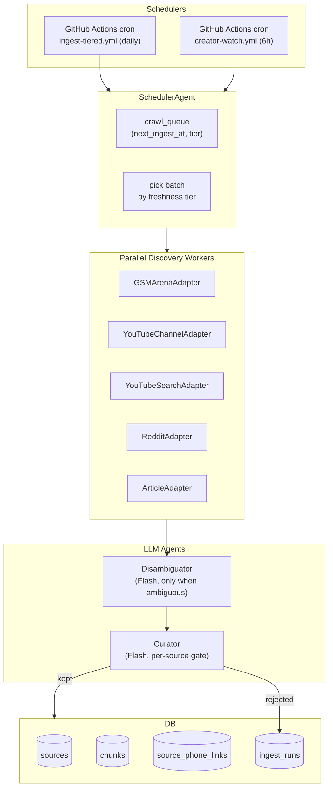

# Automated Ingestion Pipeline — End-to-End Design

> **Status.** Accepted and shipped (2026-04-22 → 2026-04-29). Hardened with resumability (ADR 0017, 2026-05-15).
> **Owner.** Ingestion.
> **See also.** [ADR 0014](../adr/0014-automated-ingestion-curation.md) (Accepted),
> [`docs/ingest/README.md`](../ingest/README.md), [ADR 0003](../adr/0003-ingestion-typescript.md),
> [ADR 0017 — Ingestion resumability + intelligent retry](../adr/0017-ingestion-resumability-and-intelligent-retry.md).

## 1. Problem Today

- `/p/[slug]` "Ask about this phone" returns the no-corpus honesty copy ("run
  `pnpm ingest --phone <slug>`") because the nightly cron in
  `.github/workflows/ingest.yml` only iterates **four hand-listed phones**,
  YouTube `discover()` runs generic search queries (not creator-focused),
  GSMArena isn't an adapter, and article discovery is a **no-op** — reviews
  only arrive via manual `--url`.
- The orchestrator works end-to-end (writer is idempotent; `content_hash`
  dedupe is solid), so this plan extends rather than rewrites it.

## 2. Target Architecture



Each worker is a **pure async function** (discover → fetch → chunk). The
`Curator` is the single LLM bottleneck; `Disambiguator` only fires when titles
mention > 1 phone.

## 3. Freshness Tiers & Scheduling

New columns on `phones`:

- `last_ingest_at timestamptz`
- `next_ingest_at timestamptz` (indexed)
- `ingest_tier` is **derived** (SQL expression) from `launch_date` + `status`:
  - **`hot`** — `launchDate >= now() - 60d` OR `status='upcoming'` → every **3 days**.
  - **`warm`** — `60d < age ≤ 180d` → every **7 days**.
  - **`cold`** — age > 180d → every **14 days**.

The scheduler picks `N` phones where `next_ingest_at <= now()` ordered by tier
(`hot → warm → cold`) then `last_ingest_at asc`. Daily batch ≈ 10 phones × 3
adapters — comfortably inside Gemini free tier (see §8 envelope).

## 4. Adapters

### 4a. `GSMArenaAdapter` (new)

Discovery, combined and deduped by canonical URL:

1. Device lookup: `https://www.gsmarena.com/res.php3?sSearch={brand}+{model}` →
   maker page → review link (`*-review-*.php`).
2. Deep-link override from `phones.raw_json.gsmarenaUrl`.
3. Optional sitemap poll (`/news-sitemap.xml`) for news mentions.

Fetch reuses `ArticleAdapter`'s Readability path via the new shared HTTP
module (`src/services/ingest/http.ts`).

Politeness: dedicated per-host limiter at **1 req / 4 s** with ±40% jitter;
respects `Retry-After`; User-Agent identifies us with contact URL; single
concurrency.

### 4b. `YouTubeChannelAdapter` (new)

Allowlist stored in `creator_profiles` (seeded):

| Handle         | Channel ID               |
| -------------- | ------------------------ |
| MKBHD          | UCBJycsmduvYEL83R_U4JriQ |
| Mrwhosetheboss | UCMiJRAwDNSNzuYeN2uWa0pA |
| TheTechChap    | UCzlXf-yUIaOpOjEjPrOO9TA |
| SuperSaf       | UCIrrRLyFMVmmL9NDAU2obJA |
| TheUnlockr     | UCaDBRJTQhIg_QhCkW7SxWGQ |
| MrMobile       | UCSOpcUkE-is7u7c4AkLgqTw |

Discovery polls
`https://www.youtube.com/feeds/videos.xml?channel_id={id}` every 6 h — no API
key, no quota. For each new video title:

1. Phone-alias match against `phone_aliases`.
2. Exactly one match → queue candidate.
3. Multiple matches → send title + description to `Disambiguator`.

Fetch/chunk unchanged — reuses the 3-tier transcript chain in
`src/services/ingest/adapters/youtube.ts`. Datacenter-IP transcript failures
remain a known limit; the source is skipped with an `ingest_runs.status='failed'`.

### 4c. `YouTubeSearchAdapter` (existing, narrowed)

Only runs on **hot-tier** phones to catch launch-window creators not on the
allowlist — at most 2 queries per phone per run.

### 4d. `RedditAdapter` (extended)

- Subreddit allowlist becomes data — stored in `subreddit_profiles`, seeded
  with general (`r/Android`, `r/apple`) plus device-specific (`r/GooglePixel`,
  `r/GalaxyS25`, `r/iphone`, etc.).
- Adds `/r/{sub}/new.json` polling alongside the existing search path so we
  catch threads before they peak.

## 5. The Two LLM Agents

### 5a. `DisambiguatorAgent`

- Invoked **only when ≥ 2 phones** match a title via alias heuristic.
- Input: `{title, description, knownPhoneCandidates[]}`.
- Output:
  ```ts
  {
    primaryPhoneId: string | null,
    alsoAboutPhoneIds: string[],
    confidence: 'high' | 'medium' | 'low',
    reason: string,
  }
  ```
- `low` confidence or `primaryPhoneId: null` → dropped with
  `ingest_runs.status='skipped'` (reason: `disambiguation-low-confidence`).
- Flash, `LLM_CACHE_ENABLED=true`, key = `sha256(title + '\n' + description)`.

### 5b. `CuratorAgent`

Runs **once per fetched source**, after chunking but before embedding.

- Input: `{phone, sourceType, title, firstChunks[0..2], sourceMetadata}`.
- Output:
  ```ts
  {
    keep: boolean,
    relevance: 0..1,       // content about THIS phone
    quality: 0..1,         // review depth vs. blurb/rant
    aspectsCovered: Array<'camera'|'battery'|'performance'|'display'|'build'|'software'|'value'>,
    sentimentSummary: 'positive' | 'mixed' | 'negative' | 'neutral',
    reason: string,
  }
  ```
- Starting thresholds: `keep && relevance >= 0.5 && quality >= 0.4`.
- Rejects persist in `ingest_runs` with `rejectedReason` for weekly audit.
- Gate at source level, not chunk level: one Flash call per source (≈ 10
  chunks). Per-chunk relevance is already handled by hybrid retrieval.

## 6. Schema Changes

New migrations via `pnpm db:generate`:

- `phones`: `last_ingest_at`, `next_ingest_at` (indexed).
- `phone_aliases` new: `(phoneId, alias, priority)`.
- `creator_profiles` new:
  `(platform, externalId, handle, trustWeight, lastPolledAt, status)`.
- `subreddit_profiles` new:
  `(name, scope, minScore, lastPolledAt, status)`.
- `domain_profiles` new:
  `(host, trustWeight, rateLimitMs, robotsRespected, robotsJson, robotsFetchedAt, status)`.
- `source_phone_links` new many-to-many:
  `(sourceId, phoneId, role ['primary'|'secondary'], relevance)`.
- `sources` additions: `relevance`, `quality`, `sentimentSummary`,
  `aspectsCovered text[]`, `viewCount`, `engagementScore`,
  `publishedPrecision enum ['day','month','year']`.
- `ingest_runs` additions: `tier`, `discoveryStrategy`, `rejectedReason`.
- `crawl_queue` new: `(phoneId, adapter, tier, scheduledFor, attempts, lastError, status)`.
- `rate_limit_state` new: `(host PK, windowStart, reqCount, nextAllowedAt)`.

RLS: service-role-only (same pattern as `sources`/`ingest_runs`).

## 7. Anti-Ban / Politeness Layer

New `src/services/ingest/http.ts` — every adapter switches to this.

- **Per-host token-bucket rate limiter**, config from
  `domain_profiles.rateLimitMs`; state persisted in `rate_limit_state` so
  parallel GH-Actions shards cooperate. Defaults:
  - `gsmarena.com` 1 req / 4 s
  - `reddit.com` 1 req / 2 s
  - `youtube.com` 1 req / 1 s
  - Generic editorial 1 req / 3 s
- **Jitter:** ±40% uniform on every delay.
- **Exponential backoff** via `p-retry`; respect `Retry-After` explicitly.
- **UA rotation** from a small pool of 3 self-identifying variants (contact
  URL included — polite bot, not stealth).
- **robots.txt cache** per host per 24 h in `domain_profiles.robotsJson`.
  Adapters call `http.isAllowed(url)` before fetching.
- **Stagger:** scheduler shuffles phone-order by `hash(slug + dayOfYear)` so
  the same host isn't always hit first.
- **Scope discipline:** GET only, public URLs only, no auth, no login walls.

## 8. Scheduling & Deployment (zero cost)

All workloads live on **GitHub Actions** (free 2 000 min/mo on public repos;
pipeline ≈ 540 min/mo amortised).

Workflows:

- **`ingest-tiered.yml`** — daily 03:17 UTC. Picks up to 12 phones with
  `next_ingest_at <= now()` prioritised `hot → warm → cold`, runs a 4-shard
  matrix (`max-parallel: 3`) where each shard processes ≈ 3 phones via
  `pnpm ingest:auto --shard I --shards 4`.
- **`creator-watch.yml`** — every 6 h. Polls 6 channel RSS feeds + subreddit
  `new.json`; writes `crawl_queue` rows only (heavy work is the tiered job).
- **`ingest-on-new-phone.yml`** — `workflow_dispatch` / dispatched by
  seed-commit hook; runs a priority one-off ingest for just-added slugs.
- **`ingest.yml`** — kept as `workflow_dispatch` only (manual override of the
  existing `pnpm ingest --phone X`). Schedule block removed.

**Compute envelope** (back-of-envelope):

- Gemini Flash free tier: 15 RPM, 1M tok/day.
- Curator: ~12 phones × 3 adapters × 3 kept × 800 tok ≈ 86k tok/day.
- Disambiguator: 20% × ~240 candidates × 300 tok ≈ 14k tok/day.
- Embeddings: ~12 phones × 30 chunks × 500 tok ≈ 180k tok/day.
- GH Actions: tiered 10 min × 30 = 300 min; creator-watch 2 min × 4 × 30 =
  240 min → ~540 min/mo. Under 2000.

## 9. Code Layout

```
src/services/ingest/
  adapters/
    gsmarena.ts                    # NEW
    youtube-channel.ts             # NEW (RSS-based)
    youtube.ts                     # unchanged
    reddit.ts                      # extended: /new.json + profiles-driven list
    article.ts                     # delegates to http.ts
  agents/
    disambiguator.ts               # NEW — Gemini Flash + zod
    curator.ts                     # NEW — Gemini Flash + zod
  scheduler/
    pick-phones.ts                 # NEW — tier/next_ingest_at logic
    enqueue.ts                     # NEW — crawl_queue writer
    profiles.ts                    # NEW — domain/creator/subreddit lookups
  http.ts                          # NEW — polite fetch, UA pool, robots
  rate-limit.ts                    # NEW — token bucket backed by rate_limit_state
  orchestrator.ts                  # + Curator gate, source_phone_links write
  writer.ts                        # + sources enrichment columns
scripts/
  ingest.ts                        # + --auto flag
  ingest-auto.ts                   # NEW entrypoint for cron
  ingest-report.ts                 # NEW 24h digest
  seed/creator-profiles.ts         # NEW
  seed/subreddit-profiles.ts       # NEW
  seed/domain-profiles.ts          # NEW
  seed/phone-aliases.ts            # NEW
.github/workflows/
  ingest-tiered.yml                # NEW
  creator-watch.yml                # NEW
  ingest-on-new-phone.yml          # NEW
  ingest.yml                       # dispatch-only (schedule removed)
docs/adr/0014-automated-ingestion-curation.md  # NEW
docs/ingest/README.md              # extended
docs/ImplementationPlans/automated-ingestion-pipeline.md  # this file
```

**Application-layer downstream:** the phone chat no-corpus copy in
`src/app/p/[slug]/phone-chat.tsx` changes from developer-facing "run
`pnpm ingest`" to user-facing **"We're still gathering reviews for this phone
— check back soon. Usually ≤ 72 hours after launch."** — dynamic based on
`phones.lastIngestAt`.

## 10. Quality / Filtering Mechanism

Layered, cheapest first, early exits to protect the budget:

1. **Alias exact/fuzzy match** (free). Reject if title doesn't mention phone.
2. **Source trust weight** (free). Reject if `domain_profiles.trustWeight <
0.3` or domain isn't allowlisted.
3. **Engagement floor** (free). Reddit score ≥ 20, YouTube views ≥ 10k
   (creator-tunable).
4. **Content-hash dedupe** (existing).
5. **Near-duplicate via embedding cosine** — compare chunk 0 against existing
   chunks of the same phone; `> 0.92` cosine → skip (syndication guard).
6. **Curator LLM gate** (1 Flash call) — `keep + relevance ≥ 0.5 + quality ≥
0.4`.
7. **Post-hoc audit** — `ingest_quality_audit` view aggregating rejects by
   reason for weekly review.

## 11. Observability

- `ingest_runs` now carries `tier`, `discoveryStrategy`, `rejectedReason`.
- `pino` child loggers per agent (`curator`, `disambiguator`, `scheduler`).
- `scripts/ingest-report.ts` prints a 24h digest: sources added / rejected /
  failed by adapter + phones still unvisited — runnable locally and in CI.

## 12. Reviewed Risks

| Risk                                      | Likelihood | Mitigation                                                                                             |
| ----------------------------------------- | ---------- | ------------------------------------------------------------------------------------------------------ |
| GSMArena Cloudflare challenge             | Medium     | robots.txt respect, 1 req/4 s, realistic UA, degrade to skip on challenge body hash.                   |
| YouTube datacenter-IP transcript failures | High       | Accept; creator-watch still captures metadata so we at least surface "latest MKBHD said …".            |
| Gemini free-tier RPM throttle             | Medium     | `p-limit(1)` on Curator + `p-retry` 429 handling + cron spreading.                                     |
| GH Actions quota                          | Low        | 540 min vs 2000 min budget; headroom for reruns.                                                       |
| Curator false negatives                   | Medium     | `rejectedReason` audit; thresholds tunable; `--force` CLI override.                                    |
| Schema migration conflicts                | Low        | All new cols nullable; migrations ship before code references them.                                    |
| Disambiguator flapping                    | Medium     | `llm_cache` keyed on `hash(title + desc)`; `source_phone_links` only written when confidence = `high`. |
| Residential-IP ban                        | Low        | Polite UA, robots respect, conservative rates; auto-disable adapter for 72 h on repeated 403/429.      |
| Legal / ToS (scraping, transcripts)       | Medium     | Public pages only, excerpts with citations, non-commercial disclosure in UA + ADR 0014.                |
| Reddit killing public JSON                | Medium     | Degrade to "reddit disabled"; other sources carry on.                                                  |

## 13. Phased Rollout

- **Phase A** — schema + politeness foundation.
- **Phase B** — Curator + Disambiguator agents + orchestrator wiring.
- **Phase C** — new adapters (GSMArena, YouTubeChannel) + scheduler + queue.
- **Phase D** — new GH Actions workflows; retire hand-coded roster.
- **Phase E** — UI polish, ingest-report, ADR 0014.

Each phase ends green on `pnpm typecheck && pnpm test && pnpm lint`.

## 14. Decisions & Answers to Open Questions

- `ingest_tier`: **derived at query time** from `launch_date` + `status` — no
  backfill needed, always fresh.
- ADR 0003 Python plan: **permanently dropped** — this is purely TS.
- Curator thresholds `relevance ≥ 0.5, quality ≥ 0.4`: starting values, locked
  for 1-week audit window then revisited.
