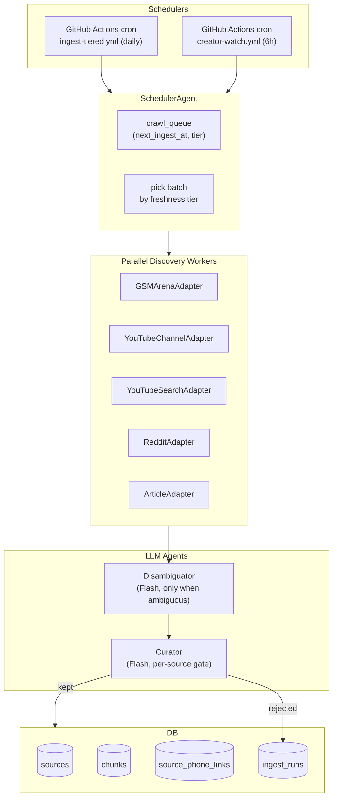

# Automated Ingestion Pipeline — End-to-End Design

> Save this document at [`docs/implementationPlans/automated-ingestion-pipeline.md`](docs/implementationPlans/automated-ingestion-pipeline.md) as the first todo after approval.

## 1. Problem Today

- `/p/[slug]` "Ask about this phone" returns the no-corpus honesty copy ("run `pnpm ingest --phone <slug>`") because the nightly cron in [`.github/workflows/ingest.yml`](.github/workflows/ingest.yml) only iterates **four hand-listed phones**, YouTube `discover()` runs generic search queries (not creator-focused), GSMArena isn't an adapter, and article discovery is a **no-op** — reviews only arrive via manual `--url`.
- The orchestrator works end-to-end (writer is idempotent; `content_hash` dedupe is solid), so this plan extends rather than rewrites it.

## 2. Target Architecture



Each worker is a **pure async function** (discover → fetch → chunk). The `Curator` is the single LLM bottleneck; `Disambiguator` only fires when titles mention >1 phone.

## 3. Freshness Tiers & Scheduling

Add to [`src/services/db/schema.ts`](src/services/db/schema.ts) `phones` table:

- `lastIngestAt timestamptz`
- `nextIngestAt timestamptz` (index)
- `ingestTier text` — computed column or derived from `launchDate`:
  - **`hot`** — `launchDate >= now() - 60d` or `status='upcoming'` → re-ingest every **3 days**.
  - **`warm`** — `60d < age <= 180d` → every **7 days**.
  - **`cold`** — age > 180d → every **14 days**.

The scheduler picks `N` phones where `next_ingest_at <= now()` ordered by tier then `last_ingest_at asc`. Daily batch ≈ 10 phones × 3 adapters = manageable inside Gemini free tier.

## 4. New / Modified Adapters

### 4a. `GSMArenaAdapter` (new) — [`src/services/ingest/adapters/gsmarena.ts`](src/services/ingest/adapters/gsmarena.ts)

- **Discovery:** combine three strategies, dedupe by canonical URL:
  1. Device lookup: `https://www.gsmarena.com/res.php3?sSearch={brand}+{model}` → scrape the phone's maker page → its review link (`*-review-*.php`).
  2. Deep-link overrides from `phones.raw_json.gsmarenaUrl` (seeded manually where the slug is unambiguous).
  3. Sitemap poll (`/news-sitemap.xml`) for news mentions (optional tier-2).
- **Fetch:** reuses `ArticleAdapter`'s Readability path. GSMArena serves static HTML — Readability extracts it cleanly.
- **Politeness:** dedicated per-host limiter at **1 req / 4 s** with ±1 s jitter; respects `Retry-After`; User-Agent identifies us with contact URL; single concurrency.

### 4b. `YouTubeChannelAdapter` (new)

- **Allowlist** stored in `creator_profiles` table (seeded):
  ```
  MKBHD           UCBJycsmduvYEL83R_U4JriQ
  Mrwhosetheboss  UCMiJRAwDNSNzuYeN2uWa0pA
  TheTechChap     UCzlXf-yUIaOpOjEjPrOO9TA
  SuperSaf        UCIrrRLyFMVmmL9NDAU2obJA
  TheUnlockr      UCaDBRJTQhIg_QhCkW7SxWGQ
  MrMobile        UCSOpcUkE-is7u7c4AkLgqTw
  ```
- **Discovery is poll-based, not search-based.** Hit `https://www.youtube.com/feeds/videos.xml?channel_id={id}` (no API key, no quota) per channel every 6 h. For each new video title:
  1. Phone-alias match against `phone_aliases` table.
  2. If exactly one match → queue candidate.
  3. If >1 match (e.g. "S25 Ultra vs Pixel 9 Pro") → send title + description to `Disambiguator` which returns `primaryPhoneId` + `alsoAboutPhoneIds[]`.
- **Fetch / chunk:** unchanged — reuses the existing 3-tier transcript chain in [`src/services/ingest/adapters/youtube.ts`](src/services/ingest/adapters/youtube.ts). Datacenter-IP transcript failures are still a known limit — the source is simply skipped with a logged `ingest_runs.status='failed'`.

### 4c. `YouTubeSearchAdapter` (existing, keep)

- Only runs on **hot-tier** phones to catch creators not on the allowlist (e.g. launch-window reviewers) — at most 2 queries per phone per run.

### 4d. `RedditAdapter` (extend existing)

- Expand `ALLOWED_SUBREDDITS` with device-specific: `r/Pixel9Pro`, `r/iPhone16ProMax`, `r/S25Ultra`, `r/OnePlus13`, `r/Nothing`, `r/Xiaomi`, `r/Motorola`, etc. — added progressively as phones are seeded; map in `subreddit_profiles` table.
- Poll `/r/{sub}/new.json` every 24 h in addition to the search path so we catch threads before they peak.

## 5. The Two LLM Agents

### 5a. `DisambiguatorAgent` ([`src/services/ingest/agents/disambiguator.ts`](src/services/ingest/agents/disambiguator.ts))

- Input: `{title, description, knownPhoneCandidates[]}`.
- **Only invoked when heuristic matches ≥ 2 phones.** Pure JSON output via `generateObject` (Gemini Flash, `LLM_CACHE_ENABLED=true` keys on `hash(title+desc)`).
- Output schema:
  ```ts
  {
    primaryPhoneId: string | null,       // the phone the content focuses on
    alsoAboutPhoneIds: string[],         // others meaningfully discussed
    confidence: 'high' | 'medium' | 'low',
    reason: string,
  }
  ```
- `low` confidence or `primaryPhoneId: null` → dropped with `ingest_runs.status='skipped'` (reason: `disambiguation-low-confidence`).

### 5b. `CuratorAgent` ([`src/services/ingest/agents/curator.ts`](src/services/ingest/agents/curator.ts))

Runs **once per fetched source**, after chunking but before embedding. Gates the whole source (cheapest: one Flash call per source, not per chunk).

- Input: `{phone, sourceType, title, firstChunks[0..2], sourceMetadata}`.
- Output schema:
  ```ts
  {
    keep: boolean,
    relevance: 0..1,                         // how much of the content is about THIS phone
    quality: 0..1,                           // review depth vs. news blurb / rant
    aspectsCovered: Array<'camera'|'battery'|'performance'|'display'|'build'|'software'|'value'>,
    sentimentSummary: 'positive' | 'mixed' | 'negative' | 'neutral',
    reason: string,
  }
  ```
- Thresholds (tunable): `keep && relevance >= 0.5 && quality >= 0.4`. Rejects persist in `ingest_runs.error` so operators can audit false negatives.

**Why gate at source level, not chunk level:** one source is ~10 chunks; gating at chunk level would quintuple LLM calls for marginal precision gain. The later hybrid retrieval + aspect scorecard already does per-chunk relevance.

## 6. Schema Changes

New migrations via `pnpm db:generate`:

- **`phones`** add `lastIngestAt`, `nextIngestAt`, `ingestTier` columns.
- **`phone_aliases`** new table: `(phoneId, alias text, priority int)` — e.g. `"S25 Ultra"` → `samsung-galaxy-s25-ultra`, `"iphone 16 pm"` → `apple-iphone-16-pro-max`. Needed for robust fuzzy matching against YouTube titles / Reddit posts.
- **`creator_profiles`** new table: `(platform, externalId, handle, trustWeight numeric(3,2), lastPolledAt, status)`.
- **`subreddit_profiles`** new table: `(name, scope text, minScore int, lastPolledAt, status)`.
- **`domain_profiles`** new table: `(host, trustWeight, rateLimitMs int, robotsRespected bool, status)` — seeds: gsmarena.com, theverge.com, techradar.com, gsmarena.com, 9to5google.com, etc.
- **`source_phone_links`** new **many-to-many** table: `(sourceId, phoneId, role text ['primary'|'secondary'], relevance numeric(3,2))`. Comparison videos get one `primary` row + N `secondary` rows so `/p/[slug]` can surface them. `chunks.phoneId` stays denormalised for fast retrieval, always pointing to the `primary`.
- **`sources`** additions to enrich without breaking today's reads:
  - `relevance numeric(3,2)`, `quality numeric(3,2)` (Curator output)
  - `sentimentSummary text`
  - `aspectsCovered text[]` (from Curator)
  - `viewCount int`, `engagementScore numeric`
  - `retrievedAt`, `publishedPrecision` enum (`day`/`month`/`year`)
- **`ingest_runs`** additions: `tier text`, `discoveryStrategy text`, `rejectedReason text`.
- **`crawl_queue`** new table: `(id, phoneId, adapter, tier, scheduledFor, attempts, lastError)`. Lets the scheduler retry transient failures without re-picking the whole phone.
- **`rate_limit_state`** new table: `(host, windowStart, reqCount, nextAllowedAt)` — shared limiter state so parallel GH-Actions jobs don't race.

RLS: all new tables are service-role-only (same pattern as `sources`/`ingest_runs`).

## 7. Anti-Ban / Politeness Layer

Create [`src/services/ingest/http.ts`](src/services/ingest/http.ts) — **every adapter switches to this**; ad-hoc `fetch()` calls are removed from adapters.

- **Per-host token-bucket rate limiter**, config from `domain_profiles.rateLimitMs`. Persists `nextAllowedAt` in `rate_limit_state` so multiple GH-Actions shards cooperate. Defaults:
  - `gsmarena.com` — 1 req / 4 s
  - `reddit.com` — 1 req / 2 s
  - `youtube.com` — 1 req / 1 s (search is cheap, transcript scraping is the limiter)
  - Generic editorial → 1 req / 3 s
- **Jitter:** ±40% uniform on every delay.
- **Exponential backoff** via `p-retry` already in place; respect `Retry-After` explicitly.
- **User-Agent rotation from a small pool** (3 variants, each still self-identifying with contact URL — we're a polite bot, not a stealth scraper).
- **robots.txt cache:** fetch once per host per 24h, stored in `domain_profiles.robotsJson`. Adapters call `http.isAllowed(url)` before fetching; denied URLs throw `NotFoundError`.
- **Stagger:** cron kicks at `:17` past the hour (already) + scheduler shuffles phone-order by `hash(slug + dayOfYear) % N` so the same host isn't slammed first every day.
- **Scope discipline:** only **GET**, only **public** URLs, never authenticated endpoints, never login walls.

## 8. Scheduling & Deployment (zero cost)

All workloads live on **GitHub Actions** (free 2 000 min/mo on public repos; this pipeline ≈ 400 min/mo amortised).

Workflows (replacing/extending [`.github/workflows/ingest.yml`](.github/workflows/ingest.yml)):

- **`ingest-tiered.yml`** — daily at 03:17 UTC.
  - Step 1 picks up to **12 phones** with `nextIngestAt <= now()`, prioritising `hot → warm → cold`.
  - Uses matrix strategy (`max-parallel: 3`) to run 3 phones concurrently × 4 shards = 12 phones / run.
  - Each shard runs `pnpm ingest --phone <slug> --auto` which invokes the **SchedulerAgent** + all enabled adapters.
  - On completion: updates `phones.nextIngestAt = now() + tierInterval`.

- **`creator-watch.yml`** — every 6 h.
  - Cheap: polls the 6 channel RSS feeds (≤ 6 HTTP requests) + subreddit `new.json` feeds.
  - Invokes `YouTubeChannelAdapter.discover()` only — produces queue rows in `crawl_queue` for the tiered job to pick up (keeps heavy transcript + embed work out of the frequent cron).

- **`ingest-on-new-phone.yml`** — `workflow_dispatch` + triggered by new-seed commits; runs a priority one-off ingest for just-added slugs.

- **`ingest-backfill.yml`** — `workflow_dispatch` (existing `pnpm ingest --phone X` path kept for operator overrides).

**Compute envelope check (back-of-envelope):**

- Gemini Flash free tier: 15 RPM, 1M tokens/day.
- Curator: ~12 phones × 3 adapters × avg 3 kept sources × 800 input tokens ≈ 86 k tokens/day. Well under.
- Disambiguator: fires on maybe 20% of candidates × ~12 phones × ~20 candidates × 300 tokens ≈ 14 k tokens/day.
- Embeddings: ~12 phones × ~30 new chunks/day × 500 tokens ≈ 180 k tokens/day embed — also under.
- GitHub Actions: tiered ≈ 10 min/run × 30 = 300 min, plus creator-watch ≈ 2 min × 4/day × 30 = 240 min → 540 min/mo. Under 2 000.

## 9. Code Layout & Changes

```
src/services/ingest/
  adapters/
    gsmarena.ts                    # NEW
    youtube-channel.ts             # NEW (RSS-based)
    youtube.ts                     # existing, unchanged
    reddit.ts                      # add new-post polling method
    article.ts                     # unchanged, reused by gsmarena
  agents/
    disambiguator.ts               # NEW — Gemini Flash + zod
    curator.ts                     # NEW — Gemini Flash + zod
  scheduler/
    pick-phones.ts                 # NEW — reads crawl_queue, tier logic
    enqueue.ts                     # NEW — creates crawl_queue rows
  http.ts                          # NEW — rate-limited fetch, UA pool, robots
  rate-limit.ts                    # NEW — token bucket backed by rate_limit_state
  orchestrator.ts                  # add: Curator gate + source_phone_links write
  writer.ts                        # add: relevance/quality/aspectsCovered columns
scripts/
  ingest.ts                        # add --auto flag (scheduler picks phones)
  ingest-auto.ts                   # NEW entrypoint used by cron
  seed/creator-profiles.ts         # NEW
  seed/subreddit-profiles.ts       # NEW
  seed/domain-profiles.ts          # NEW
  seed/phone-aliases.ts            # NEW
.github/workflows/
  ingest-tiered.yml                # NEW (replaces schedule block of ingest.yml)
  creator-watch.yml                # NEW
  ingest-on-new-phone.yml          # NEW
docs/implementationPlans/
  automated-ingestion-pipeline.md  # this document
docs/ingest/README.md              # extend with curator/scheduler/rate-limit sections
docs/adr/0014-automated-ingestion-curation.md  # NEW ADR
```

**Application-layer downstream:** the phone chat no-corpus copy in [`src/app/p/[slug]/phone-chat.tsx`](src/app/p/[slug]/phone-chat.tsx) changes from "run `pnpm ingest`" (developer-facing) to **"We're still gathering reviews for this phone — check back soon. Usually ≤ 72 hours after launch."** — dynamic based on `phones.lastIngestAt`.

## 10. Quality / Filtering Mechanism (pollution guard)

Layered — each cheaper than the next, early exits protect the budget:

1. **Alias exact/fuzzy match** (free, deterministic) — reject if title doesn't mention the phone.
2. **Source trust weight** (free) — reject if `domain_profiles.trustWeight < 0.3` or domain not allowlisted.
3. **Engagement floor** (free) — Reddit score ≥ 20, YouTube views ≥ 10 k (tunable by creator).
4. **Content-hash dedupe** (existing) — `sources.content_hash`.
5. **Near-duplicate via embedding cosine** — compare the embedding of chunk 0 against existing chunks of the same phone; if `> 0.92` cosine, mark as duplicate and skip. Prevents re-chunking syndicated/reposted content.
6. **Curator LLM gate** (1 Flash call) — `keep + relevance ≥ 0.5 + quality ≥ 0.4`.
7. **Post-hoc audit view** — new `ingest_quality_audit` SQL view aggregating rejects by reason for weekly review.

## 11. Observability

- Every `ingest_runs` row now carries `tier`, `discoveryStrategy`, `rejectedReason`.
- `pino` child loggers per agent (`curator`, `disambiguator`, `scheduler`).
- New `scripts/ingest-report.ts` prints a 24h digest: sources added / rejected (by reason) / failed (by adapter) / phones still unvisited — runs as a comment on a stale GH Issue for auditability.

## 12. Reviewed Risks & Mitigations

| Risk                                                                  | Likelihood | Mitigation                                                                                                                                                                                    |
| --------------------------------------------------------------------- | ---------- | --------------------------------------------------------------------------------------------------------------------------------------------------------------------------------------------- |
| GSMArena blocks our IP / returns Cloudflare challenge                 | Medium     | Respect robots.txt, 1 req/4s, realistic UA, stop & alert if `hash(body) == known-challenge-hash`; degrade to skip.                                                                            |
| YouTube transcripts keep failing on datacenter IPs (known limit)      | High       | Accept; `creator-watch.yml` still captures metadata + descriptions so we at least surface "latest MKBHD said …".                                                                              |
| Gemini free-tier 15 RPM throttles during bursts                       | Medium     | `p-limit(concurrency: 1)` on Curator calls + `p-retry` already handles 429; cron timing spreads load.                                                                                         |
| GH Actions 2 000 min quota exhaustion                                 | Low        | Budget above is 540 min; keep ≤ 70% headroom for reruns. Public-repo grant is effectively unlimited; we're on one.                                                                            |
| Curator false negatives (good review dropped)                         | Medium     | `ingest_runs.rejectedReason` audited weekly; thresholds tunable; `--force` override in CLI.                                                                                                   |
| Schema migration conflicts with in-flight ingest                      | Low        | New columns are nullable; migrations ship before code references them. Drizzle `db:generate → db:migrate` staged.                                                                             |
| Disambiguator flips randomly across runs → chunks flap between phones | Medium     | Cache by `hash(title+desc)` in `llm_cache`; confidence < `high` never writes to `source_phone_links`.                                                                                         |
| Residential-IP ban escalates                                          | Low        | Contact URL in UA + `robots.txt` respect + conservative rates; if ever banned, adapter auto-disables for 72h.                                                                                 |
| Legal / ToS gray area (GSMArena scraping, YouTube transcripts)        | Medium     | We fetch only public pages, store excerpts not full content, cite source URLs in UI. Non-commercial disclosure in UA. This project is portfolio/learning per README — documented in ADR 0014. |
| Reddit killing free JSON API                                          | Medium     | Already happened once (2023); we degrade to "reddit disabled" and keep other sources. No core dependency.                                                                                     |

## 13. Phased Rollout

- **Phase A** — schema + politeness foundation (no new content yet):
  migrations for new columns/tables, `http.ts` + `rate-limit.ts`, seed `domain_profiles` / `creator_profiles` / `subreddit_profiles` / `phone_aliases`, unit tests.
- **Phase B** — Curator + Disambiguator agents + orchestrator wiring, keep existing adapters unchanged.
- **Phase C** — new `GSMArenaAdapter`, `YouTubeChannelAdapter`; scheduler; `crawl_queue`.
- **Phase D** — new GH Actions workflows; retire the hand-coded nightly roster.
- **Phase E** — UI polish (phone-chat empty-corpus copy) + ingest-report + weekly audit review.

Each phase ends green on `pnpm typecheck && pnpm test && pnpm lint`, with an ADR-0014 update documenting what landed.

## 14. Open Questions (flag for confirmation before implementation)

- Confirm `ingestTier` stays derived (cheap, always fresh) vs. persisted column (joins simpler, needs backfill job). Recommending derived.
- Confirm acceptable to **drop the Python plan from ADR 0003** forever — answer: yes, this is purely TS.
- Curator thresholds (`relevance ≥ 0.5`, `quality ≥ 0.4`) are starting values; plan a 1-week audit window before locking.
