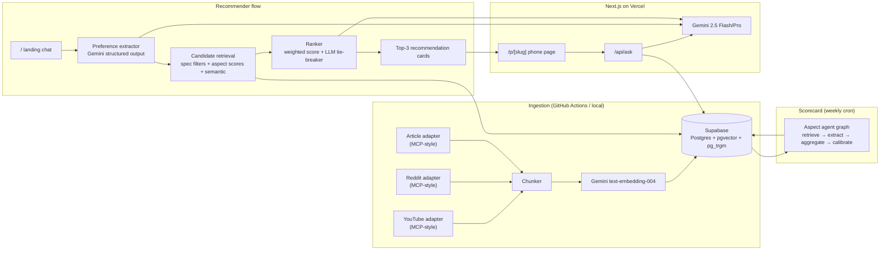

# RECSY v2 — Project Context

> **Purpose.** This is the single source of truth for what RECSY v2 is, why it
> exists, how it works, and where it's going. It is a **living document** —
> every phase update edits this file. If a decision isn't captured here, it
> doesn't exist.

**Status.** Phase 1 shipped on 2026-04-21 (DB + data model + seed corpus).
Phase 0 (scaffold + design system + service skeletons) shipped on
2026-04-19. Phase 2 (Python ingestion adapters) is next.

---

## Table of Contents

1. [Executive Summary](#1-executive-summary)
2. [Origin Story](#2-origin-story)
3. [Product Vision & Positioning](#3-product-vision--positioning)
4. [Honest Defensibility Statement](#4-honest-defensibility-statement)
5. [Target Users & Use Cases](#5-target-users--use-cases)
6. [Feature Inventory](#6-feature-inventory)
7. [System Architecture](#7-system-architecture)
8. [Tech Stack](#8-tech-stack)
9. [Data Model](#9-data-model)
10. [Retrieval & Chat Q&A Pipeline](#10-retrieval--chat-qa-pipeline)
11. [Recommender Pipeline](#11-recommender-pipeline)
12. [Aspect Scorecard Agent](#12-aspect-scorecard-agent)
13. [Ingestion Pipeline (MCP-style adapters)](#13-ingestion-pipeline-mcp-style-adapters)
14. [LLM Infrastructure](#14-llm-infrastructure)
15. [Design System](#15-design-system)
16. [Observability, Ops & Security](#16-observability-ops--security)
17. [Testing Strategy](#17-testing-strategy)
18. [CI/CD & Deployment](#18-cicd--deployment)
19. [Project Phases & Progress](#19-project-phases--progress)
20. [Open Questions & Future Work](#20-open-questions--future-work)
21. [Glossary](#21-glossary)
22. [Change Log](#22-change-log)

---

## 1. Executive Summary

**RECSY v2** is a web-first, AI-native smartphone companion that combines two
experiences on one site:

- **Conversational recommender.** The landing page is a chat intake. A user
  describes what they care about in plain English; an LLM extracts structured
  requirements; a hybrid retriever picks 3 phones and explains why.
- **Per-phone consensus engine.** Each phone has a dedicated page with a
  seven-axis aspect scorecard (camera, battery, performance, display, build,
  software, value) aggregated from YouTube, Reddit, and editorial reviews —
  and a chat Q&A where every answer is grounded in cited source excerpts
  (YouTube deep-links include timestamps).

**Stack summary.** Next.js 16 · Drizzle ORM → Supabase Postgres + pgvector ·
Gemini 2.5 Flash/Pro via Vercel AI SDK · Python 3.12 ingestion (added Phase 4).
Runs entirely on free tiers.

**This is a portfolio/learning project.** See
[§4 Honest Defensibility Statement](#4-honest-defensibility-statement). The
goal is to ship a production-quality application, not to out-compete
general-purpose LLMs at the review-summarisation task.

---

## 2. Origin Story

The original **RECSY** was a 2020 undergraduate project: a Flutter mobile app
that asked the user 6–8 preference questions, fed them to a bespoke Keras
model exported to TensorFlow Lite, and returned a recommended smartphone. The
dataset was a hand-curated CSV; ~100 phones.

By 2026 this approach is dead. Users ask ChatGPT/Gemini the same question and
get a synthesised answer sourced from the live web. The app's value
proposition — "ask questions, get a phone" — has been fully absorbed by
general-purpose assistants.

The original project files live under [`legacy/`](../legacy) for reference.

**What we keep from v1.**

- The _recommender_ as the primary entrypoint (spiritual continuity).
- Brand colors (orange + cyan/turquoise), re-authored in OKLCH.
- The insight that users want picks, not endless listicles.

**What we throw out.**

- The Flutter stack (mobile-first, app-store distribution).
- The bespoke ML pipeline (LLMs subsume that work).
- The static CSV (replaced by a living corpus of source-backed chunks).

---

## 3. Product Vision & Positioning

**One-liner.** "Ask what matters. Get the phone that actually fits you —
grounded in real reviews, with receipts."

**What the user gets.**

- A **pick**, not a list. Top 3 phones, ranked, with a headline and explicit
  trade-offs for each.
- A **receipt for every claim.** No floating statements. If we say "the X95
  has the best battery in its price bracket," it links to the reviewer clip
  that said so, with a timestamp.
- A **plain-English Q&A** on each phone page that answers follow-ups grounded
  in the corpus, with inline citations.

**Explicit non-goals.**

- Not a used-phone marketplace.
- Not a price-tracker / deal site (initially).
- Not a forum / social product.
- Not trying to beat Rtings / GSMArena at technical specs — we _cite_ them.

---

## 4. Honest Defensibility Statement

Generalist LLMs (GPT-5.x, Gemini 2.5+, Claude 4.x) can already summarise phone
reviews from web search. Within 12 months they will do it better than any
bespoke pipeline we can build on a free tier. **We accept this.**

RECSY v2 is therefore shipped as a **portfolio / learning project** with these
intentional goals:

1. **Demonstrate modern retrieval + agent engineering** end-to-end — hybrid
   RAG, structured-output agents, MCP-style ingestion adapters, LLM response
   caching, observability.
2. **Produce a polished, self-contained product** that a recruiter or
   collaborator can use, inspect, and form an opinion from.
3. **Build muscle** around the full production cycle: strict TypeScript, DI,
   migrations, RLS, ADRs, CI, testing, LLM evaluation.

Durability features we _do_ invest in (because they're good engineering, not
moats):

- **Transparent methodology** — aspect definitions, weights, and retrieval
  prompts are data (`aspect_definitions`) not code, versioned and auditable.
- **Citation fidelity** — claim-level citation validation in the chat
  pipeline (a claim without a supporting chunk is rejected).
- **Source-tier awareness (deferred)** — the schema leaves room for a future
  reputation signal per source.

---

## 5. Target Users & Use Cases

### Primary persona — "overwhelmed buyer" (Rahul, 27, India/US/UK/global English)

Has a rough budget, three or four non-negotiables, and 45 minutes before
pulling the trigger on a phone they'll live with for 2 years. Doesn't want
to watch four 30-minute reviews. Trusts picks more than rankings.

### Secondary persona — "skeptical researcher"

Already has a shortlist; wants to stress-test it. Lands on `/p/<slug>` pages,
opens the consensus scorecard, asks specific follow-ups ("does the camera
struggle at night?", "is the battery really that good?").

### Tertiary — "just browsing"

Lands on `/browse`, filters by price & form factor. (Phase 3+.)

### Core user flows

| #   | Flow                     | Entry                            | Exit                                       |
| --- | ------------------------ | -------------------------------- | ------------------------------------------ |
| U1  | Conversational recommend | `/` landing chat                 | 3-card pick → click through to `/p/<slug>` |
| U2  | Consensus & Q&A          | `/p/<slug>`                      | Answer with citations → buy-link / browse  |
| U3  | Browse & filter          | `/browse` (Phase 3+)             | Phone page                                 |
| U4  | Compare two phones       | `/compare/<a>-vs-<b>` (Phase 5+) | Phone page                                 |

### Non-users we explicitly decline to serve

- Users wanting a used-phone price valuation.
- Users wanting a storefront checkout.
- Users under ~$150 budget in unsupported regions (Phase 1 seed list skews
  global-flagship; regional depth comes later).

---

## 6. Feature Inventory

**Legend.** ✓ = shipped, ▲ = in progress, ◯ = planned.

| Feature                               | Status | Phase | Notes                                          |
| ------------------------------------- | ------ | ----- | ---------------------------------------------- |
| Landing hero placeholder              | ✓      | 0     | Real conversational intake arrives Phase 5     |
| Dark/light theme (OKLCH tokens)       | ✓      | 0     | Dark default, `next-themes`, AA contrast       |
| `/api/health` liveness probe          | ✓      | 0     |                                                |
| Typed env validation                  | ✓      | 0     | `@t3-oss/env-nextjs` + Zod                     |
| LLM provider abstraction              | ✓      | 0     | Gemini impl + cache decorator                  |
| Drizzle schema (12 tables, 8 enums)   | ✓      | 0     |                                                |
| Postgres extensions bootstrapped      | ✓      | 1     | pgvector, pg_trgm, pgcrypto (pg_cron deferred) |
| Initial migration applied             | ✓      | 1     | All tables + HNSW (cosine) indexes             |
| RLS policies                          | ✓      | 1     | default-deny + anon read on public tables      |
| `PhoneSpec` Zod schema                | ✓      | 1     | `src/features/phones/schema.ts`                |
| Aspect definitions seeded             | ✓      | 1     | 7 aspects, weights sum to 1.0                  |
| Starter phone corpus (20 phones)      | ✓      | 1     | budget→flagship, 6 brands, 1 foldable          |
| `db:setup` orchestrator + `db:smoke`  | ✓      | 1     | 6/6 smoke checks incl. HNSW round-trip         |
| MCP-style ingestion adapters          | ◯      | 2     | Python; YouTube, Reddit, articles              |
| Hybrid retrieval (vector + FTS + RRF) | ◯      | 3     | + MMR + source coverage                        |
| Per-phone page & chat Q&A             | ◯      | 3     |                                                |
| Aspect scorecard agent graph          | ◯      | 4     |                                                |
| Conversational recommender            | ◯      | 5     | Replaces landing placeholder                   |
| Browse + filter                       | ◯      | 6     |                                                |
| Compare (two phones)                  | ◯      | 7     |                                                |
| PWA install + offline shell           | ◯      | 7     |                                                |
| LLM evaluation harness in CI          | ◯      | 3+    | Gated by eval set                              |

---

## 7. System Architecture

High-level:



### Runtime boundaries

| Layer                                       | Runtime                      | Notes                                             |
| ------------------------------------------- | ---------------------------- | ------------------------------------------------- |
| Edge (`middleware.ts`, future rate-limiter) | Edge                         | Supabase REST only (cannot use `postgres` driver) |
| Route handlers & server components          | Node.js                      | Drizzle + `postgres` driver OK                    |
| Ingestion pipeline                          | Python 3.12 / GitHub Actions | Writes via service role                           |

### Data flow (simplified, user asks a question on a phone page)

1. Browser → `POST /api/ask` `{ phoneSlug, query }`
2. Zod validates input; trace id created; rate limit checked.
3. Server fetches phone by slug; builds a retrieval context scoped to its
   chunks.
4. Hybrid retrieval: embedding cosine top-K + FTS top-K + RRF; MMR dedup;
   source-coverage; LLM rerank.
5. Gemini Flash streams answer with citations; we validate each claim has a
   supporting chunk id.
6. Response streamed to client; query logged to `chat_queries` for analytics.

---

## 8. Tech Stack

### Frontend

| Concern   | Choice                                           | Version | Why                             |
| --------- | ------------------------------------------------ | ------- | ------------------------------- |
| Framework | Next.js (App Router)                             | 16.2    | RSC, typed routes, streaming    |
| Runtime   | React                                            | 19.2    | Concurrent features, `use`      |
| Language  | TypeScript (strict + `noUncheckedIndexedAccess`) | 5.9     | Catch bugs early                |
| Styling   | Tailwind CSS                                     | 4.2     | CSS-first config, native OKLCH  |
| Theme     | `next-themes`                                    | 0.4     | Dark default, `data-theme` attr |
| Icons     | `lucide-react`                                   | 1.x     | Tree-shakable                   |
| Animation | `motion` (fka Framer)                            | 12.x    | `prefers-reduced-motion` aware  |
| Forms     | `react-hook-form` + Zod                          | TBD     | Added Phase 5 intake            |
| State     | `@tanstack/react-query`                          | 5.x     | Client caching                  |
| Toast     | `sonner`                                         | 2.x     | Accessible                      |

### Backend / data

| Concern              | Choice                  | Version  | Why                                  |
| -------------------- | ----------------------- | -------- | ------------------------------------ |
| DB                   | Supabase Postgres       | 17.6     | Free tier + pgvector                 |
| Vector search        | pgvector (HNSW, cosine) | latest   | No extra infra                       |
| Text search          | `pg_trgm` + tsvector    | built-in | Hybrid with vector                   |
| Scheduler            | `pg_cron`               | latest   | Cache eviction, cleanup              |
| ORM                  | Drizzle                 | 0.45     | Type-safe, migration-first           |
| Client-side DB proxy | `@supabase/supabase-js` | 2.x      | For anon RLS-scoped queries          |
| Driver               | `postgres` (Porsager)   | 3.4      | Fast, `prepare: false` for pgbouncer |

### AI

| Concern            | Choice                              | Version | Why                                 |
| ------------------ | ----------------------------------- | ------- | ----------------------------------- |
| LLM SDK            | Vercel AI SDK                       | 6.x     | `generateObject`, streaming         |
| Primary provider   | `@ai-sdk/google` → Gemini 2.5 Flash | 3.x     | Free tier, fast, structured output  |
| Reasoning model    | Gemini 2.5 Pro                      | —       | Aspect extraction, ranker tie-break |
| Fallback (planned) | Groq Llama 3.3                      | —       | Provider diversity                  |
| Embeddings         | `text-embedding-004`                | —       | 768 dim, free tier                  |
| Schema             | Zod v4                              | 4.x     | Runtime validation of LLM output    |

### Ingestion (Phase 2)

Python 3.12 · `uv` · `ruff` · `mypy` · `pydantic` v2 · `youtube-transcript-api`
· `yt-dlp` · `praw` · `tenacity`.

### DevOps

| Concern         | Choice                                     |
| --------------- | ------------------------------------------ |
| Package manager | pnpm 10                                    |
| Logging         | `pino` structured JSON                     |
| Error tracking  | Sentry (optional, env-gated)               |
| Analytics       | Vercel Analytics (future)                  |
| Host            | Vercel (Hobby)                             |
| CI              | GitHub Actions                             |
| Tests           | Vitest (unit) · Playwright (E2E, Phase 3+) |
| Pre-commit      | Husky + lint-staged + commitlint           |

---

## 9. Data Model

The canonical source is [`src/services/db/schema.ts`](../src/services/db/schema.ts).
Conventions enforced in review:

- UUID PKs (`gen_random_uuid()`).
- `timestamptz` for all timestamps.
- Enums for all finite sets (never raw `text`).
- `onDelete` defaults to `restrict`; `cascade` only when child is owned by parent.
- Embeddings stored as `vector(768)` with HNSW index, cosine operator class.

### Tables (Phase 1)

| Table                     | Purpose                                     | Key columns                                                                              |
| ------------------------- | ------------------------------------------- | ---------------------------------------------------------------------------------------- |
| `phones`                  | Canonical phone entities                    | `slug`, `brand`, `model`, `spec_json`, `spec_embedding`, `status`, `region_availability` |
| `sources`                 | Ingested artefacts (video, thread, article) | `phone_id`, `type`, `url`, `content_hash`, `published_at`, `status`                      |
| `chunks`                  | Retrievable text chunks                     | `source_id`, `phone_id`, `text`, `embedding`, `start_ts`, `anchor`, `tokens`             |
| `aspect_definitions`      | Methodology — aspects are data              | `aspect`, `version`, `description`, `query_prompts`, `default_weight`                    |
| `aspects`                 | Current score per phone × aspect            | `phone_id`, `aspect_definition_id`, `score`, `confidence`, supporting/dissenting quotes  |
| `recommendation_sessions` | One per browser session (hashed)            | `session_cookie`, `ip_hash`, `status`                                                    |
| `recommendation_turns`    | Per-message state in a session              | `user_message`, `extracted_requirements`, `candidate_phone_ids`, `picks`                 |
| `recommendation_feedback` | User signals on picks                       | `turn_id`, `phone_id`, `event`                                                           |
| `chat_queries`            | Per-phone Q&A log (analytics)               | `phone_id`, `query`, `answer`, `citations`, `model`, `latency_ms`                        |
| `llm_cache`               | LLM response cache (sha256 prompt key)      | `prompt_hash`, `model`, `response`, `hits`                                               |
| `ingest_runs`             | Ingestion telemetry                         | `adapter`, `status`, `chunks_created`, `error`                                           |
| `rate_limits`             | IP-window counters                          | `key`, `window_start`, `count`                                                           |

### Enums

`phone_status`, `source_type`, `source_status`, `aspect`, `recommendation_intent`,
`session_status`, `feedback_event`, `ingest_status`.

### Indexing strategy

- **HNSW (cosine)** on `chunks.embedding` and `phones.spec_embedding` — vector search.
- **B-tree** on `phones.brand`, `phones.status`, `chunks.phone_id`, `chunks.source_id`.
- **tsvector** FTS index on `chunks.text` (added Phase 3 when hybrid retrieval lands).
- **Unique constraints** on `phones.slug`, `(sources.phone_id, sources.url)`,
  `(aspects.phone_id, aspects.aspect_definition_id)`.

### RLS posture

- All tables: **default-deny**.
- `anon` role: `SELECT` on `phones`, `aspects`, `aspect_definitions`, `sources` (public),
  `chunks` (public read), `chat_queries` and `recommendation_*` restricted to
  own-session via cookie match.
- `service_role` (server-only): full access. Used by server route handlers
  via the service-role key.

Applied via `drizzle/sql/999_rls.sql` (see Phase 1).

---

## 10. Retrieval & Chat Q&A Pipeline

Phase 3 deliverable. High-level steps for an ask-phone-Q&A call:

1. **Input validation.** Zod parses `{ phoneSlug, query }`; `query` ≤
   `MAX_CHAT_MESSAGE_BYTES` (4 KB); trace id generated.
2. **Rate limit.** IP hash keyed, 1-minute + 1-hour windows, checked against
   `rate_limits`.
3. **Intent guard.** A cheap Flash call classifies the query as `factual`,
   `opinion`, `comparison`, or `off-topic`. Off-topic short-circuits to a
   polite refusal.
4. **Query decomposition (HyDE).** For semantic queries, generate a
   hypothetical answer and use its embedding alongside the literal query.
5. **Hybrid retrieval.**
   - Top-K vector search (cosine) scoped to the phone.
   - Top-K FTS search (tsvector + trigram fallback).
   - Reciprocal Rank Fusion (RRF) merges ranks.
6. **MMR + source coverage.** `MMR_LAMBDA = 0.6` balances relevance vs
   diversity; ensure ≥3 distinct sources in the final context.
7. **LLM rerank.** Gemini Flash re-orders the top 12 → top 8 with a single
   structured call.
8. **Answer generation.** Flash streams the answer with **inline claim tags**
   (`[chunk-id]`). A post-processor validates every tag resolves to a chunk
   in the retrieved set; unresolved tags trigger a retry with a stricter
   system prompt.
9. **Logging.** Query, citations, latency, model, and `retrieved_chunk_ids`
   written to `chat_queries`.

Caching: Steps 3, 4, 7 are cached via `CachedLlmProvider`. Step 8 streams and
bypasses the cache by design.

---

## 11. Recommender Pipeline

Phase 5 deliverable. Three-stage:

### Stage A — Preference extraction (`UserRequirements`)

Structured-output Gemini Flash call. Zod schema:

```ts
interface UserRequirements {
  budget_usd: { min?: number; max: number } | null;
  priorities: Array<{
    aspect: 'camera' | 'battery' | 'performance' | 'display' | 'build' | 'software' | 'value';
    weight: number; // 0–1, sums to 1
  }>;
  must_haves: string[];
  deal_breakers: string[];
  use_cases: string[];
  form_factor: {
    screen_size_range_in?: [number, number];
    weight_max_g?: number;
    foldable?: boolean;
  };
  brand_preference: { liked: string[]; disliked: string[] };
  confidence: number; // 0–1
  clarifying_question?: string; // present iff confidence < threshold
}
```

Multi-turn sessions merge requirements across turns. If
`confidence < RECOMMENDER_CLARIFY_THRESHOLD` (0.6), emit
`clarifying_question` and wait for next user message.

### Stage B — Candidate retrieval

1. **Hard filter** by `spec_json` (budget, foldable, region availability).
2. **Soft filter** by must-haves / deal-breakers (penalty, not exclusion).
3. **Aspect score join** — weight aspects by user priorities.
4. **Semantic retrieval** over `phones.spec_embedding` using the
   `use_cases` + priorities as query.
5. **Diversity filter** — at most 2 phones per brand in the candidate pool.

### Stage C — Ranking

1. Deterministic weighted score per phone.
2. If top-3 scores are within 5 points, Gemini Pro tie-breaks with a single
   structured call returning `RecommendationSet` (headline + reasoning +
   trade-offs per pick).
3. Picks saved to `recommendation_turns`; click/dismiss events logged to
   `recommendation_feedback` for later offline evaluation.

### Fallback rules

- If zero candidates survive hard filters, relax soft constraints one at a
  time and surface this in the UI ("I relaxed your preference for X because
  no phone in your budget met it.").
- If _still_ zero, return the single nearest match with a "nothing really
  fits" explanation rather than pretending.

---

## 12. Aspect Scorecard Agent

Phase 4 deliverable. Runs weekly via `pg_cron` per phone, producing the row
in `aspects`.

### Agent graph (pseudocode)

```
for each phone × aspect_definition:
  chunks = retrieve(
    phone_id,
    queries = aspect_definition.query_prompts,
    k = 30,
    recency_bias = 0.3
  )
  raw = llm.structured(
    schema = AspectSignal[],
    messages = [...]
  )
  validated = keep(raw, where: supporting_chunk_id ∈ chunks)
  weighted = weight_by_recency(validated)
  aggregated = aggregate(weighted)   // mean + dissent ratio
  calibrated = z_score_within_bracket(aggregated)  // 0..10
  upsert aspects (phone_id, aspect_definition_id, ...calibrated)
```

### Key properties

- **Aspects are data, not code.** To add a new aspect, insert a row in
  `aspect_definitions` with its `query_prompts` and `default_weight`, bump
  `version`, and the next cron run picks it up.
- **Recency weighting.** Sources from the last 90 days carry 2× weight vs
  older; configurable per aspect.
- **Z-score calibration within price bracket.** A "great camera for $500" ≠
  "great camera for $1200". Scores normalised within peer group (defined in
  `aspect_definitions.metadata`, TBD) then re-mapped to 0–10.
- **Dissent tracking.** We keep `n_dissenting` and quote counter-examples
  explicitly on the phone page — this is a product feature, not just
  analytics.

---

## 13. Ingestion Pipeline (MCP-style adapters)

Phase 2. Separate Python package under `ingest/` (added later). Shared
adapter protocol:

```python
class SourceAdapter(Protocol):
    type: Literal['youtube', 'reddit', 'article']

    def discover(self, phone: Phone) -> Iterable[SourceCandidate]: ...
    def fingerprint(self, candidate: SourceCandidate) -> str: ...
    def fetch(self, candidate: SourceCandidate) -> RawSource: ...
    def chunk(self, raw: RawSource) -> list[Chunk]: ...
```

### Per-adapter specifics

- **YouTube.** `youtube-transcript-api` for transcripts; `yt-dlp` as
  metadata fallback. Chunk at sentence-aligned 400-token windows with
  `start_ts` / `end_ts` preserved for deep-linking.
- **Reddit.** `praw` scoped to r/Android, r/PickAnAndroidForMe, r/iphone,
  r/GalaxyS\*. Post + top 10 comments, each comment a chunk. Spam / karma
  floors applied.
- **Article.** `trafilatura` for extraction, `readability-lxml` fallback.

### Orchestration

- Idempotency via `sources.content_hash` — re-ingest is a no-op unless the
  content changed.
- Retries via `tenacity` (exponential backoff).
- Rate limits per adapter (YouTube's implicit transcript rate limit is
  ~1 req/s per IP; we stay well under).
- Telemetry written to `ingest_runs`.
- Scheduled in GitHub Actions cron (daily for new releases, weekly for
  catalog refresh) to keep secrets out of the Vercel runtime.

---

## 14. LLM Infrastructure

### Provider abstraction

[`src/services/llm/types.ts`](../src/services/llm/types.ts) defines
`LlmProvider`. Feature code **never** imports a concrete provider:

```
LlmProvider
  ├── GeminiProvider   (real network calls)
  └── CachedLlmProvider (decorator, sha256-keyed Postgres cache)
```

### Model routing

| Task                       | Model                | Rationale                     |
| -------------------------- | -------------------- | ----------------------------- |
| Chat/Q&A answer streaming  | `gemini-2.5-flash`   | Fast, cheap, good enough      |
| Preference extraction      | `gemini-2.5-flash`   | Structured output             |
| Aspect signal extraction   | `gemini-2.5-pro`     | Reasoning-heavy, lower volume |
| Ranker tie-breaker         | `gemini-2.5-pro`     | Only runs on close rankings   |
| Query decomposition (HyDE) | `gemini-2.5-flash`   | Cheap                         |
| Embeddings                 | `text-embedding-004` | 768 dim; HNSW index matched   |

### Cache policy

- `chat` and `structured` results cached keyed on
  `sha256(model || canonical_messages || temperature || maxOutputTokens || extras)`.
- Hit refreshes `hits++` and `last_hit_at` for observability.
- Cached `structured` payloads re-validated on read; schema change invalidates.
- `chatStream` and `embed` bypass cache (complexity vs savings).

### Rate-limit & failure handling

- Any 429 / quota error → single retry after jittered backoff; on second
  failure → surface to user with a "try again" message.
- Gemini schema violations → one retry with "your previous response was
  malformed" system nudge (see `GeminiProvider.structured`).

### Budget guard-rails

- `LLM_CACHE_ENABLED=true` by default.
- All Gemini calls observable via `pino` logs (`tokensIn`, `tokensOut`,
  `model`, `latencyMs`).
- `chat_queries` table aggregates real-world token usage for offline
  cost analysis.

---

## 15. Design System

See [ADR 0002](./adr/0002-design-tokens.md).

- **OKLCH everywhere** for perceptual uniformity.
- **Semantic tokens only** (`primary`, `muted-foreground`, …) — no hex in
  feature code.
- **Dark default**, `next-themes` toggles `data-theme="dark|light"`.
- **Brand palette.** Primary = orange (OKLCH `0.78 0.17 62` dark / `0.70 0.19
55` light); Accent = cyan (OKLCH `0.80 0.14 195` dark / `0.65 0.14 195`
  light).
- **WCAG AA** contrast on all foreground/background pairs.
- **`prefers-reduced-motion: reduce`** collapses animations.
- **Tailwind v4** `@theme inline` aliases semantic vars to utility color
  names, so `bg-primary` / `text-muted-foreground` resolve from tokens.
- **Typography.** Inter (sans), JetBrains Mono (code/data), both via
  `next/font`.

---

## 16. Observability, Ops & Security

### Logging (pino)

- JSON per line, one `logger` singleton, `logger.child({...})` per request.
- Standard bindings: `traceId`, `route`, `phoneSlug`, `sessionId` where
  applicable.
- Redacted paths: `password`, `apiKey`, `token`, `authorization`, `cookie`,
  `headers.authorization`.
- Dev runs through `pino-pretty`; prod emits raw JSON (Vercel drains).

### Error reporting

- Sentry optional, `SENTRY_DSN` env-gated.
- All exceptions normalise to `AppError` subclasses at API boundaries
  (see [`src/lib/errors.ts`](../src/lib/errors.ts)).

### Env validation

- `@t3-oss/env-nextjs` + Zod at [`src/env.ts`](../src/env.ts).
- ESLint rule forbids `process.env.*` outside `src/env.ts`, config files,
  and scripts — prevents a class of configuration drift bugs.

### Security

- **RLS default-deny** on all tables.
- **IP rate-limiting** via `rate_limits` table (Phase 3 wires this into
  route handlers).
- **CSP & security headers** in `next.config.ts` (X-Frame-Options DENY,
  nosniff, Referrer-Policy strict-origin, Permissions-Policy locked down,
  HSTS 2y preload).
- **No raw IPs stored** — sha256 hash only.
- **No raw PII** — we never store emails / names (no auth in MVP).
- **Service-role key** never exposed to the client; only used in server
  route handlers + ingestion jobs.

---

## 17. Testing Strategy

| Layer            | Tool                      | Scope                                         | CI?           |
| ---------------- | ------------------------- | --------------------------------------------- | ------------- |
| Unit             | Vitest + `jsdom`          | Pure functions, components without DB         | ✓             |
| Integration (DB) | Vitest with live Supabase | Migrations, RLS, retrieval helpers            | ✓ (env-gated) |
| E2E              | Playwright                | Critical flows (landing chat, phone page Q&A) | ✓ Phase 3+    |
| LLM evaluation   | Custom harness            | Canned queries vs expected citations/intents  | ✓ Phase 3+    |

### LLM evaluation harness (Phase 3+)

- Fixture: ~50 curated `(query, phoneSlug, expectedAspects, expectedCitations)`.
- On CI: run against cached Gemini responses; fail if F1 on cited-chunk
  overlap < threshold.
- Manual nightly: re-run against live Gemini to catch drift.

### Conventions

- Tests sit next to the unit under test: `foo.ts` + `foo.test.ts`.
- Integration tests live under `tests/integration/` and are excluded from the
  default `pnpm test` — run with `pnpm test:integration` (added when first
  DB-touching test lands in Phase 3).
- Coverage target: **80% on `src/services/`** (the plumbing that _must_
  not regress). Product code gets lighter coverage on the happy path.

---

## 18. CI/CD & Deployment

### CI (`.github/workflows/ci.yml`)

On every PR and `main` push:

1. Prettier check
2. ESLint
3. Typecheck (`tsc --noEmit`, strict)
4. Vitest unit suite
5. `next build` (verifies production build)

`SKIP_ENV_VALIDATION=true` in CI so runs don't require real secrets.
`NEXT_PUBLIC_COMMIT_SHA` injected from `github.sha` so the `/api/health`
endpoint reports the commit the build was made from.

### Deployment

- **Vercel Hobby** — auto-deploys `main` to production, PR branches to
  preview URLs.
- **Migrations** are applied via a GitHub Action on `main` push (Phase 1
  deliverable) against Supabase production.
- **Rollback** — Vercel's instant rollback for code; schema changes are
  forward-only (we don't rollback migrations in prod; we write compensating
  migrations).

### Environments

| Env           | DB                                                  | Purpose            |
| ------------- | --------------------------------------------------- | ------------------ |
| `development` | Supabase (dev schema or same DB)                    | Local work         |
| `preview`     | Same Supabase project                               | Vercel PR previews |
| `production`  | Same Supabase project (free tier, one project only) | Live site          |

We run one Supabase project in MVP. Will split when cost/complexity
justifies it.

---

## 19. Project Phases & Progress

| Phase                       | Scope                                                    | Status         | Notes                        |
| --------------------------- | -------------------------------------------------------- | -------------- | ---------------------------- |
| 0 — Scaffold                | Next.js, TS strict, design tokens, services skeleton, CI | ✓ (2026-04-19) | See change log               |
| 1 — Database                | Extensions, migrations, RLS, aspect + phone seeds        | ✓ (2026-04-21) | All gates green; 6/6 smoke   |
| 2 — Ingestion               | Python adapters, idempotency, content hashing            | ◯              | Next phase                   |
| 3 — Retrieval + phone pages | Hybrid search, Q&A with citations                        | ◯              |                              |
| 4 — Aspect scorecard        | Agent graph, calibration                                 | ◯              |                              |
| 5 — Recommender             | Intake, candidate gen, ranker                            | ◯              | Replaces landing placeholder |
| 6 — Browse                  | Filter UI, faceted search                                | ◯              |                              |
| 7 — Polish                  | Compare, PWA, SEO, OG images, analytics                  | ◯              |                              |

Acceptance for every phase: green CI + ADR(s) for non-obvious decisions +
this document updated.

### Phase 1 acceptance — met

- ✅ `pnpm db:setup` idempotently: extensions → migrate → RLS → seed (7 aspects, 20 phones).
- ✅ `pnpm db:smoke` returns 6/6: extensions, 12 tables, aspect/phone seeds, vector
  round-trip (cosine distance `0.00e+0` on identity match), and HNSW index plan.
- ✅ `pnpm typecheck` · `lint` · `format:check` · `test` · `build` all green.
- ✅ This document updated.

### Phase 2 plan (Ingestion)

- Python 3.12 package under `ingest/`, managed with `uv`.
- Three `SourceAdapter` implementations: YouTube (transcript-first), Reddit
  (r/Android, r/PickAnAndroidForMe, r/iphone), articles (trafilatura).
- Embedder using Gemini `text-embedding-004` via REST API, with per-batch
  rate limiting and the same `llm_cache` table for re-runs.
- Orchestrator: per-phone discover → fingerprint → fetch → chunk → embed → upsert.
- GitHub Actions cron with `secrets.SUPABASE_SERVICE_ROLE_KEY` writing via
  the service role (RLS bypass intentional for ingest).
- Telemetry rows in `ingest_runs` for every adapter invocation.

---

## 20. Open Questions & Future Work

| #   | Question                                                       | Resolution path                                                                                                    |
| --- | -------------------------------------------------------------- | ------------------------------------------------------------------------------------------------------------------ |
| Q1  | Which regions do we seed phones for?                           | Phase 1 pick: global-English flagship-heavy list. Regional expansion driven by ingestion coverage.                 |
| Q2  | Do we need auth for feedback signals?                          | Deferred. Cookie-based anonymous sessions suffice until feedback volume demands dedup.                             |
| Q3  | How do we keep the corpus fresh without blowing the free tier? | GitHub Actions cron writing via service-role; 50-100 new chunks / day cap.                                         |
| Q4  | What's the LLM eval harness's "fail" threshold?                | TBD in Phase 3 when we have baseline numbers.                                                                      |
| Q5  | Multi-language support?                                        | Deferred indefinitely — scope creep for a learning project.                                                        |
| Q6  | Sponsorship-detection for sources?                             | Schema leaves room (`sources.raw_json` can hold signals). Implemented only if a clear, lightweight signal emerges. |

---

## 21. Glossary

- **Aspect** — one of the 7 canonical evaluation axes (camera, battery,
  performance, display, build, software, value). Data-driven via
  `aspect_definitions`.
- **Chunk** — a retrievable segment of a source (transcript slice, Reddit
  comment, article paragraph). Has its own embedding.
- **Source** — one ingested artefact (a video, a thread, an article).
  Produces N chunks.
- **Consensus** — the aggregated opinion across sources for a given phone ×
  aspect. Expressed as `(score, confidence, supporting_quotes,
dissenting_quotes)`.
- **Scorecard** — the full 7-aspect consensus snapshot for a phone,
  rendered on its page.
- **RRF** — Reciprocal Rank Fusion. Merges ranked lists from different
  retrievers (vector + FTS) without score normalisation.
- **MMR** — Maximal Marginal Relevance. Reranks to trade relevance for
  diversity.
- **HyDE** — Hypothetical Document Embedding. Generate a pseudo-answer and
  embed _that_ to improve recall on short queries.
- **MCP-style adapter** — a `SourceAdapter` class implementing the standard
  discover/fingerprint/fetch/chunk protocol. Name riffs on Anthropic's
  Model Context Protocol without claiming full compatibility.

---

## 22. Change Log

### 2026-04-21 — Phase 1 shipped

- Postgres extensions installed: `vector`, `pg_trgm`, `pgcrypto` (pg_cron deferred — needs Supabase dashboard enable on free tier).
- Drizzle migration `0000_light_bromley.sql` applied to Supabase: 12 tables, 8 enums, all FKs, btree + 2 HNSW (cosine) indexes.
- RLS enabled on every table; anon role granted `SELECT` on the public-facing
  set (`phones [active]`, `aspect_definitions`, `aspects`, `sources [active]`,
  `chunks`). Operational tables (logs, cache, rate-limits) remain
  service-role-only.
- `src/features/phones/schema.ts` — Zod `PhoneSpec` schema for runtime validation
  of `phones.spec_json`. Decimal weights (e.g. 185.9 g) supported.
- 7 `aspect_definitions` seeded with retrieval prompts; default weights sum to 1.0
  (validated at seed time).
- 20 phones seeded across budget → flagship → foldable, six brands, 2024–2025
  launches. Spec JSON validated by `PhoneSpec`.
- Orchestrator scripts: `scripts/db-setup.ts` (idempotent), `scripts/db-reset.ts`
  (guarded by `RECSY_ALLOW_DB_RESET=1`), `scripts/db-smoke.ts` (6 acceptance
  checks including HNSW round-trip).
- New package scripts: `db:setup`, `db:reset`, `db:smoke`.
- All Phase 0 quality gates remain green.

### 2026-04-21 — Repository re-rooted

- Moved Phase 0 scaffold from `recsy-v2/` subdirectory to the repo root.
- Old Flutter project preserved under `legacy/`.
- CI workflow + `.gitignore` updated accordingly.
- Husky hooks now bind to the repo `.git/`.

### 2026-04-19 — Phase 0 shipped

- Next.js 16 + React 19 + Tailwind v4 + TS strict scaffolded.
- Design tokens (OKLCH, dark default, AA) wired via `@theme inline`.
- Drizzle schema drafted for all tables.
- `LlmProvider` + `GeminiProvider` + `CachedLlmProvider` landed.
- Pino logger + typed errors + strict env.
- CI (typecheck + lint + test + build) green.
- ADRs 0001 (stack) and 0002 (design tokens) written.

---

_When updating this document: add a new block to §22, bump status markers in
§6 and §19, and keep the ToC in sync._
