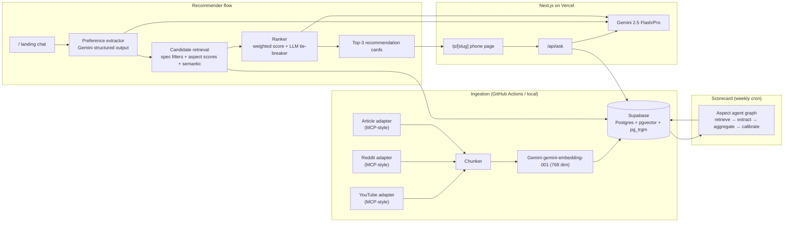

# RECSY v2 — Project Context

> **Purpose.** This is the single source of truth for what RECSY v2 is, why it
> exists, how it works, and where it's going. It is a **living document** —
> every phase update edits this file. If a decision isn't captured here, it
> doesn't exist.

**Status.** Phase 6 (Browse + faceted filter) **shipped (MVP)** — URL-driven
`GET` filters on `/browse` (brands, `min`/`max` MSRP, foldable from
`spec_json`), server-side Drizzle `where`, **no** client fetch for the list; see
[ADR 0008](./adr/0008-browse-filters-mvp.md) and [`docs/browse/README.md`](./browse/README.md).
Phase 5 (Conversational recommender) **shipped (MVP)** — `/recommend` multi-turn
intake, `POST /api/recommend` with cookie-backed `recommendation_sessions` /
`recommendation_turns`, Flash **structured** `UserRequirements` extraction +
clarify threshold, **aspect-weighted** ranking with budget / form-factor /
brand filters, optional **cosine bump** vs `phones.spec_embedding` after
`pnpm spec-embed:backfill`, deal-breaker keyword gate, must-have soft scoring,
**two-per-brand** diversity in the top three picks, relaxation ladder when
filters empty, separate **rate limit** from `/api/ask`, and `/browse` list.
**Living risk register:** §20 (feature & approach). **Still deferred:** Gemini
**Pro tie-break**, richer NLP on must-haves — see [ADR 0007](./adr/0007-recommender-mvp.md)
and [`docs/recommender/README.md`](./recommender/README.md).
Phase 4 (Aspect scorecard) **shipped (MVP)** — hybrid retrieval per
aspect with a **single combined query** from `query_prompts`, structured Gemini
extraction with chunk-id validation + one retry, `pnpm scorecard:run`, neutral
rows when retrieval is empty, recency as a **confidence** bump only, and
`ScorecardSection` on `/p/[slug]` when aspects exist. **Calibration** (z-score /
price bracket) and **multi-query fusion** per aspect are explicitly deferred;
see [ADR 0006](./adr/0006-aspect-scorecard-mvp.md) and [`docs/scorecard/README.md`](./scorecard/README.md).
Phase 3 (Retrieval + phone pages) **shipped (MVP)** —
retrieval, IP-hashed `/api/ask` rate limiting, citation-tagged chat
with validation + retry, `/p/[slug]` UI, `pnpm retrieval:smoke`, **Playwright
E2E** (SSR phone page + mocked NDJSON ask), **tiered eval** (`docs/eval/README.md`,
`pnpm eval:retrieval`), and **optional LLM rerank** (`RETRIEVAL_LLM_RERANK`,
ADR [0005](./adr/0005-e2e-and-evaluation.md)) landed 2026-04-21. **`db:smoke`**
8/8; portability: `CREATE SCHEMA IF NOT EXISTS extensions` + `search_path` during
`db-setup` for vanilla Postgres CI. **Remaining polish:** token-true streaming
before citation validation; Tier-3 generative eval (live Gemini) stays manual /
scheduled. Phase 2 (Ingestion) **shipped** 2026-04-21. End-to-end
verified against live articles (10/10 smoke checks pass; 23 chunks
embedded at 768 dims, idempotent re-run confirmed). The YouTube
adapter has a full three-tier transcript fallback chain and iterates
ranked caption tracks until one yields segments; failures degrade
gracefully to a skipped-source telemetry row. Phase 1 (DB, data
model, seed corpus) and Phase 0 (scaffold, design system, service
skeletons) shipped 2026-04-21 and 2026-04-19 respectively.

---

## Table of Contents

1. [Executive Summary](#1-executive-summary)
2. [Origin Story](#2-origin-story)
3. [Product Vision & Positioning](#3-product-vision--positioning)
4. [Honest Defensibility Statement](#4-honest-defensibility-statement)
5. [Target Users & Use Cases](#5-target-users--use-cases)
6. [Feature Inventory](#6-feature-inventory)
7. [System Architecture](#7-system-architecture)
8. [Tech Stack](#8-tech-stack)
9. [Data Model](#9-data-model)
10. [Retrieval & Chat Q&A Pipeline](#10-retrieval--chat-qa-pipeline)
11. [Recommender Pipeline](#11-recommender-pipeline)
12. [Aspect Scorecard Agent](#12-aspect-scorecard-agent)
13. [Ingestion Pipeline (MCP-style adapters)](#13-ingestion-pipeline-mcp-style-adapters)
14. [LLM Infrastructure](#14-llm-infrastructure)
15. [Design System](#15-design-system)
16. [Observability, Ops & Security](#16-observability-ops--security)
17. [Testing Strategy](#17-testing-strategy)
18. [CI/CD & Deployment](#18-cicd--deployment)
19. [Project Phases & Progress](#19-project-phases--progress)
20. [Open Questions & Future Work](#20-open-questions--future-work) — includes [feature & approach risk register](#feature-and-approach-risk-register-living)
21. [Glossary](#21-glossary)
22. [Change Log](#22-change-log)
23. [Issues Log](#23-issues-log)

---

## 1. Executive Summary

**RECSY v2** is a web-first, AI-native smartphone companion that combines two
experiences on one site:

- **Conversational recommender.** The landing page is a chat intake. A user
  describes what they care about in plain English; an LLM extracts structured
  requirements; the pipeline ranks active phones (aspects + filters + optional
  `spec_embedding` cosine) and returns three diverse picks with links to detail
  pages.
- **Per-phone consensus engine.** Each phone has a dedicated page with a
  seven-axis aspect scorecard (camera, battery, performance, display, build,
  software, value) aggregated from YouTube, Reddit, and editorial reviews —
  and a chat Q&A where every answer is grounded in cited source excerpts
  (YouTube deep-links include timestamps).

**Stack summary.** Next.js 16 · Drizzle ORM → Supabase Postgres + pgvector ·
Gemini 2.5 Flash/Pro via Vercel AI SDK · TypeScript ingestion adapters
(`youtubei.js` · Reddit public JSON · `@mozilla/readability` + `linkedom`).
Runs entirely on free tiers.

**This is a portfolio/learning project.** See
[§4 Honest Defensibility Statement](#4-honest-defensibility-statement). The
goal is to ship a production-quality application, not to out-compete
general-purpose LLMs at the review-summarisation task.

---

## 2. Origin Story

The original **RECSY** was a 2020 undergraduate project: a Flutter mobile app
that asked the user 6–8 preference questions, fed them to a bespoke Keras
model exported to TensorFlow Lite, and returned a recommended smartphone. The
dataset was a hand-curated CSV; ~100 phones.

By 2026 this approach is dead. Users ask ChatGPT/Gemini the same question and
get a synthesised answer sourced from the live web. The app's value
proposition — "ask questions, get a phone" — has been fully absorbed by
general-purpose assistants.

The original project files live under [`legacy/`](../legacy) for reference.

**What we keep from v1.**

- The _recommender_ as the primary entrypoint (spiritual continuity).
- Brand colors (orange + cyan/turquoise), re-authored in OKLCH.
- The insight that users want picks, not endless listicles.

**What we throw out.**

- The Flutter stack (mobile-first, app-store distribution).
- The bespoke ML pipeline (LLMs subsume that work).
- The static CSV (replaced by a living corpus of source-backed chunks).

---

## 3. Product Vision & Positioning

**One-liner.** "Ask what matters. Get the phone that actually fits you —
grounded in real reviews, with receipts."

**What the user gets.**

- A **pick**, not a list. Top 3 phones, ranked, with a headline and explicit
  trade-offs for each.
- A **receipt for every claim.** No floating statements. If we say "the X95
  has the best battery in its price bracket," it links to the reviewer clip
  that said so, with a timestamp.
- A **plain-English Q&A** on each phone page that answers follow-ups grounded
  in the corpus, with inline citations.

**Explicit non-goals.**

- Not a used-phone marketplace.
- Not a price-tracker / deal site (initially).
- Not a forum / social product.
- Not trying to beat Rtings / GSMArena at technical specs — we _cite_ them.

---

## 4. Honest Defensibility Statement

Generalist LLMs (GPT-5.x, Gemini 2.5+, Claude 4.x) can already summarise phone
reviews from web search. Within 12 months they will do it better than any
bespoke pipeline we can build on a free tier. **We accept this.**

RECSY v2 is therefore shipped as a **portfolio / learning project** with these
intentional goals:

1. **Demonstrate modern retrieval + agent engineering** end-to-end — hybrid
   RAG, structured-output agents, MCP-style ingestion adapters, LLM response
   caching, observability.
2. **Produce a polished, self-contained product** that a recruiter or
   collaborator can use, inspect, and form an opinion from.
3. **Build muscle** around the full production cycle: strict TypeScript, DI,
   migrations, RLS, ADRs, CI, testing, LLM evaluation.

Durability features we _do_ invest in (because they're good engineering, not
moats):

- **Transparent methodology** — aspect definitions, weights, and retrieval
  prompts are data (`aspect_definitions`) not code, versioned and auditable.
- **Citation fidelity** — claim-level citation validation in the chat
  pipeline (a claim without a supporting chunk is rejected).
- **Source-tier awareness (deferred)** — the schema leaves room for a future
  reputation signal per source.

---

## 5. Target Users & Use Cases

### Primary persona — "overwhelmed buyer" (Rahul, 27, India/US/UK/global English)

Has a rough budget, three or four non-negotiables, and 45 minutes before
pulling the trigger on a phone they'll live with for 2 years. Doesn't want
to watch four 30-minute reviews. Trusts picks more than rankings.

### Secondary persona — "skeptical researcher"

Already has a shortlist; wants to stress-test it. Lands on `/p/<slug>` pages,
opens the consensus scorecard, asks specific follow-ups ("does the camera
struggle at night?", "is the battery really that good?").

### Tertiary — "just browsing"

Lands on `/browse`, filters by price & form factor. (Phase 3+.)

### Core user flows

| #   | Flow                     | Entry                            | Exit                                       |
| --- | ------------------------ | -------------------------------- | ------------------------------------------ |
| U1  | Conversational recommend | `/` landing chat                 | 3-card pick → click through to `/p/<slug>` |
| U2  | Consensus & Q&A          | `/p/<slug>`                      | Answer with citations → buy-link / browse  |
| U3  | Browse & filter          | `/browse` (Phase 3+)             | Phone page                                 |
| U4  | Compare two phones       | `/compare/<a>-vs-<b>` (Phase 5+) | Phone page                                 |

### Non-users we explicitly decline to serve

- Users wanting a used-phone price valuation.
- Users wanting a storefront checkout.
- Users under ~$150 budget in unsupported regions (Phase 1 seed list skews
  global-flagship; regional depth comes later).

---

## 6. Feature Inventory

**Legend.** ✓ = shipped, ▲ = in progress, ◯ = planned.

| Feature                                    | Status | Phase | Notes                                                                                                                                   |
| ------------------------------------------ | ------ | ----- | --------------------------------------------------------------------------------------------------------------------------------------- |
| Landing hero + CTA                         | ✓      | 0–5   | Hero points to `/recommend` and `/browse`                                                                                               |
| Dark/light theme (OKLCH tokens)            | ✓      | 0     | Dark default, `next-themes`, AA contrast                                                                                                |
| `/api/health` liveness probe               | ✓      | 0     |                                                                                                                                         |
| Typed env validation                       | ✓      | 0     | `@t3-oss/env-nextjs` + Zod                                                                                                              |
| LLM provider abstraction                   | ✓      | 0     | Gemini impl + cache decorator                                                                                                           |
| Drizzle schema (12 tables, 8 enums)        | ✓      | 0     |                                                                                                                                         |
| Postgres extensions bootstrapped           | ✓      | 1     | pgvector, pg_trgm, pgcrypto (pg_cron deferred)                                                                                          |
| Initial migration applied                  | ✓      | 1     | All tables + HNSW (cosine) indexes                                                                                                      |
| RLS policies                               | ✓      | 1     | default-deny + anon read on public tables                                                                                               |
| `PhoneSpec` Zod schema                     | ✓      | 1     | `src/features/phones/schema.ts`                                                                                                         |
| Aspect definitions seeded                  | ✓      | 1     | 7 aspects, weights sum to 1.0                                                                                                           |
| Starter phone corpus (20 phones)           | ✓      | 1     | budget→flagship, 6 brands, 1 foldable                                                                                                   |
| `db:setup` orchestrator + `db:smoke`       | ✓      | 1     | 6/6 smoke checks incl. HNSW round-trip                                                                                                  |
| MCP-style ingestion adapters               | ✓      | 2     | TypeScript; YouTube, YouTube-channel RSS, Reddit, articles, GSMArena (ADR 0014)                                                         |
| `pnpm ingest` CLI + tiered GH Actions      | ✓      | 2     | `ingest:auto` / `creator:watch` / `ingest:report`; scheduler picks by `next_ingest_at`; Curator + Disambiguator agents                  |
| Hybrid retrieval (vector + FTS + RRF)      | ✓      | 3     | + MMR + source coverage; optional LLM rerank (ADR 0005)                                                                                 |
| Per-phone page & chat Q&A                  | ✓      | 3     | `/p/[slug]`, `/api/ask`, citations; scope + `retrievalTrace` [ADR 0011](./adr/0011-phone-qa-scope-images-home-ask-trace.md)             |
| Aspect scorecard agent graph               | ✓      | 4     | MVP: ADR 0006; CLI `scorecard:run`; UI when rows exist                                                                                  |
| Conversational recommender                 | ✓      | 5     | MVP: ADR 0007; `/api/recommend`, `/recommend`                                                                                           |
| Browse (phone list)                        | ✓      | 5     | `/browse` → `/p/[slug]`                                                                                                                 |
| Browse + filter                            | ✓      | 6     | ADR 0008; URL `GET` form + server `where`                                                                                               |
| About page                                 | ✓      | 7     | `/about` — what RECSY is + links to flows                                                                                               |
| Compare (two phones)                       | ✓      | 7     | [ADR 0009](./adr/0009-phone-ux-images-compare.md); `/compare?a&b=…`                                                                     |
| Phone page: spec grid + MSRP + image       | ✓      | 7     | `PhoneSpecSummary`, `PhoneImage`, from `spec_json` / `image_url`                                                                        |
| Browse + rec cards: product imagery        | ✓      | 7     | Thumbnails when `phones.image_url` set; else initial placeholder                                                                        |
| Recommender: price + image on pick cards   | ✓      | 7     | `RecommendApiPick.msrpUsd` + `imageUrl` from catalog                                                                                    |
| PWA manifest + icons (installable)         | ✓      | 7     | [ADR 0010](./adr/0010-pwa-seo-analytics-compare.md); **offline** SW still planned                                                       |
| SEO + default OG (sitemap, robots)         | ✓      | 7     | `app/sitemap.ts`, `robots.ts`, `opengraph-image.tsx`                                                                                    |
| Product analytics (Vercel)                 | ✓      | 7     | `AnalyticsClient`; no-op off Vercel; ADR 0010                                                                                           |
| Compare: catalog pickers + slug form       | ✓      | 7     | `ComparePhonePickers` + [ADR 0010](./adr/0010-pwa-seo-analytics-compare.md)                                                             |
| Starter corpus: sample `image_url`         | ✓      | 7     | Five flagship rows → Wikimedia Commons; allowlisted in `next.config`                                                                    |
| Hybrid `eval:retrieval` in CI              | ▲      | 3+7   | [ADR 0010](./adr/0010-pwa-seo-analytics-compare.md) — job runs when `GEMINI_API_KEY` secret is set; see [docs/eval](eval/README.md)     |
| PWA **offline** shell (service worker)     | ◯      | 7+    | Deferred; ADR 0010                                                                                                                      |
| Phone Q&A: cross-scope guidance + trace UI | ✓      | 3+7   | [ADR 0011](./adr/0011-phone-qa-scope-images-home-ask-trace.md) — system prompt, panel copy, `retrievalTrace` on `done`, `<details>` UI  |
| Landing: “What you can do” cards           | ✓      | 7     | [ADR 0011](./adr/0011-phone-qa-scope-images-home-ask-trace.md) — `/` below hero                                                         |
| `PhoneImage` remote delivery               | ✓      | 7     | [ADR 0011](./adr/0011-phone-qa-scope-images-home-ask-trace.md) — `` + `referrerPolicy="no-referrer"`                               |
| Recommender: refine-over-prior-picks       | ✓      | 7     | [ADR 0012](./adr/0012-recommender-refine-rank-ui-and-empty-corpus-honesty.md) — re-ranks prior picks on conversational follow-ups       |
| Recommender: tie + no-data honesty         | ✓      | 7     | [ADR 0013](./adr/0013-recommender-summary-context-tie-honesty-settings.md) — `scoresTied`, `scorecardMissing`, `topAspects`, banner     |
| Recommender: context-aware summaries       | ✓      | 7     | [ADR 0013](./adr/0013-recommender-summary-context-tie-honesty-settings.md) — refined turns name top + secondary priority aspects        |
| Phone Q&A: empty-corpus short-circuit      | ✓      | 7     | [ADR 0012](./adr/0012-recommender-refine-rank-ui-and-empty-corpus-honesty.md) — deterministic message when 0 chunks, `NO_CONTEXT_MODEL` |
| Client settings + `/settings`              | ✓      | 7     | [ADR 0013](./adr/0013-recommender-summary-context-tie-honesty-settings.md) — `useClientSetting`, Enter-to-send toggle, header link      |

> **Backlog check (2026-04-22).** PWA/SEO/OG, eval job, and compare/seed polish remain as in [ADR 0010](./adr/0010-pwa-seo-analytics-compare.md). [ADR 0011](./adr/0011-phone-qa-scope-images-home-ask-trace.md) / [ADR 0012](./adr/0012-recommender-refine-rank-ui-and-empty-corpus-honesty.md) / [ADR 0013](./adr/0013-recommender-summary-context-tie-honesty-settings.md) document the Q&A scope, refine, and tie/no-data/settings work. Still **planned**: offline PWA, per-route OG, broader `image_url` backfill, scorecard ingestion seed shortcut for dev.

---

## 7. System Architecture

High-level:



### Runtime boundaries

| Layer                                       | Runtime                  | Notes                                                                                             |
| ------------------------------------------- | ------------------------ | ------------------------------------------------------------------------------------------------- |
| Edge (`middleware.ts`, future rate-limiter) | Edge                     | Supabase REST only (cannot use `postgres` driver)                                                 |
| Route handlers & server components          | Node.js                  | Drizzle + `postgres` driver OK                                                                    |
| Ingestion pipeline                          | Node.js / GitHub Actions | TypeScript adapters (see [ADR 0003](./adr/0003-ingestion-typescript.md)); writes via service role |

### Data flow (simplified, user asks a question on a phone page)

1. Browser → `POST /api/ask` `{ phoneSlug, query }`
2. Zod validates input; trace id created; rate limit checked.
3. Server fetches phone by slug; builds a retrieval context scoped to its
   chunks.
4. Hybrid retrieval: embedding cosine top-K + FTS top-K + RRF; MMR dedup;
   source-coverage; LLM rerank.
5. Gemini Flash streams answer with citations; we validate each claim has a
   supporting chunk id.
6. Response streamed to client; query logged to `chat_queries` for analytics.

---

## 8. Tech Stack

### Frontend

| Concern   | Choice                                           | Version | Why                             |
| --------- | ------------------------------------------------ | ------- | ------------------------------- |
| Framework | Next.js (App Router)                             | 16.2    | RSC, typed routes, streaming    |
| Runtime   | React                                            | 19.2    | Concurrent features, `use`      |
| Language  | TypeScript (strict + `noUncheckedIndexedAccess`) | 5.9     | Catch bugs early                |
| Styling   | Tailwind CSS                                     | 4.2     | CSS-first config, native OKLCH  |
| Theme     | `next-themes`                                    | 0.4     | Dark default, `data-theme` attr |
| Icons     | `lucide-react`                                   | 1.x     | Tree-shakable                   |
| Animation | `motion` (fka Framer)                            | 12.x    | `prefers-reduced-motion` aware  |
| Forms     | `react-hook-form` + Zod                          | TBD     | Added Phase 5 intake            |
| State     | `@tanstack/react-query`                          | 5.x     | Client caching                  |
| Toast     | `sonner`                                         | 2.x     | Accessible                      |

### Backend / data

| Concern              | Choice                  | Version  | Why                                  |
| -------------------- | ----------------------- | -------- | ------------------------------------ |
| DB                   | Supabase Postgres       | 17.6     | Free tier + pgvector                 |
| Vector search        | pgvector (HNSW, cosine) | latest   | No extra infra                       |
| Text search          | `pg_trgm` + tsvector    | built-in | Hybrid with vector                   |
| Scheduler            | `pg_cron`               | latest   | Cache eviction, cleanup              |
| ORM                  | Drizzle                 | 0.45     | Type-safe, migration-first           |
| Client-side DB proxy | `@supabase/supabase-js` | 2.x      | For anon RLS-scoped queries          |
| Driver               | `postgres` (Porsager)   | 3.4      | Fast, `prepare: false` for pgbouncer |

### AI

| Concern            | Choice                              | Version | Why                                                                 |
| ------------------ | ----------------------------------- | ------- | ------------------------------------------------------------------- |
| LLM SDK            | Vercel AI SDK                       | 6.x     | `generateObject`, streaming                                         |
| Primary provider   | `@ai-sdk/google` → Gemini 2.5 Flash | 3.x     | Free tier, fast, structured output                                  |
| Reasoning model    | Gemini 2.5 Pro                      | —       | Aspect extraction, ranker tie-break                                 |
| Fallback (planned) | Groq Llama 3.3                      | —       | Provider diversity                                                  |
| Embeddings         | `gemini-embedding-001`              | —       | 768 dim (Matryoshka-truncated), free tier, hardcoded in `gemini.ts` |
| Schema             | Zod v4                              | 4.x     | Runtime validation of LLM output                                    |

### Ingestion (Phase 2 — shipped 2026-04-21)

TypeScript on the same Node.js toolchain as the web app (see
[ADR 0003](./adr/0003-ingestion-typescript.md) for why we dropped the
Python sidecar plan). Key libraries: `youtubei.js` (YouTube/Innertube,
no API key), `@mozilla/readability` + `linkedom` (article extraction),
`gpt-tokenizer` (token-bounded chunking), `p-retry` + `p-limit`
(batched embedding with backoff).

### DevOps

| Concern         | Choice                                     |
| --------------- | ------------------------------------------ |
| Package manager | pnpm 10                                    |
| Logging         | `pino` structured JSON                     |
| Error tracking  | Sentry (optional, env-gated)               |
| Analytics       | Vercel Analytics (future)                  |
| Host            | Vercel (Hobby)                             |
| CI              | GitHub Actions                             |
| Tests           | Vitest (unit) · Playwright (E2E, Phase 3+) |
| Pre-commit      | Husky + lint-staged + commitlint           |

---

## 9. Data Model

The canonical source is [`src/services/db/schema.ts`](../src/services/db/schema.ts).
Conventions enforced in review:

- UUID PKs (`gen_random_uuid()`).
- `timestamptz` for all timestamps.
- Enums for all finite sets (never raw `text`).
- `onDelete` defaults to `restrict`; `cascade` only when child is owned by parent.
- Embeddings stored as `vector(768)` with HNSW index, cosine operator class.

### Tables (Phase 1)

| Table                     | Purpose                                     | Key columns                                                                              |
| ------------------------- | ------------------------------------------- | ---------------------------------------------------------------------------------------- |
| `phones`                  | Canonical phone entities                    | `slug`, `brand`, `model`, `spec_json`, `spec_embedding`, `status`, `region_availability` |
| `sources`                 | Ingested artefacts (video, thread, article) | `phone_id`, `type`, `url`, `content_hash`, `published_at`, `status`                      |
| `chunks`                  | Retrievable text chunks                     | `source_id`, `phone_id`, `text`, `embedding`, `start_ts`, `anchor`, `tokens`             |
| `aspect_definitions`      | Methodology — aspects are data              | `aspect`, `version`, `description`, `query_prompts`, `default_weight`                    |
| `aspects`                 | Current score per phone × aspect            | `phone_id`, `aspect_definition_id`, `score`, `confidence`, supporting/dissenting quotes  |
| `recommendation_sessions` | One per browser session (hashed)            | `session_cookie`, `ip_hash`, `status`                                                    |
| `recommendation_turns`    | Per-message state in a session              | `user_message`, `extracted_requirements`, `candidate_phone_ids`, `picks`                 |
| `recommendation_feedback` | User signals on picks                       | `turn_id`, `phone_id`, `event`                                                           |
| `chat_queries`            | Per-phone Q&A log (analytics)               | `phone_id`, `query`, `answer`, `citations`, `model`, `latency_ms`                        |
| `llm_cache`               | LLM response cache (sha256 prompt key)      | `prompt_hash`, `model`, `response`, `hits`                                               |
| `ingest_runs`             | Ingestion telemetry                         | `adapter`, `status`, `chunks_created`, `error`                                           |
| `rate_limits`             | IP-window counters                          | `key`, `window_start`, `count`                                                           |

### Enums

`phone_status`, `source_type`, `source_status`, `aspect`, `recommendation_intent`,
`session_status`, `feedback_event`, `ingest_status`.

### Indexing strategy

- **HNSW (cosine)** on `chunks.embedding` and `phones.spec_embedding` — vector search.
- **B-tree** on `phones.brand`, `phones.status`, `chunks.phone_id`, `chunks.source_id`.
- **tsvector** FTS index on `chunks.text` (added Phase 3 when hybrid retrieval lands).
- **Unique constraints** on `phones.slug`, `(sources.phone_id, sources.url)`,
  `(aspects.phone_id, aspects.aspect_definition_id)`.

### RLS posture

- All tables: **default-deny**.
- `anon` role: `SELECT` on `phones`, `aspects`, `aspect_definitions`, `sources` (public),
  `chunks` (public read), `chat_queries` and `recommendation_*` restricted to
  own-session via cookie match.
- `service_role` (server-only): full access. Used by server route handlers
  via the service-role key.

Applied via `drizzle/sql/999_rls.sql` (see Phase 1).

---

## 10. Retrieval & Chat Q&A Pipeline

Phase 3 deliverable — **MVP shipped 2026-04-21.** Code:
`src/services/retrieval/`, `src/services/chat/`, `POST /api/ask`,
`src/app/p/[slug]/`. Design: [ADR 0004](./adr/0004-hybrid-retrieval.md),
[operator guide](./retrieval/README.md).

High-level steps (implemented):

1. **Input validation.** Zod parses `{ phoneSlug, query }`; `query` byte
   length ≤ `MAX_CHAT_MESSAGE_BYTES` (4 KB); `X-Trace-Id` on responses.
2. **Rate limit.** Client IP from `x-forwarded-for` / `x-real-ip`, SHA-256
   hashed; sliding window `ASK_RATE_LIMIT_WINDOW_MS` with max
   `ASK_RATE_LIMIT_MAX` requests per window; atomic upsert into
   `rate_limits` (unique on `key, window_start`).
3. **Hybrid retrieval** — vector + FTS → RRF → MMR → source-coverage clamp
   (constants in `src/lib/constants.ts` align pre/post K and λ with the
   product defaults).
4. **Answer generation.** Gemini Flash **blocking** `chat()` call with
   `[c:<chunkUuid>]` inline tags. Post-processor validates every tag ⊆
   retrieved chunk ids; one retry with a stricter system prompt if the model
   hallucinates ids.
5. **Response.** `application/x-ndjson`: `meta`, `delta` (chunked replay of
   the validated answer), `done` (resolved citations + usage). Not
   token-true streaming — first byte waits for validation.
6. **Logging.** Best-effort insert into `chat_queries` (answer text,
   structured citations JSON, `retrieved_chunk_ids`, latency, tokens,
   model).

**Optional:** `RETRIEVAL_LLM_RERANK=true` adds a structured Flash rerank after
MMR (see `src/services/retrieval/llm-rerank.ts`); failures fall back to MMR +
coverage with `debug.llmRerank.applied = false`.

**Explicitly not in MVP:** intent guard, HyDE, multi-window rate limits.
`CachedLlmProvider` wraps `chat()` / `structured()` when enabled; streaming
`chatStream` bypasses cache by design (we use blocking generation for
citation validation).

---

## 11. Recommender Pipeline

Phase 5 **MVP (shipped 2026-04-21)** — [ADR 0007](./adr/0007-recommender-mvp.md),
[`docs/recommender/README.md`](./recommender/README.md). The live path uses
**Flash** structured extraction, **SQL + spec-json** candidate filtering, and
**aspect-weighted** scores; `spec_embedding` semantic retrieval and **Pro**
tie-break are documented below as **full vision** / deferred.

### Stage A — Preference extraction (`UserRequirements`)

Structured-output Gemini Flash call. Zod schema:

```ts
interface UserRequirements {
  budget_usd: { min?: number; max: number } | null;
  priorities: Array<{
    aspect: 'camera' | 'battery' | 'performance' | 'display' | 'build' | 'software' | 'value';
    weight: number; // after normalise: 0–1, sum 1; prior to that, any nonnegative scale
  }>;
  must_haves: string[];
  deal_breakers: string[];
  use_cases: string[];
  form_factor: {
    screen_size_range_in?: [number, number]; // after normalise; the LLM schema uses
    // screen_size_min_in / screen_size_max_in (no tuple) for Gemini `responseSchema`
    weight_max_g?: number;
    foldable?: boolean;
  };
  brand_preference: { liked: string[]; disliked: string[] };
  confidence: number; // 0–1
  clarifying_question?: string; // present iff confidence < threshold
}
```

The **runtime** shape above is what `normalizeUserRequirements` returns. The
Zod `userRequirementsSchema` used with `generateObject` is more permissive on
**LLM output** (e.g. title-case aspect names, `budget_usd` as a single number
or string currency, `null` for optional objects) so a single model quirk does
not trip `LLM_SCHEMA_VIOLATION` on every request; see
[`docs/recommender/README.md`](./recommender/README.md) (“Stage A: structured
`UserRequirements`”).

Multi-turn sessions merge requirements across turns. If
`confidence < RECOMMENDER_CLARIFY_THRESHOLD` (0.6), emit
`clarifying_question` and wait for next user message.

### Stage B — Candidate retrieval

**MVP (implemented):**

1. **Hard filter** by parsed `spec_json` + `msrp_usd` (budget min/max, foldable,
   screen-size range, max weight) and **disliked brands**.
2. **Deal-breakers** — substring match on a compact haystack; **exclude** hits.
3. **Must-haves** — keyword overlap **soft multiplier** on the composite score
   (reduces false-empty sets from literal matching).
4. **Aspect score join** — weighted `aspects.score` with user priorities;
   missing explicit priorities use **`aspect_definitions.default_weight`**
   (latest version per axis).
5. **Optional semantic bump** — when at least one active phone has
   `spec_embedding`, embed `buildRecommenderQueryText(requirements)` once and
   add a **bounded additive** term from cosine vs each phone’s stored vector
   (phones without a vector get **no** bonus for that part). Backfill:
   `pnpm spec-embed:backfill` (not part of `db:setup`).
6. **Diversity** — at most **two** phones per **brand** in the top **three**
   picks.

**Full vision (deferred):**

- **Deeper semantic retrieval** (e.g. re-rank top-K from HNSW on `spec_embedding`
  alone, or multi-vector fusion) if offline eval shows gain over additive cosine.
- **Regional** hard filter via `region_availability` once intake captures region.

### Stage C — Ranking

**MVP:** deterministic composite score only; picks persisted on
`recommendation_turns` (`intent: recommend`, `picks`, `candidate_phone_ids`).

**Full vision (deferred):** if top candidates are within a narrow band, **Gemini
Pro** (or equivalent) structured **tie-break** returning richer `RecommendationSet`
copy; **feedback** rows on `recommendation_feedback` for offline eval.

### Fallback rules

**MVP:** widen **budget max** once (fixed factor), then drop **foldable-only**
if still empty, then rank **all active** phones that survive deal-breakers
(surfaced as `relaxed` codes to the UI).

**Principle (unchanged):** never pretend a great match exists when the corpus
cannot support it — honest relaxation beats silent failure.

---

## 12. Aspect Scorecard Agent

Phase 4 **MVP (shipped)** — see [ADR 0006](./adr/0006-aspect-scorecard-mvp.md)
and [`docs/scorecard/README.md`](./scorecard/README.md). Produces `aspects` rows
from hybrid retrieval + structured LLM extraction. **`pg_cron` / weekly batch**
is documented for later; today the operator entrypoint is **`pnpm scorecard:run`**.

### Agent graph (MVP pseudocode)

```
for each phone × latest aspect_definition (seven axes):
  query = combine(query_prompts)        // one string, UTF-8 byte cap
  chunks = hybrid_retrieve(phone_id, query, scorecard_knobs)
  if chunks empty:
    upsert neutral aspect (score 5, low confidence, "not enough reviews")
    continue
  extraction = llm.structured(AspectScorecard schema, passages = chunks)
  extraction = validate_chunk_ids(extraction, chunks)  // retry once if needed
  confidence = extraction.confidence + recency_boost(cited chunks only)
  upsert aspects (score = raw = overallScore, quotes, n_supporting, n_dissenting, ...)
```

### Full vision (deferred)

- **Multi-query retrieval** — several embeds per aspect (e.g. battery life vs
  charging) fused before the LLM; MVP uses one combined query to cap cost.
- **Recency in scoring** — MVP applies recency only as a small **confidence**
  bump, not 2× evidence weights in the headline 0–10 score.
- **Z-score calibration within price bracket** — peer-normalised scores using
  `aspect_definitions.metadata` (TBD). MVP keeps `score` and `raw_score`
  identical.
- **Automation** — `pg_cron` per phone, same operational pattern as ingestion
  when we schedule it.

### Key properties (unchanged intent)

- **Aspects are data, not code.** To add a new aspect, insert a row in
  `aspect_definitions` with its `query_prompts` and `default_weight`, bump
  `version`, and the next scorecard run picks it up (once `ASPECT_NAMES` and UI
  lists include the new axis).
- **Dissent tracking.** We keep `n_dissenting` and quote counter-examples in
  JSON; the phone page shows summaries and evidence counts once rows exist.

---

## 13. Ingestion Pipeline (MCP-style adapters)

> **Phase 2 status.** Shipped. End-to-end verified against a live
> article (10/10 smoke checks, idempotent re-run). YouTube ingestion
> has a three-tier transcript fallback chain; the known YouTube
> datacenter-IP throttling (see "Known issues") is handled by graceful
> per-source skips. See [ADR 0003](./adr/0003-ingestion-typescript.md)
> for the TypeScript pivot rationale and
> [`docs/ingest/README.md`](./ingest/README.md) for the operator's
> guide.

The ingestion layer lives at `src/services/ingest/` and is **TypeScript-
native**. Earlier drafts of this doc called for a Python sidecar; ADR 0003
documents why we consolidated on one runtime.

### Adapter protocol

```ts
interface SourceAdapter {
  readonly type: 'youtube' | 'reddit' | 'article';
  discover(phone: PhoneRef, opts: DiscoverOpts): Promise<SourceCandidate[]>;
  fetch(candidate: SourceCandidate): Promise<RawSource>;
  chunk(raw: RawSource): RawChunk[]; // pure
}
```

Stages are deliberately fine-grained so adapters are unit-testable against
fixtures without a network or an LLM.

### Per-adapter specifics

- **YouTube** (`adapters/youtube.ts`). Uses `youtubei.js` (Innertube — no
  API key). Discovery searches `"{brand} {model} review"`, `"camera test"`,
  `"long term review"`; results deduped by video id. Chunking is
  **timestamp-aware**: each chunk carries `start_ts` + an `?t=<sec>`
  anchor so retrieval citations deep-link into the video.

  **Transcript fallback chain** (tries in order, first non-empty wins):
  1. `info.getTranscript()` — Innertube's transcript endpoint (fastest
     when YouTube isn't rotating the endpoint).
  2. Caption tracks on the already-fetched `Info` object, requested as
     `timedtext?fmt=json3`.
  3. Watch-page HTML scrape → `captionTracks` → `timedtext?fmt=json3`
     (same mechanism the YouTube web player itself falls back to).

  Within tiers 2/3 we iterate `rankCaptionTracks` (manual English → ASR
  English → any English → any) because YouTube occasionally lists a
  manual English track whose endpoint returns empty; the actual
  captions are on the ASR track one position lower. Segments are
  passed from `fetch()` → `chunk()` via `RawSource.transient` so
  timestamps survive without bloating `sources.raw_json`.

- **Reddit** (`adapters/reddit.ts`). Reddit's public JSON endpoints — no
  OAuth required. Discovery searches an allowlist (`r/Android`,
  `r/GooglePixel`, `r/apple`, `r/iphone`, `r/OnePlus`, `r/nothingtech`, …)
  for the phone model over the last year. Thread + top-N comments above
  `MIN_COMMENT_SCORE`. Spam / karma floors applied.
- **Article** (`adapters/article.ts`). `linkedom` + `@mozilla/readability`
  (same algorithm as Firefox Reader View). Discovery uses DuckDuckGo HTML Lite to search for reviews and filters against trusted `domain_profiles`; URLs can also be supplied via the CLI's `--url` flag.

### Orchestration

- `IngestOrchestrator` coordinates `discover → fetch → chunk → embed →
write` per phone × adapter. Candidates fetched serially per adapter (be
  a polite bot). Adapters run serially per phone.
- Idempotency via `sources.content_hash` (sha256 of normalised body):
  matching hash → skip re-embed and re-insert entirely; record
  `ingest_runs.status = skipped`.
- Embedding: `ChunkEmbedder` batches 50 texts/call, concurrency 1,
  exponential backoff via `p-retry`.
- Writing: single transaction per source replaces chunks atomically.
- Telemetry: one `ingest_runs` row per source-write attempt
  (`status` ∈ `started | success | skipped | failed`).
- Scheduling:
  [`.github/workflows/ingest.yml`](../.github/workflows/ingest.yml)
  provides manual dispatch + nightly cron at 03:17 UTC.

### CLI

```
pnpm ingest --phone <slug> [--adapter youtube|reddit|article]
                           [--url <url>] [--limit N] [--dry-run]
```

`--dry-run` runs discover + fetch + chunk, but skips embedding and DB
writes — useful for validating a new adapter end-to-end without cost.

### Known issues

- **YouTube datacenter-IP throttling.** YouTube's `timedtext` endpoint
  silently returns HTTP 200 with a **zero-byte body** when called from a
  non-residential IP — observed consistently from home/ISP ranges
  flagged as dynamic and from cloud runners. All three fallback tiers
  hit this ceiling together because the signed URLs are the same
  resource. Mitigation: the adapter already detects the empty-body
  case, walks the ranked track list, and ultimately emits a
  `NotFoundError` that the orchestrator records as a skipped source —
  ingestion never crashes. A residential-IP proxy (e.g. Bright Data,
  Scrape.do) would fix it, but it costs money and is therefore
  explicitly out of scope for the zero-budget MVP. Documented in
  [`docs/ingest/README.md`](./ingest/README.md#youtube-adaptersyoutube-ts).
- **`youtubei.js` `getTranscript()` returns HTTP 400** sporadically —
  YouTube rotates the Innertube endpoint every few months. The
  fallback chain above makes this a performance degradation, not an
  outage.
- **`youtubei.js` parser warnings** for novel UI nodes
  (`ShoppingTimelyShelfView`, etc.) spam stdout — non-fatal; a future
  PR may silence them by redirecting the library's logger.

---

## 14. LLM Infrastructure

### Provider abstraction

[`src/services/llm/types.ts`](../src/services/llm/types.ts) defines
`LlmProvider`. Feature code **never** imports a concrete provider:

```
LlmProvider
  ├── GeminiProvider   (real network calls)
  └── CachedLlmProvider (decorator, sha256-keyed Postgres cache)
```

### Model routing

| Task                       | Model                  | Rationale                                |
| -------------------------- | ---------------------- | ---------------------------------------- |
| Chat/Q&A answer streaming  | `gemini-2.5-flash`     | Fast, cheap, good enough                 |
| Preference extraction      | `gemini-2.5-flash`     | Structured output                        |
| Aspect signal extraction   | `gemini-2.5-pro`       | Reasoning-heavy, lower volume            |
| Ranker tie-breaker         | `gemini-2.5-pro`       | Only runs on close rankings              |
| Query decomposition (HyDE) | `gemini-2.5-flash`     | Cheap                                    |
| Embeddings                 | `gemini-embedding-001` | 768 dim (Matryoshka); HNSW index matched |

### Cache policy

- `chat` and `structured` results cached keyed on
  `sha256(model || canonical_messages || temperature || maxOutputTokens || extras)`.
- Hit refreshes `hits++` and `last_hit_at` for observability.
- Cached `structured` payloads re-validated on read; schema change invalidates.
- `chatStream` and `embed` bypass cache (complexity vs savings).

### Rate-limit & failure handling

- Any 429 / quota error → single retry after jittered backoff; on second
  failure → surface to user with a "try again" message.
- Gemini schema violations → one retry with "your previous response was
  malformed" system nudge (see `GeminiProvider.structured`).

### Budget guard-rails

- `LLM_CACHE_ENABLED=true` by default.
- All Gemini calls observable via `pino` logs (`tokensIn`, `tokensOut`,
  `model`, `latencyMs`).
- `chat_queries` table aggregates real-world token usage for offline
  cost analysis.

---

## 15. Design System

See [ADR 0002](./adr/0002-design-tokens.md).

- **OKLCH everywhere** for perceptual uniformity.
- **Semantic tokens only** (`primary`, `muted-foreground`, …) — no hex in
  feature code.
- **Dark default**, `next-themes` toggles `data-theme="dark|light"`.
- **Brand palette.** Primary = orange (OKLCH `0.78 0.17 62` dark / `0.70 0.19
55` light); Accent = cyan (OKLCH `0.80 0.14 195` dark / `0.65 0.14 195`
  light).
- **WCAG AA** contrast on all foreground/background pairs.
- **`prefers-reduced-motion: reduce`** collapses animations.
- **Tailwind v4** `@theme inline` aliases semantic vars to utility color
  names, so `bg-primary` / `text-muted-foreground` resolve from tokens.
- **Typography.** Inter (sans), JetBrains Mono (code/data), both via
  `next/font`.

---

## 16. Observability, Ops & Security

### Logging (pino)

- JSON per line, one `logger` singleton, `logger.child({...})` per request.
- Standard bindings: `traceId`, `route`, `phoneSlug`, `sessionId` where
  applicable.
- Redacted paths: `password`, `apiKey`, `token`, `authorization`, `cookie`,
  `headers.authorization`.
- Dev runs through `pino-pretty`; prod emits raw JSON (Vercel drains).

### Error reporting

- Sentry optional, `SENTRY_DSN` env-gated.
- All exceptions normalise to `AppError` subclasses at API boundaries
  (see [`src/lib/errors.ts`](../src/lib/errors.ts)).

### Env validation

- `@t3-oss/env-nextjs` + Zod at [`src/env.ts`](../src/env.ts).
- ESLint rule forbids `process.env.*` outside `src/env.ts`, config files,
  and scripts — prevents a class of configuration drift bugs.

### Security

- **RLS default-deny** on all tables.
- **IP rate-limiting** via `rate_limits` table (Phase 3 wires this into
  route handlers).
- **CSP & security headers** in `next.config.ts` (X-Frame-Options DENY,
  nosniff, Referrer-Policy strict-origin, Permissions-Policy locked down,
  HSTS 2y preload).
- **No raw IPs stored** — sha256 hash only.
- **No raw PII** — we never store emails / names (no auth in MVP).
- **Service-role key** never exposed to the client; only used in server
  route handlers + ingestion jobs.

---

## 17. Testing Strategy

| Layer             | Tool                      | Scope                                             | CI?              |
| ----------------- | ------------------------- | ------------------------------------------------- | ---------------- |
| Unit              | Vitest + `jsdom`          | Pure functions, components without DB             | ✓                |
| Integration (DB)  | Vitest with live Supabase | Migrations, RLS, retrieval helpers                | ✓ (env-gated)    |
| E2E               | Playwright                | Phone SSR + mocked `/api/ask` NDJSON client path  | ✓ CI (`e2e` job) |
| Retrieval eval    | `pnpm eval:retrieval`     | Fixture JSON vs hybrid search (embed cost)        | Local / staging  |
| LLM eval (Tier 3) | TBD script                | Live `runPhoneQna` citation overlap vs golden set | Manual / cron    |

### Evaluation layout

- **ADR [0005](./adr/0005-e2e-and-evaluation.md)** — why CI mocks Gemini for
  browser tests, why `eval:retrieval` is tier 2, and how LLM rerank fails open.
- **`docs/eval/README.md`** — fixture schema, command matrix, Tier-3 notes.

### Conventions

- Tests sit next to the unit under test: `foo.ts` + `foo.test.ts`.
- **Scorecard** — pure helpers (`query-build`, `definitions`, `recency`,
  `extraction-schema`) are covered by Vitest; the full agent path needs DB +
  Gemini (manual / script).
- **Recommender** — `match.ts`, `vector-utils`, `spec-embedding-text`, and
  `extract-requirements` (mock `LlmProvider`) have unit tests; full `/api/recommend`
  path still needs DB + live Gemini for an integration test (manual for now).
- **`spec-embed:backfill`** — not in CI; run locally/staging when seeds or
  `buildSpecDocumentForEmbedding` change.
- Integration tests live under `tests/integration/` and are excluded from the
  default `pnpm test` — run with `pnpm test:integration` (added when first
  DB-touching test lands in Phase 3).
- Coverage target: **80% on `src/services/`** (the plumbing that _must_
  not regress). Product code gets lighter coverage on the happy path.

---

## 18. CI/CD & Deployment

### CI (`.github/workflows/ci.yml`)

On every PR and `main` push:

1. Prettier check
2. ESLint
3. Typecheck (`tsc --noEmit`, strict)
4. Vitest unit suite
5. `next build` (verifies production build)
6. **Playwright** (`e2e` job) — Postgres service container, `scripts/db-setup.ts`,
   Chromium, `pnpm e2e` (SSR phone page + mocked ask). Uses real env-shaped
   dummy values (not `SKIP_ENV_VALIDATION`) so `next dev` matches production
   validation.

`SKIP_ENV_VALIDATION=true` only on the **`quality`** job so typecheck/tests/build
don't need secrets. The **`e2e`** job exports a minimal real `.env` superset
inline. `NEXT_PUBLIC_COMMIT_SHA` is injected from `github.sha` where applicable.

### Deployment

- **Vercel Hobby** — auto-deploys `main` to production, PR branches to
  preview URLs.
- **Migrations** are applied via a GitHub Action on `main` push (Phase 1
  deliverable) against Supabase production.
- **Rollback** — Vercel's instant rollback for code; schema changes are
  forward-only (we don't rollback migrations in prod; we write compensating
  migrations).

### Environments

| Env           | DB                                                  | Purpose            |
| ------------- | --------------------------------------------------- | ------------------ |
| `development` | Supabase (dev schema or same DB)                    | Local work         |
| `preview`     | Same Supabase project                               | Vercel PR previews |
| `production`  | Same Supabase project (free tier, one project only) | Live site          |

We run one Supabase project in MVP. Will split when cost/complexity
justifies it.

---

## 19. Project Phases & Progress

| Phase                       | Scope                                                    | Status         | Notes                                                                                                                    |
| --------------------------- | -------------------------------------------------------- | -------------- | ------------------------------------------------------------------------------------------------------------------------ |
| 0 — Scaffold                | Next.js, TS strict, design tokens, services skeleton, CI | ✓ (2026-04-19) | See change log                                                                                                           |
| 1 — Database                | Extensions, migrations, RLS, aspect + phone seeds        | ✓ (2026-04-21) | All gates green; 6/6 smoke                                                                                               |
| 2 — Ingestion               | TS adapters (YT/Reddit/Article), idempotency, CI cron    | ✓ (2026-04-21) | Article e2e 10/10; YT fallback shipped, IP-throttled in dev                                                              |
| 3 — Retrieval + phone pages | Hybrid search, Q&A with citations                        | ✓ (2026-04-21) | MVP: `/api/ask`, `/p/[slug]`, rate limit, `retrieval:smoke`; E2E/eval follow-ups                                         |
| 4 — Aspect scorecard        | Agent graph, aspects rows, phone UI                      | ✓ (2026-04-21) | MVP: ADR 0006; calibration + multi-query deferred                                                                        |
| 5 — Recommender             | Intake, candidate gen, ranker                            | ✓ (2026-04-21) | MVP: ADR 0007; spec_embedding + Pro tie-break deferred                                                                   |
| 6 — Browse                  | URL faceted filters, server-side list                    | ✓ (2026-04-21) | MVP: ADR 0008; `search-params` + Drizzle `where`                                                                         |
| 7 — Polish                  | Compare/About/phone UX, PWA, SEO, OG, analytics          | ▲              | ADR 0009 + 0010: manifest, SEO, OG, analytics, compare pickers, sample images; SW offline + optional eval job follow-ups |

Acceptance for every phase: green CI + ADR(s) for non-obvious decisions +
this document updated.

### Phase 1 acceptance — met

- ✅ `pnpm db:setup` idempotently: extensions → migrate → RLS → seed (7 aspects, 20 phones).
- ✅ `pnpm db:smoke` returns 6/6: extensions, 12 tables, aspect/phone seeds, vector
  round-trip (cosine distance `0.00e+0` on identity match), and HNSW index plan.
- ✅ `pnpm typecheck` · `lint` · `format:check` · `test` · `build` all green.
- ✅ This document updated.

### Phase 2 progress (Ingestion)

**Pivot.** The original plan called for a Python 3.12 sidecar. At the
start of Phase 2 we revisited the trade-offs and consolidated on a
TypeScript-only implementation co-located with the web app. Rationale and
consequences: [ADR 0003](./adr/0003-ingestion-typescript.md).

**Shipped (code, tests, infra, docs):**

- `src/services/ingest/types.ts` — `SourceAdapter` protocol + Zod-
  validated DTOs (`SourceCandidate`, `RawSource`, `RawChunk`,
  `AdapterRunSummary`).
- `src/services/ingest/chunking.ts` — sentence-aligned token-bounded
  chunker. 9 unit tests (splitSentences, chunkText, countTokens) passing.
- `src/services/ingest/hashing.ts` — sha256 helper + 4 unit tests.
- `src/services/ingest/embedder.ts` — `ChunkEmbedder` batches 50
  texts/call, `p-limit` concurrency, `p-retry` with exponential backoff.
- `src/services/ingest/writer.ts` — `IngestionWriter`: transactional,
  idempotent via `content_hash`; writes `sources` + `chunks` + one
  `ingest_runs` telemetry row per attempt.
- `src/services/ingest/adapters/article.ts` — `linkedom` +
  `@mozilla/readability`; discovery is a no-op (CLI `--url` only).
- `src/services/ingest/adapters/youtube.ts` — `youtubei.js` Innertube;
  timestamp-aware chunking with `?t=<sec>` deep-link anchors.
- `src/services/ingest/adapters/reddit.ts` — Reddit's public JSON API;
  allowlisted subreddits with score/spam floors.
- `src/services/ingest/orchestrator.ts` — isolates adapter failures,
  aggregates telemetry per-phone.
- `scripts/ingest.ts` + `pnpm ingest` CLI — `--phone`, `--adapter`,
  `--url`, `--limit`, `--hint`, `--dry-run`.
- `.github/workflows/ingest.yml` — `workflow_dispatch` + 03:17 UTC cron,
  per-phone concurrency keys, secrets-aware.
- `docs/ingest/README.md` — operator's guide.

**Phase 2 acceptance — met (2026-04-21):**

- ✅ **Embedding model migrated.** `text-embedding-004` was retired on
  Gemini's v1beta endpoint; switched to `gemini-embedding-001` with
  `outputDimensionality: 768` (matches the `vector(768)` schema) and
  `taskType: 'RETRIEVAL_DOCUMENT'`. Dimension is hardcoded in
  `src/services/llm/gemini.ts` as `EMBEDDING_DIMENSIONS` — coupling it
  tightly to the DB schema prevents a class of env-var drift bugs.
- ✅ **YouTube transcript fallback.** Three-tier chain implemented
  (Innertube `getTranscript` → Info-object captions → watch-page HTML
  scrape). Ranks tracks (manual EN → ASR EN → any EN → any) and walks
  the list until a non-empty response lands. See
  `src/services/ingest/adapters/youtube-transcript.ts` + unit tests
  (`rankCaptionTracks`, `parseJson3Transcript`,
  `extractCaptionTracksArray`, `normaliseRawTrack`).
- ✅ **Live article end-to-end** (`pnpm ingest:smoke`). Runs a full
  `discover → fetch → chunk → embed → write` pass against a real
  Wikipedia article for `google-pixel-9-pro-xl`, then reruns to verify
  idempotency. 10/10 checks pass: 1 source + 23 chunks written on
  pass 1, all embeddings are 768-dim, chunk indices are contiguous,
  pass 2 records `skipped: unchanged-content` with zero new chunks and
  an advanced `last_fetched_at`, and `ingest_runs` logs both passes.
- ✅ **Graceful YouTube degradation.** Where YouTube refuses captions
  (datacenter-IP throttling — see §13 Known Issues), the adapter skips
  the source cleanly; the orchestrator records a `NotFoundError`
  telemetry row and continues. No hangs, no data corruption.
- ✅ **Unit tests.** 42/42 green across 4 ingestion test files.
- ✅ **`pnpm typecheck`** green (`gemini-embedding-001` migration
  surfaced a `p-retry` v8 `RetryContext` API change — fixed).
- ✅ **CI.** `.github/workflows/ingest.yml` provides manual dispatch +
  nightly 03:17 UTC cron; concurrency keyed per-phone.

**Deferred to Phase 3 (by design, not blockers):**

- A `ingest_runs` query inside `pnpm db:smoke` that asserts
  non-zero-`success` rows after an e2e run (currently verified
  ad-hoc by `ingest-smoke.ts`). Worth folding into `db:smoke` once the
  retrieval layer exists and exercises the same rows.
- Residential-IP proxy evaluation for YouTube (only matters when we
  actually need higher YouTube coverage — currently articles + Reddit
  cover our corpus needs).

### Phase 3 progress (Retrieval + phone pages)

**Locked-in design.** [ADR 0004](./adr/0004-hybrid-retrieval.md)
ratifies the hybrid retrieval pipeline: vector (cosine, pgvector
HNSW) + FTS (tsvector + `pg_trgm` fallback) → RRF fusion → MMR
rerank → source-coverage clamp. Parameter defaults and non-goals
(no HyDE, no cross-encoder, no external vector DB) are frozen.

**Shipped (code, tests, migration, docs):**

- Migration `drizzle/fts.sql` adds `chunks.text_tsv` (generated
  `tsvector`), a GIN index on the tsvector, and a `gin_trgm_ops`
  GIN index on `chunks.text`. Idempotent (`IF NOT EXISTS`) and
  wired into step 3/5 of `pnpm db:setup`.
- `pnpm db:smoke` checks the generated column + both GIN indexes + the
  `rate_limits_key_window_uniq` index (Phase 3 acceptance). 8/8 green
  against the live DB after `db:setup`.
- `src/services/retrieval/` full module:
  - `types.ts`, `vector.ts`, `fts.ts`, `rrf.ts`, `mmr.ts`,
    `coverage.ts`, `retriever.ts`, `index.ts` barrel.
  - 3 pure-function test files: `rrf.test.ts`, `mmr.test.ts`,
    `coverage.test.ts` — 26 tests, including a bug caught in
    review (default `maxPerSource` was using `floor`, should be
    `ceil`, else k=4/min=3 returns 3 chunks instead of 4).
- `docs/retrieval/README.md` operator guide with call-site
  example, tuning knobs, observability/debugging playbook, and
  extension hooks (adding a third retriever, enabling LLM rerank,
  adding HyDE).

**Also shipped (same Phase 3 tranche):**

- `getPostgres()` + `createHybridRetriever()` factory; `src/services/rate-limit/`
  (`consumeAskRateLimit`); `src/services/chat/` (`runPhoneQna`,
  `citations.ts`, `persistChatQuery`); `POST /api/ask`; `/p/[slug]` with
  `PhoneHeader`, `PhoneChat`, `CitationChip`; `pnpm retrieval:smoke`;
  `drizzle/fts.sql` adds `rate_limits_key_window_uniq`; Drizzle schema uses
  matching `uniqueIndex`.

**Phase 3+ polish (shipped in the same phase tranche):**

- Playwright (`pnpm e2e`): seeded phone SSR smoke + client NDJSON parsing with
  `POST /api/ask` mocked (no Gemini in CI). See [ADR 0005](./adr/0005-e2e-and-evaluation.md).
- Retrieval fixtures: `fixtures/eval/retrieval-fixtures.json` + `pnpm eval:retrieval`
  (DB + embeddings; local/staging — not default `quality` CI).
- Optional structured LLM rerank after MMR when `RETRIEVAL_LLM_RERANK=true`
  (extra Flash call; automatic fallback to MMR + coverage on failure).

**Still open:**

- Token-true streaming while preserving citation guarantees.
- Tier-3 generative citation eval (threshold TBD — see Q4).

**Phase 3 quality gates as of 2026-04-21:**

- ✅ `pnpm typecheck` clean.
- ✅ `pnpm test` (Vitest) + `pnpm e2e` (Playwright) in CI.
- ✅ `pnpm lint` clean.
- ✅ `pnpm db:smoke` 8/8 green (includes rate-limit unique index).

### Phase 6 progress (Browse + filter)

**Locked-in design.** [ADR 0008](./adr/0008-browse-filters-mvp.md) — query string
is the filter source of truth; `GET` form; parsed `BrowseFilterState` drives
Drizzle, not ad hoc string SQL for user-supplied values.

**Shipped (code, tests, docs):**

- `src/features/browse/search-params.ts` — `parseBrowseSearchParams`,
  `browseFiltersToQueryString`, `isDefaultBrowseState`; unit tests
  `search-params.test.ts`.
- `src/features/browse/query.ts` — `browseWhereFromState` (active rows, optional
  brand `inArray`, MSRP bounds with null exclusion, foldable from JSONB
  `spec_json`).
- `src/app/browse/` — `page.tsx` (distinct brands for checkboxes, filtered list),
  `browse-filters-form.tsx`, `search-params-helpers.ts`.

**Phase 6 quality gates as of 2026-04-21:**

- ✅ `pnpm typecheck` · `test` · `lint` · `build` green.
- ✅ [`docs/browse/README.md`](./browse/README.md) operator note.

---

## 20. Open Questions & Future Work

| #   | Question                                                       | Resolution path                                                                                                                      |
| --- | -------------------------------------------------------------- | ------------------------------------------------------------------------------------------------------------------------------------ |
| Q1  | Which regions do we seed phones for?                           | Phase 1 pick: global-English flagship-heavy list. Regional expansion driven by ingestion coverage.                                   |
| Q2  | Do we need auth for feedback signals?                          | Deferred. Cookie-based anonymous sessions suffice until feedback volume demands dedup.                                               |
| Q3  | How do we keep the corpus fresh without blowing the free tier? | GitHub Actions cron writing via service-role; 50-100 new chunks / day cap.                                                           |
| Q4  | What's the LLM eval harness's "fail" threshold?                | Tier 3 only: define after first `runPhoneQna` golden set exists; start with strict cited-chunk-id overlap before BLEU-style metrics. |
| Q5  | Multi-language support?                                        | Deferred indefinitely — scope creep for a learning project.                                                                          |
| Q6  | Sponsorship-detection for sources?                             | Schema leaves room (`sources.raw_json` can hold signals). Implemented only if a clear, lightweight signal emerges.                   |

### Feature and approach risk register (living)

Non-exhaustive. **Status** is updated in place when we mitigate or ship a fix —
rows are not deleted so history stays visible in the “Notes” column.

| Area                  | Issue / limit                                                                       | Status                         | Notes                                                                                                                                                                                                                                                   |
| --------------------- | ----------------------------------------------------------------------------------- | ------------------------------ | ------------------------------------------------------------------------------------------------------------------------------------------------------------------------------------------------------------------------------------------------------- |
| Recommender — Stage B | `phones.spec_embedding` not populated at seed; no cosine signal vs user query       | **Mitigated (code + op path)** | `pnpm spec-embed:backfill` (`scripts/backfill-spec-embeddings.ts`); `runRecommendationPipeline` embeds `buildRecommenderQueryText` when any phone has a vector and adds `specSemanticBonus` (bounded). If no rows have embeddings, no extra embed call. |
| Recommender — Stage C | No Gemini Pro (or similar) tie-break; ordering is deterministic only                | **Open**                       | ADR 0007; add when eval thresholds + budget exist.                                                                                                                                                                                                      |
| Recommender — Stage A | Gemini `UserRequirements` JSON often drifts (casing, nulls, string numbers)         | **Mitigated (MVP)**            | Lenient `userRequirementsSchema` + `normalizeUserRequirements` + one retry. See `docs/recommender/README.md` and ADR 0007 supplement. On persistent `LLM_SCHEMA_VIOLATION`, inspect Zod `cause` and extend the schema, not the ranker.                  |
| Recommender           | Must-haves / deal-breakers use keyword heuristics over a short haystack             | **Open**                       | Can misfire; clarify path + soft must-haves reduce empty sets, not semantic correctness.                                                                                                                                                                |
| Scorecard             | No peer z-score or price-bracket calibration; `score` == `raw_score`                | **Open**                       | ADR 0006; product copy must not imply bracket-relative scores.                                                                                                                                                                                          |
| Ingestion             | YouTube `timedtext` often empty from datacentre / non-residential IPs               | **Open** (external)            | Documented in §13 and Issues log; not a code defect.                                                                                                                                                                                                    |
| DB / RLS              | Service-role routes bypass RLS; anon read scope must stay aligned with product      | **Ongoing**                    | Migrations + `db:smoke` as regression guard.                                                                                                                                                                                                            |
| Browse                | Untrusted query params; risk of log noise or injection if filter values hit raw SQL | **Mitigated (MVP)**            | Parsers map to `BrowseFilterState` (int bounds, brand list); Drizzle parameterises values; foldable filter uses a fixed JSON path expression. See ADR 0008. Do not ship raw full-query logging as analytics without redaction.                          |

---

## 21. Glossary

- **Aspect** — one of the 7 canonical evaluation axes (camera, battery,
  performance, display, build, software, value). Data-driven via
  `aspect_definitions`.
- **Chunk** — a retrievable segment of a source (transcript slice, Reddit
  comment, article paragraph). Has its own embedding.
- **Source** — one ingested artefact (a video, a thread, an article).
  Produces N chunks.
- **Consensus** — the aggregated opinion across sources for a given phone ×
  aspect. Expressed as `(score, confidence, supporting_quotes,
dissenting_quotes)`.
- **Scorecard** — the full 7-aspect consensus snapshot for a phone,
  rendered on its page.
- **RRF** — Reciprocal Rank Fusion. Merges ranked lists from different
  retrievers (vector + FTS) without score normalisation.
- **MMR** — Maximal Marginal Relevance. Reranks to trade relevance for
  diversity.
- **HyDE** — Hypothetical Document Embedding. Generate a pseudo-answer and
  embed _that_ to improve recall on short queries.
- **MCP-style adapter** — a `SourceAdapter` class implementing the standard
  discover/fingerprint/fetch/chunk protocol. Name riffs on Anthropic's
  Model Context Protocol without claiming full compatibility.

---

## 22. Change Log

### 2026-04-22 — Automated, tiered ingestion with LLM curation (ADR 0014)

- **ADR 0014** — [automated tiered ingestion with LLM curation](./adr/0014-automated-ingestion-curation.md). Extends ADR 0003 (TypeScript ingestion) with a scheduling + curation layer so the corpus refreshes without operator involvement.
- **Freshness tiers** (`src/services/ingest/scheduler/tiers.ts`) — `classifyTier(launchDate)` → `hot` (≤60d, ~3.5d cadence) | `warm` (60–365d, 7d) | `cold` (>365d, 14d). `computeNextIngestAt(tier)` returns the next refresh timestamp. Single source of truth for the scheduler, cron, and UI.
- **Scheduler** (`src/services/ingest/scheduler/{pick-phones,enqueue}.ts`) — `pickPhones({ tiers, shard, totalShards, limit })` picks phones where `next_ingest_at <= now()` (or null = immediately due), filters by tier, shards deterministically via FNV-32 on phone id, orders hot → warm → cold. `markIngested` writes `last_ingest_at=now` + `next_ingest_at=now + interval(tier)`; `bootstrapNextIngestAt` jitters a fresh cohort across the first interval.
- **CuratorAgent** (`src/services/ingest/agents/curator.ts`) — Gemini Flash gatekeeper between `chunk()` and `embed()`. Scores `relevance`/`quality` (0–10), extracts `aspectsCovered`, emits `sentimentSummary`. Dropped sources skip embedding; `rejectedReason` lands in `ingest_runs`. Permissive fallback on LLM error (keep un-enriched) — we'd rather have raw content than lose it.
- **DisambiguatorAgent** (`src/services/ingest/agents/disambiguator.ts`) — only invoked when heuristic alias matching finds ≥2 distinct phones in the title+description. Picks a primary (confidence + reason) and secondaries (relevance). Orchestrator reassigns the primary phone via `phoneLookup(slug)` when the LLM's pick differs from the ingesting phone, and writes `source_phone_links` rows with `role='primary' | 'secondary'`.
- **Alias matcher** (`src/services/ingest/agents/alias-match.ts`) — longest-match-wins so "Galaxy S25 Ultra" suppresses "S25" for the same span. Aliases are cached once per orchestrator run.
- **Polite HTTP** (`src/services/ingest/http.ts` + `rate-limit.ts`) — per-host token-bucket persisted in `rate_limit_state` so parallel GH Actions shards cooperate via UPSERT; UA pool of 3 self-identifying variants; robots.txt cache (24h in `domain_profiles` + in-memory); `Retry-After` honoring on 429/503 capped at 30s; timeout + `p-retry` exp backoff with jitter. Default limits: gsmarena 4s, reddit 2s, youtube 1s, everything else 3s.
- **New adapters:**
  - `GsmArenaAdapter` — discovery via `phones.raw_json.gsmarenaUrl` override + `res.php3?sSearch=<brand> <model>` → device page → in-site `*-review-*.php` links. Fetch reuses Readability through `http.ts`.
  - `YouTubeChannelAdapter` — RSS-based discovery from `creator_profiles` allowlist (MKBHD, Mrwhosetheboss, TheTechChap, SuperSaf, TheUnlockr, MrMobile). Matches entries against `phone_aliases` and only emits candidates where the target phone is mentioned. Reuses `YouTubeAdapter.fetch/chunk` for transcripts. Per-run RSS cache.
- **Reddit extension** (`src/services/ingest/adapters/reddit.ts`) — subreddit allowlist now DB-driven from `subreddit_profiles` with a hardcoded fallback for tests. Discovery adds `/r/<sub>/new.json` polling alongside `/search.json` — enabled for `scope='device'` subs and for general-scope subs when the phone is fresh.
- **Schema additions** (`src/services/db/schema.ts`):
  - `phones.lastIngestAt`, `phones.nextIngestAt`, `phones.ingestTier`.
  - New tables: `phone_aliases`, `creator_profiles`, `subreddit_profiles`, `domain_profiles`, `source_phone_links`, `crawl_queue`, `rate_limit_state`.
  - `sources` gains `relevance`, `quality`, `aspects_covered`, `sentiment_summary`, `view_count`, `engagement_score`, `published_precision`.
  - `ingest_runs` gains `tier`, `discovery_strategy`, `rejected_reason`.
  - `source_type` enum extended with `'gsmarena'`.
  - Seed scripts for the four profile tables (`scripts/seed/{phone-aliases,creator-profiles,subreddit-profiles,domain-profiles}.ts`).
- **Scripts + workflows:**
  - `scripts/ingest-auto.ts` (`pnpm ingest:auto`) — tiered CLI: `--tier hot|warm|cold|all --shard K --total-shards N --limit N --per-phone-limit N --dry-run`. Wires the full agent stack, updates `next_ingest_at` via `markIngested` on success.
  - `scripts/creator-watch.ts` (`pnpm creator:watch`) — RSS-only poll. Enqueues hot-tier rows into `crawl_queue` with alias-matched URLs. No embedding. Cheap enough for 4×/day.
  - `scripts/ingest-report.ts` (`pnpm ingest:report [--days N]`) — weekly audit: runs by adapter×status, by tier, top `rejected_reason`, avg relevance/quality on new sources, phones overdue relative to 2× their tier's interval.
  - `.github/workflows/ingest.yml` — retired the hand-coded nightly roster; now only a manual `workflow_dispatch` entrypoint.
  - `.github/workflows/ingest-tiered.yml` — daily 02:17 UTC. A `plan` job picks tiers by day-of-week (hot every day, warm Mon/Wed/Fri/Sat, cold Sun). Matrix `tier × shard[0..3]`, `max-parallel: 4`.
  - `.github/workflows/creator-watch.yml` — every 6h, 23 minutes past the hour.
  - `.github/workflows/ingest-on-new-phone.yml` — `workflow_dispatch` bootstrap for admin-added phones.
- **Empty-corpus UX, time-aware** (`src/services/chat/answer.ts`) — `buildNoContextMessage(phoneMeta)` names brand + model, mentions days-since-last-ingest, and surfaces the next scheduled refresh window (e.g. "Next refresh is scheduled in about 12h"). `POST /api/ask` passes `{brand, model, lastIngestAt, nextIngestAt}` from the same row it already fetches. No more developer-oriented `pnpm ingest --phone <slug>` in user-facing text. ADR 0012's short-circuit + `NO_CONTEXT_MODEL='no-context@v1'` sentinel stay.
- **Verification**: 112/112 tests green across `src/services/chat` + `src/services/ingest` (15 test files). Linter clean. New unit tests: `alias-match.test.ts`, `disambiguator.test.ts`, `gsmarena.test.ts`, `youtube-channel.test.ts`, `reddit.test.ts` (extensions), `tiers.test.ts`, `pick-phones.test.ts` (`shardIndex`), plus `buildNoContextMessage` cases on `answer.test.ts`.

### 2026-04-22 — Context-aware recommender summaries, tie honesty, client settings (ADR 0013)

- **ADR 0013** — [context-aware recommender summaries, tie/no-data honesty, and a client settings surface](./adr/0013-recommender-summary-context-tie-honesty-settings.md).
- **`src/services/recommender/match.ts`** — `rankCandidates` now returns a richer `RankResult` with `scoresTied`, `scorecardMissing`, and normalised `weights`. New helpers `hasRealAspectData`, `aspectsByWeight`, and `SCORE_TIE_EPSILON`. `pickSummaryLine(entry, context)` takes a `SummaryContext { weights, refined, corpusScorecardMissing }` and emits one of four explicit strings: refined + data (primary and secondary aspects), refined + no data, fresh + no data, fresh + data (existing behavior).
- **`src/services/recommender/run-recommendation.ts`** — threads `refined` into `rankCandidates`, computes `topAspects` from the normalised weights, and surfaces the new flags on `RecommendPipelineResult.results`.
- **`POST /api/recommend`** — response gains `scoresTied: boolean`, `scorecardMissing: boolean`, `topAspects: string[]` alongside `refined`.
- **`/recommend`** — picks header appends the top ranking aspects (`· by camera then performance`); a new `role="note"` banner between the header and the pick list names ties and no-data states; an honest chat bubble is appended to the conversation when ranking could not separate picks.
- **`src/lib/client-settings.ts`** — new `useClientSetting<T>(key, fallback)` hook backed by `localStorage` via `useSyncExternalStore`, with a module-level emitter for same-tab sync and a `storage` listener for cross-tab sync. `CLIENT_SETTING_KEYS` + `CLIENT_SETTING_DEFAULTS` are the canonical registry.
- **`/settings`** — new route with an accessible toggle (`role="switch"`, `aria-checked`) for “Enter key sends message.” Header nav gains a Settings link.
- **`/recommend` + `/p/[slug]`** — both chat inputs now read the `enterToSend` setting and gate their Enter-submit handler on it. Shift+Enter always inserts a newline; disabling the setting makes Enter insert a newline as well.
- **Tests** — `src/services/recommender/match-summary.test.ts` covers `hasRealAspectData`, `aspectsByWeight`, the four `pickSummaryLine` branches, and `rankCandidates` tie/missing-scorecard flag propagation.
- **Issues log** — §23 adds entries for “three identical 5.00 scores, same ‘camera’ line on refine” and “no user control over Enter-to-send.”

### 2026-04-24 — Recommender refine path, rank UI, empty-corpus honesty (ADR 0012)

- **ADR 0012** — [recommender refine, rank UI, empty-corpus](./adr/0012-recommender-refine-rank-ui-and-empty-corpus-honesty.md).
- **`src/services/recommender/refine-intent.ts`** — new heuristic `detectRefineIntent(message)` with positive refine patterns and new-query hints; conservative by design.
- **`src/services/recommender/session.ts`** — new `getLatestRecommendPickIds` helper (reads `candidatePhoneIds` from the most recent `recommend` turn).
- **`src/services/recommender/run-recommendation.ts`** — when refine is detected and prior picks exist, narrows the catalog to those ids before ranking; sets `refined: true` on the result; falls back to full catalog if filters exclude all prior picks.
- **`POST /api/recommend`** — response now carries `refined: boolean`.
- **`/recommend`** — explicit `Top pick / Runner-up / 3rd` rank badges on every card; list header states the count honestly (“Showing 2 picks, ranked”); “Re-ranked your earlier picks” label appears when the server signals a refine.
- **`src/services/chat/answer.ts`** — empty-corpus short-circuit: if hybrid retrieval returns zero chunks, `runPhoneQna` returns a deterministic message (routed to Recommend / Compare) **without calling the LLM**, `model: 'no-context@v1'`, `tokensIn/tokensOut: 0`. Fixes the “every answer says there is no info” behavior on phones with no ingested sources.
- **`src/app/p/[slug]/phone-chat.tsx`** — forwards `retrievalTrace` from the NDJSON `done` event into React state; the “Show retrieval pipeline & sources” disclosure now actually renders (was dropped on the client despite the server sending it).
- **Tests** — `refine-intent.test.ts` (positive + negative + long-message + new-query-hint) and `answer.test.ts` (zero-chunk short-circuit asserts no LLM call + sentinel model).
- **Issues log** — §23 adds entries for “follow-ups feel repetitive,” “phone ask reports no info for everything,” and “retrieval trace button missing.”

### 2026-04-22 — Compare: direct `/compare` + invalid slugs

- **`/compare`** — GET form to enter two slugs (no empty “dead end” on direct
  navigation); invalid slugs show a clear message + form instead of `notFound()`.

### 2026-04-21 — Phone UX, About, Compare, images & price (ADR 0009)

- **ADR 0009** — [phone page detail, about, compare, recommender price](./adr/0009-phone-ux-images-compare.md).
- **`/p/[slug]`** — `PhoneSpecSummary`, header shows `msrp` + `PhoneImage` (placeholder if no `image_url`).
- **`/about`**, **`/compare?a&b=…`** — static about; server compare table + 404 when a slug is missing.
- **API** — `RecommendApiPick` + `ScoredCandidate` include `msrpUsd`, `imageUrl` (`src/services/recommender/catalog.ts` loads `image_url`).
- **UI** — Browse + recommend cards use `PhoneImage`; recommender “Compare the top 2” deep-link; nav shows Browse / About / Compare on mobile.
- **`docs/compare/README.md`** — operator one-pager.

### 2026-04-21 — Recommender: Gemini `responseSchema` + retry fix

- **Form factor** — Llm Zod no longer uses a 2-tuple for screen size
  (Gemini/JSON “items” / protobuf limitation); use
  `screen_size_min_in` / `screen_size_max_in` → `normalize` →
  `screen_size_range_in` for `match.ts`. Legacy tuple / DB JSON still round-trip
  via preprocess.
- **Retry** — second structured attempt appends a **`user`** nudge, not
  `system` (Gemini: system only at the start of the conversation).
- **Docs** — `docs/recommender/README.md`, ADR 0007 supplement, §11 comment.

### 2026-04-21 — Recommender: Stage A Zod hardening (structured extraction)

- **`userRequirementsSchema`** — tolerate typical Gemini/JSON output (lowercase
  aspect names after trim, 0–100 relative weights, currency-shaped `min`/`max`,
  `null` for optional nested objects, coerced `confidence`) before
  `normalizeUserRequirements`; `requirements-schema.test.ts` locks examples.
- **`docs/recommender/README.md`** — documents `LLM_SCHEMA_VIOLATION` (double
  validation failure) and the lenient-parse pattern.
- **§11** in this file — “runtime `UserRequirements`” vs Zod+LLM input clarified.

### 2026-04-21 — Phase 6 MVP (browse + faceted filters)

- **ADR 0008** — [browse filters: URL contract, server SQL, logging note](./adr/0008-browse-filters-mvp.md).
- **`src/features/browse/`** — `search-params` + `query` (`browseWhereFromState`).
- **`src/app/browse/`** — `GET` filter form, list + count, distinct brands.
- **Tests** — `search-params.test.ts` (parse + query string round-trip).
- **`docs/browse/README.md`** — operator map; **§20** risk register row for
  untrusted URL params marked mitigated; §6 and §19 updated.

### 2026-04-21 — Recommender: `spec_embedding` backfill + semantic bump

- **`pnpm spec-embed:backfill`** — `scripts/backfill-spec-embeddings.ts`; fills
  `phones.spec_embedding` from `buildSpecDocumentForEmbedding` + Gemini
  embeddings (default: null columns only; `--force` re-embeds active phones).
- **`src/services/recommender/spec-embedding-text.ts`**, **`vector-utils.ts`** —
  query/spec text for aligned cosine, `parseVectorColumn` + cosine helper.
- **`match.ts`** — `specSemanticBonus`, `rankCandidates(..., { queryEmbedding })`;
  catalogue loads `spec_embedding`.
- **Tests** — `extract-requirements.test.ts` (mock `LlmProvider`), plus unit
  tests for vector + spec text.
- **[ADR 0007](./adr/0007-recommender-mvp.md)** + **§20 risk register** updated
  (mitigated row for spec vectors; entries kept when status changes).

### 2026-04-21 — Phase 5 MVP (conversational recommender)

- **`src/services/recommender/`** — `UserRequirements` Zod schema + merge
  normalisation, Flash structured extract, phone catalog + aspect join,
  filters, weighted score, diversity, relaxation ladder.
- **`POST /api/recommend`** — session cookie, `recommendation_turns` persistence,
  `consumeRecommendRateLimit`, clarify vs results response shape.
- **`/recommend`** + **`/browse`** — user-facing intake and active-phone list.
- **[ADR 0007](./adr/0007-recommender-mvp.md)** — MVP vs §11 full vision.
- **`docs/recommender/README.md`** — operator / developer map.

### 2026-04-21 — Phase 4 MVP (aspect scorecard)

- **`src/services/scorecard/`** — combined-query retrieval per aspect, Zod
  extraction schema, chunk-id validation with one retry + strip, recency
  confidence bump, upsert into `aspects`.
- **`pnpm scorecard:run`** — `scripts/scorecard-run.ts`; `--phone <slug>` or
  `--all` (active phones only).
- **`ScorecardSection`** on `/p/[slug]` — renders when at least one aspect row
  exists; seven-axis list with score, confidence, evidence counts, summary.
- **[ADR 0006](./adr/0006-aspect-scorecard-mvp.md)** — MVP scope, deferred
  calibration / multi-query / cron.
- **`docs/scorecard/README.md`** — operator guide.

### 2026-04-24 — Phone Q&A scope, product images, landing IA, ask retrieval trace

- **[ADR 0011](./adr/0011-phone-qa-scope-images-home-ask-trace.md)** — Chat `SYSTEM_PREAMBLE`
  (single-phone scope, redirect cross-catalog questions); `phone-chat` help copy; `PhoneImage`
  `` + `referrerPolicy="no-referrer"`; home page “What you can do” cards;
  `buildAskRetrievalTrace` + `retrievalTrace` on NDJSON `done`; collapsible UI.
- **Docs** — this file (feature table + backlog), `docs/RECSY_V2_PROJECT_GUIDE.md` §4/§6/§9/§13/§16,
  `docs/retrieval/README.md` §9.

### 2026-04-21 — Phase 3 MVP (phone Q&A + rate limit + smoke)

- **`POST /api/ask`** — Zod body, IP-hashed rate limit, hybrid retrieval,
  citation validation + single retry, NDJSON response, `chat_queries` log.
- **`/p/[slug]`** — `PhoneHeader` + ask UI with inline citation chips.
- **`pnpm retrieval:smoke`** — live DB hybrid retrieval sanity check.
- **`rate_limits` unique index** — enables atomic upserts (see Issues Log).
- **`getPostgres()`** — exposes the raw `postgres` driver for retrieval SQL.

### 2026-04-21 — Phase 3+ (Playwright, eval tiers, optional LLM rerank)

- **[ADR 0005](./adr/0005-e2e-and-evaluation.md)** — CI E2E strategy, evaluation
  tiers, rerank fail-open semantics.
- **`pnpm e2e` / `playwright.config.ts`** — SSR phone page + mocked `/api/ask`
  NDJSON; CI job uses `pgvector/pgvector` + `db-setup`.
- **`docs/eval/README.md` + `pnpm eval:retrieval`** — fixture-driven hybrid
  retrieval checks (local / staging; embedding cost).
- **`RETRIEVAL_LLM_RERANK`** env + `src/services/retrieval/llm-rerank.ts` —
  structured Flash rerank after MMR; telemetry on `RetrievalDebug.llmRerank`.
- **`drizzle/extensions.sql`** — `CREATE SCHEMA IF NOT EXISTS extensions` for
  portable extension installs.

### 2026-04-21 — Phase 3 in progress (retrieval layer landed)

- **ADR 0004** written:
  [`docs/adr/0004-hybrid-retrieval.md`](./adr/0004-hybrid-retrieval.md).
  Locks in the vector + FTS + RRF + MMR + source-coverage composition,
  parameter defaults (`kPerRetriever=30`, `rrfK=60`, `mmrLambda=0.6`,
  `minDistinctSources=3`, `targetResults=8`), the citation-tag
  contract for the chat layer, and the explicit things we're NOT
  doing yet (no HyDE, no cross-encoder, no external vector DB, LLM
  rerank behind a flag).
- **FTS scaffolding** migrated live: `drizzle/fts.sql` adds a
  `chunks.text_tsv` generated column (`to_tsvector('english', text)`,
  `STORED`), a GIN index on it, and a `gin_trgm_ops` GIN index on
  `chunks.text` for similarity fallback. The `db:setup` orchestrator
  picked up a new step 3/5; `db:smoke` now asserts 7/7 checks
  including the generated column + both indexes.
- **`src/services/retrieval/`** full module landed and wired through
  the barrel:
  - `types.ts` — public contracts (`RetrievedChunk`, `Retriever`,
    `RetrievalOptions`, `RetrievalResult`, telemetry shape).
  - `vector.ts` — `VectorSearch` retriever: cosine via pgvector HNSW,
    joined with `sources`, optional embedding passthrough for MMR.
    Includes a pedantic `toVectorLiteral` helper so the `postgres`
    driver can't mangle `number[]` into `text[]`.
  - `fts.ts` — `FtsSearch` retriever: tsvector match via
    `websearch_to_tsquery` with a trigram similarity fallback when
    tsvector returns zero matches. Query sanitisation strips control
    characters and clamps to 2 KB.
  - `rrf.ts` + `rrf.test.ts` — pure Reciprocal Rank Fusion, 8 unit
    tests covering empty input, tie-breaking stability,
    contribution tracking, input immutability, and k behaviour.
  - `mmr.ts` + `mmr.test.ts` — pure MMR rerank + cosine similarity,
    12 unit tests including identity at λ=1, diversity at λ=0,
    missing-embedding penalty path, and the `cosineSimilarity` edge
    cases (antipodal, zero, dimension mismatch).
  - `coverage.ts` + `coverage.test.ts` — source-coverage clamp with
    a displace-and-promote second pass. Bug caught by tests: the
    default `maxPerSource` uses `ceil(k / minDistinctSources)`, not
    `floor`, so `k=4 min=3` yields `max=2` and actually fills all 4
    slots.
  - `retriever.ts` — `HybridRetriever` orchestrator: embeds the query
    once via `LlmProvider.embed`, runs vector + FTS in parallel
    (with per-retriever error containment), fuses with RRF, reranks
    via MMR, clamps via coverage. Emits rich per-stage telemetry
    (`vector.ms`, `fts.ms`, `rrf.ms`, `mmr.ms`, `coverage.relaxed`,
    `totalMs`) at info + debug levels.
- **`docs/retrieval/README.md`** written — operator/developer guide
  with a call-site example, tuning knobs table, observability guide,
  and a debugging playbook ("answer cites the wrong chunk", "MMR
  dropped chunks I wanted", "I get `relaxed: true` everywhere").
- **Issues Log (§23) introduced** as a permanent section, ordered by
  severity, cataloguing every non-trivial issue we've hit so far
  (Phase 0 through 2) plus the known external limitations that
  aren't bugs. Maintain going forward: every non-trivial breakage
  gets a severity-sorted entry with symptom, root cause, fix, and
  hardening notes.
- **Doc hygiene**: purged the last remaining stale references to the
  old Python ingestion plan and `text-embedding-004` from §6, §7,
  §8, §13, §14 (and the system-architecture diagram). The project
  context now matches reality everywhere.
- **Verification**: `pnpm typecheck` clean; `pnpm test` 69/69 green
  (7 test files); `pnpm lint` clean; `pnpm db:smoke` 7/7 green.

### 2026-04-21 — Phase 2 shipped (ingestion closed out)

- **Live end-to-end verified**: `pnpm ingest:smoke` drives a complete
  article-adapter round-trip against a real Wikipedia article, then
  reruns to assert idempotency. **10/10 checks green** — 1 source,
  23 chunks, 768-dim embeddings, contiguous indices, skipped re-run,
  advanced `last_fetched_at`, telemetry rows.
- **Embedding model migrated** to `gemini-embedding-001` (Gemini
  retired `text-embedding-004` on the v1beta endpoint). Dimension
  locked to 768 via a hardcoded constant in
  `src/services/llm/gemini.ts` (matches the `vector(768)` column),
  `taskType: 'RETRIEVAL_DOCUMENT'` for better retrieval recall.
  `LLM_EMBEDDING_DIMS` env var removed — a Zod transform was
  unreliable across `tsx`/Next's env loaders, and coupling the
  dimension to the code is safer than to an env file.
- **YouTube transcript fallback** shipped:
  `src/services/ingest/adapters/youtube-transcript.ts` — utilities
  for JSON3 parsing, track ranking, watch-page HTML scraping, and
  bracket-balanced `captionTracks` extraction (13 new unit tests).
  `youtube.ts` now walks a three-tier chain
  (Innertube → Info captions → watch-page scrape) and iterates
  ranked English candidates within tiers 2/3 via
  `rankCaptionTracks`, because YouTube often lists a manual English
  track that returns empty while the real content lives on the ASR
  track one position lower.
- **Bug fixes uncovered by the live run:**
  - `src/services/ingest/adapters/article.ts` — em-dash in
    `User-Agent` crashed Node's `fetch` (HTTP headers are
    ByteStrings; Unicode throws `TypeError`). Replaced with ASCII
    hyphen. Added the same guard to `youtube-transcript.ts`.
  - `src/services/ingest/embedder.ts` — `p-retry@8`'s
    `onFailedAttempt` callback now receives `RetryContext` (with
    `ctx.error`) instead of the error directly. Updated accordingly
    and now surfaces `err.cause` to give actionable retry logs.
  - `src/services/ingest/writer.ts` — inlined the `recordRun` helper
    into both transaction paths to resolve a `PgTransaction` vs
    `PostgresJsDatabase` type mismatch.
- **Known blocker acknowledged, not addressed:** YouTube's
  `timedtext` endpoint silently returns HTTP 200 + zero bytes from
  datacenter IPs (and many residential dynamic IPs). The adapter
  detects the empty-body case, walks all ranked tracks, and
  ultimately records a `NotFoundError` so ingestion degrades
  cleanly. A residential-IP proxy is the production answer —
  deferred as out-of-budget. Article and Reddit adapters are
  unaffected, so our corpus coverage doesn't suffer.
- **`scripts/ingest-smoke.ts`** added to lock in the e2e expectation
  — future regressions will surface immediately.
- **`commitlint.config.mjs`**: relaxed `body-max-line-length` and
  `footer-max-line-length` (the 100-char cap rejected legitimate
  bullet lists with package names and URLs). Header limit
  unchanged.
- **`.gitignore`**: reorganised and hardened — anchored IDE/editor
  rules (`/.vscode/`, `/.idea/`, `/.cursor/`) to the repo root so
  they stop shadowing tracked files inside `legacy/`; removed
  conflicting `Icon?` pattern; added caches
  (`.turbo/`, `.swc/`, `.eslintcache`, `.prettiercache`, etc.),
  Husky internals (`.husky/_/`), and common editor scratch files.
- **Docs**: §13 rewritten with the fallback chain details,
  `docs/ingest/README.md` updated (YouTube IP-throttling
  disclaimer, Gemini embedding model, troubleshooting entries for
  the two classes of embedding errors we hit this session), and
  Phase 2 marked ✓ in §19.

### 2026-04-21 — Phase 2 code complete (ingestion)

- **ADR 0003** written: consolidated ingestion onto TypeScript instead of a
  Python sidecar. Reuses Drizzle schema, `LlmProvider`, `pino`, `@/env`,
  `vitest`, and the single CI pipeline. See ADR for the trade-off analysis.
- **`src/services/ingest/`** full module: `types.ts` (protocol + DTOs),
  `chunking.ts`, `hashing.ts`, `embedder.ts`, `writer.ts`, `orchestrator.ts`,
  and three adapters (`youtube`, `reddit`, `article`). Barrel export at
  `index.ts`.
- **Dependencies added:** `youtubei.js@17.0.1`, `@mozilla/readability@0.6`,
  `linkedom@0.18`, `gpt-tokenizer@3.4`, `p-retry@8`, `p-limit@7`.
- **CLI**: `pnpm ingest --phone <slug> [--adapter …] [--url …] [--dry-run]`.
  Entry point `scripts/ingest.ts` with arg parsing + summary print + non-
  zero exit on any adapter error.
- **CI**: `.github/workflows/ingest.yml` — manual dispatch with inputs
  (`phone`, `adapter`, `limit`) and nightly 03:17 UTC cron over a curated
  seed roster.
- **Tests**: 13 new unit tests (chunking × 9, hashing × 4). 23/23 total
  passing. `tsc --noEmit` and `eslint` clean.
- **Docs**: `docs/ingest/README.md` written (architecture, per-adapter
  notes, idempotency, troubleshooting table). §13 of this document
  rewritten around the TS implementation.
- **Known blocker to Phase 2 acceptance**: `youtubei.js`'s
  `getTranscript()` returns HTTP 400 for the discovered Pixel 9 Pro XL
  review video. Orchestrator correctly degrades these to a skipped
  source, but we need a fallback transcript path before calling Phase 2
  done. Options tracked in §13 "Known issues".

### 2026-04-21 — Phase 1 shipped

- Postgres extensions installed: `vector`, `pg_trgm`, `pgcrypto` (pg_cron deferred — needs Supabase dashboard enable on free tier).
- Drizzle migration `0000_light_bromley.sql` applied to Supabase: 12 tables, 8 enums, all FKs, btree + 2 HNSW (cosine) indexes.
- RLS enabled on every table; anon role granted `SELECT` on the public-facing
  set (`phones [active]`, `aspect_definitions`, `aspects`, `sources [active]`,
  `chunks`). Operational tables (logs, cache, rate-limits) remain
  service-role-only.
- `src/features/phones/schema.ts` — Zod `PhoneSpec` schema for runtime validation
  of `phones.spec_json`. Decimal weights (e.g. 185.9 g) supported.
- 7 `aspect_definitions` seeded with retrieval prompts; default weights sum to 1.0
  (validated at seed time).
- 20 phones seeded across budget → flagship → foldable, six brands, 2024–2025
  launches. Spec JSON validated by `PhoneSpec`.
- Orchestrator scripts: `scripts/db-setup.ts` (idempotent), `scripts/db-reset.ts`
  (guarded by `RECSY_ALLOW_DB_RESET=1`), `scripts/db-smoke.ts` (6 acceptance
  checks including HNSW round-trip).
- New package scripts: `db:setup`, `db:reset`, `db:smoke`.
- All Phase 0 quality gates remain green.

### 2026-04-21 — Repository re-rooted

- Moved Phase 0 scaffold from `recsy-v2/` subdirectory to the repo root.
- Old Flutter project preserved under `legacy/`.
- CI workflow + `.gitignore` updated accordingly.
- Husky hooks now bind to the repo `.git/`.

### 2026-04-19 — Phase 0 shipped

- Next.js 16 + React 19 + Tailwind v4 + TS strict scaffolded.
- Design tokens (OKLCH, dark default, AA) wired via `@theme inline`.
- Drizzle schema drafted for all tables.
- `LlmProvider` + `GeminiProvider` + `CachedLlmProvider` landed.
- Pino logger + typed errors + strict env.
- CI (typecheck + lint + test + build) green.
- ADRs 0001 (stack) and 0002 (design tokens) written.

---

## 23. Issues Log

> **Purpose.** A running log of every non-trivial issue we've hit during
> development — the symptom, where it happened, what actually caused it,
> and what we did about it. Ordered by severity within each phase so the
> nasty ones stay visible. Add new entries as they come up; don't let
> lessons rot.
>
> **Severity rubric:**
>
> - **CRITICAL** — blocks deploys, breaks production, or risks data loss.
> - **HIGH** — blocks a user-facing feature or a full dev pipeline (build,
>   CI, ingestion end-to-end).
> - **MEDIUM** — breaks typecheck / tests / lint, or materially slows dev
>   velocity and observability.
> - **LOW** — cosmetic, dev-only annoyance, or one-time papercut.
>
> **Each entry must answer:** what broke, where, why (root cause), how we
> fixed it, and — where possible — how we've made it harder to recur.

### Operations — GitHub Actions ingestion (2026-04-29)

#### CRITICAL

- **Automation scripts could crash on partially rolled-out ingestion schema with opaque `Failed query` wrappers.**
  Scheduled jobs like `creator-watch`, `ingest:auto`, and `ingest-report`
  assumed Phase 2 ingestion tables already existed. On environments where DB
  migrations lagged the code rollout, they could die immediately on tables like
  `phone_aliases` or `creator_profiles`, and Drizzle often surfaced only the
  outer `Failed query` message unless you inspected the nested cause chain.
  - **Fix.** Added a shared schema guard that checks required public tables /
    columns before these scripts proceed. When the ingestion schema is missing,
    the scripts now log an actionable message telling the operator to run
    `pnpm db:setup` and exit cleanly instead of crashing. Alias loading also
    falls back to an empty set when the alias table is absent.
  - **Hardening.** Error logs for these automation scripts now flatten nested
    cause chains so future DB failures expose the underlying Postgres reason
    directly.

- **`db:setup` RLS bootstrap assumed Supabase roles existed and crashed on vanilla Postgres CI.**
  The RLS SQL created policies `TO anon, authenticated` directly. That works
  on Supabase, which pre-provisions those roles, but the plain Postgres
  service used in CI has neither role. Step 4/5 then failed with
  `role "anon" does not exist`, even though the schema and seed steps were
  otherwise portable.
  - **Fix.** `drizzle/rls.sql` now discovers which of `anon` /
    `authenticated` actually exist and only creates public-read policies when
    at least one is present. On vanilla Postgres it logs a notice and skips
    those policy statements instead of aborting bootstrap.
  - **Hardening.** `db:setup` now supports both Supabase and plain Postgres
    without needing environment-specific SQL forks or synthetic role creation.

- **`db:setup` bootstrap could skip required extensions, then die on the first `vector(768)` migration.**
  The setup script's tolerant multi-statement runner split SQL on raw `;`
  characters without understanding `--` comments. `drizzle/extensions.sql`
  contains semicolons inside comments, so CI / bootstrap runs could mis-parse
  step 1, emit soft warnings, and continue into Drizzle migrations without
  `vector`, `pg_trgm`, or `pgcrypto` actually installed. The visible failure
  then appeared later at `CREATE TABLE "chunks" ... "embedding" vector(768)`.
  - **Fix.** `scripts/db-setup.ts` now installs required extensions with
    explicit statements that fail fast, and only treats `pg_cron` as optional.
  - **Hardening.** Bootstrap no longer depends on comment-sensitive SQL
    splitting for extensions, so a doc/comment edit in `extensions.sql` cannot
    silently break CI setup.

- **Tiered ingestion cron crashed before picking phones: `Unknown LLM_PROVIDER: undefined`.**
  The `ingest-tiered.yml` job exported `SKIP_ENV_VALIDATION: 'false'`, but
  `src/env.ts` used `Boolean(process.env.SKIP_ENV_VALIDATION)`, so the literal
  string `"false"` still skipped validation. With validation skipped,
  `@t3-oss/env-nextjs` did not apply schema defaults, leaving
  `env.LLM_PROVIDER` undefined; `getLlm()` then threw during startup before
  the scheduler could pick any phones. The production ingestion workflows also
  relied on the code default instead of declaring a provider explicitly.
  - **Fix.** `src/env.ts` now skips validation only when
    `SKIP_ENV_VALIDATION === 'true'`. The ingestion and creator-watch GitHub
    Actions workflows now export `LLM_PROVIDER: gemini` explicitly.
  - **Hardening.** `src/env.test.ts` asserts that
    `SKIP_ENV_VALIDATION='false'` still runs validation and applies the
    `LLM_PROVIDER` default. Production workflows keep validation enabled, so
    missing required secrets fail fast instead of producing undefined runtime
    config.

### Phase 7 polish — Context-aware summaries, tie honesty, client settings (2026-04-22)

#### HIGH

- **Refined turns still looked “dumb”: three picks with identical 5.00 scores and an identical summary naming the **first** turn’s priority.**
  With ADR 0012’s refine-over-prior-picks path live, a session with three picks followed by “which one should I choose if performance is my 2nd priority?” produced the right _shape_ (three prior phones, re-ranked) but every card showed the same score and the summary still said `Strongest on camera…`. Two layers contributed:
  1. **Data layer:** the running instance had `phones` + `aspect_definitions` seeded, but **no ingested chunks** → no `aspects` rows. `weightedAspectScore` substitutes a neutral `5` for missing aspects, so `score = Σ wᵢ · 5 = 5` for every phone regardless of priority. The ranker was mathematically correct; the inputs were empty.
  2. **Presentation layer:** `pickSummaryLine(entry, weights)` only looked at the top-weighted aspect, so refined turns could not surface the user’s **new** (secondary) priority, and the “no reviewer data” case was indistinguishable in output from “strongest on camera with rich data.”
  - **Fix.** `rankCandidates` now returns a richer `RankResult` with `scoresTied` (top picks within `SCORE_TIE_EPSILON = 0.05`), `scorecardMissing` (no pick has real aspect data), and normalised `weights`. `pickSummaryLine` takes a `SummaryContext` and emits a different string for each of: refined + data (names **primary and secondary** priority aspects with their scores), refined + no-data, fresh + no-data, fresh + data. A new banner on `/recommend` names ties and no-data states in English; an assistant chat bubble explains the tie reason (missing scorecard vs. genuinely identical weighted scores).
  - **Hardening.** `src/services/recommender/match-summary.test.ts` locks the four summary branches, the `hasRealAspectData` detector, and the tie/missing-scorecard flag propagation through `rankCandidates`. `aspectsByWeight` has a deterministic canonical tie-break so the summary string is stable across renders.

#### MEDIUM

- **No user-visible control over Enter-to-send; inconsistent across surfaces.**
  `/recommend` used Enter = send; `/p/[slug]` chat did not have any key binding. Users asked for a global toggle.
  - **Fix.** New `src/lib/client-settings.ts` with `useClientSetting<T>(key, fallback)` on `useSyncExternalStore` + `localStorage`. New `/settings` route with an accessible `role="switch"` toggle for “Enter key sends message.” Both chat inputs now read the setting and gate their Enter handler on it; Shift+Enter always inserts a newline regardless of the setting.
  - **Hardening.** Implemented via `useSyncExternalStore` rather than `useEffect` + `setState` so the hook is SSR-safe (hydration returns the fallback, then transitions to the stored value on commit — no hydration mismatch). `CLIENT_SETTING_KEYS` + `CLIENT_SETTING_DEFAULTS` are frozen objects so adding a new toggle is a 3-line change at a single location.

### Phase 7 polish — Recommender refine + empty-corpus UX (2026-04-24)

#### HIGH

- **Phone Q&A returned “the excerpts do not contain information” for every question, including basic ones (“how is the camera?”, “how is the charging speed?”).**
  The retrieval pipeline itself was correct. Root cause was an **ops-state gap leaking into product UX**: `pnpm db:setup` only seeds `phones` + `aspect_definitions`, not `sources` / `chunks` (by design — ingestion is a separate phase, see ADR 0003). On a freshly set up env, the `chunks` table is empty; hybrid retrieval returns zero candidates; `runPhoneQna` still called Gemini with an empty `SOURCE EXCERPTS` block, and the model correctly — but unhelpfully — reported the absence. To a user, this looked like the product was broken.
  - **Fix.** `src/services/chat/answer.ts` now short-circuits in `runPhoneQna` when `retrieval.chunks.length === 0`: it returns a deterministic, non-LLM message that names the missing data, gives a developer hint (`pnpm ingest --phone <slug>`), and routes the user to Recommend / Compare. Uses a sentinel `model: 'no-context@v1'` (`NO_CONTEXT_MODEL`) so analytics can find affected turns cheaply. `usage: { tokensIn: 0, tokensOut: 0 }` — no LLM spend on empty-corpus questions.
  - **Hardening.** `src/services/chat/answer.test.ts` asserts the LLM client’s `.chat` is never called in the zero-chunk case. The retrieval trace still serializes (all stages `count: 0`), so the client’s debug panel remains usable.

- **Recommender did not refine: “which of these is best for performance?” returned the same list.**
  `POST /api/recommend` loaded the previous turn’s `UserRequirements` and asked the LLM to merge. The merge worked — `priorities.performance` went up — but the **ranker then ran over the entire catalog**. With a top-K of three, brand-diversity caps, and only small shifts in aspect weights, the output slugs were almost always the same. To the user, the recommender looked stateless.
  - **Fix.** New `src/services/recommender/refine-intent.ts` with `detectRefineIntent(message)`. New session helper `getLatestRecommendPickIds`. In `runRecommendationPipeline`, when refine intent is detected **and** a previous `recommend` turn has pick ids, the catalog is filtered to those ids before `rankCandidates`. The API response carries `refined: true`; the `/recommend` client shows “Re-ranked your earlier picks.”
  - **Safety.** The detector is conservative: messages with **new-query hints** (`under $X`, `instead`, `forget those`, `show me something else`, `start over`) skip the refine path entirely, even if refine-like wording is also present. Long messages need a strong refine signal to qualify. If the narrowed catalog produces no picks after filters (e.g., a newly tightened budget excludes all prior picks), we fall back to the full-catalog path and clear `refined`.
  - **Hardening.** `refine-intent.test.ts` locks down positive examples (“rank them,” “of these,” “between the top two”), long-message rejection, and new-query override.

#### MEDIUM

- **“Show retrieval pipeline & sources” button never rendered.**
  The server was emitting `retrievalTrace` on the NDJSON `done` line, but the client’s `done` handler in `src/app/p/[slug]/phone-chat.tsx` built its `meta` state with only `{ retrievalMs, model }`, silently dropping `retrievalTrace`. The `<details>` disclosure was gated on `meta?.retrievalTrace` and so never appeared.
  - **Fix.** Extended the `StreamEvent` union’s `done` variant to carry `retrievalTrace?: AskRetrievalTrace`, and the handler now forwards it into `setMeta`.
  - **Hardening.** A typed `StreamEvent` union is the contract with the server; the compiler will catch the next instance of this regression if we keep narrowing via the union.

- **List of recommender picks implied “always 3” and had no explicit rank labels.**
  `pickDiverseTop` already returned ≤ 3, but the UI rendered cards generically. Two matches looked like “we could not find a third,” and rank was implied only by list order.
  - **Fix.** `/recommend` card headers now carry explicit `Top pick` / `Runner-up` / `3rd` badges, and a pre-list line states the count honestly (“Showing 2 picks, ranked”). Chat intro text says “one match,” “top 2,” or “top 3” as appropriate.

### Phase 3 — Retrieval + phone Q&A (2026-04-21)

#### MEDIUM

- **`rate_limits` had no composite UNIQUE — `onConflictDoUpdate` unsafe.**
  The table only carried a non-unique btree on `(key, window_start)`, so
  Drizzle could not atomically increment per-window counts; duplicate rows
  were possible under concurrency.
  - **Fix.** Added `rate_limits_key_window_uniq` via `drizzle/fts.sql`
    (`CREATE UNIQUE INDEX IF NOT EXISTS`) and `uniqueIndex` in
    `schema.ts`. `db:smoke` asserts the index exists.

#### LOW

- **Vanilla Postgres CI lacked the `extensions` schema.** GitHub Actions
  `db-setup` failed on `CREATE EXTENSION ... WITH SCHEMA extensions` because
  stock images don't pre-create that namespace (Supabase does).
  - **Fix.** `CREATE SCHEMA IF NOT EXISTS extensions` at the top of
    `drizzle/extensions.sql`, plus `set_config('search_path', …)` for the
    `db-setup` session so migrations resolve `vector`.

### Phase 2 — Ingestion (2026-04-21)

#### CRITICAL

- **Gemini `text-embedding-004` returning 404.**
  `ingest:smoke` failed with `models/text-embedding-004 is not found for
API version v1beta`. Google retired the model on `v1beta` in early 2026.
  - **Fix.** Migrated to `gemini-embedding-001` in `src/env.ts` (default)
    and `src/services/llm/gemini.ts`. Switched to `google.embedding(...)`
    with `providerOptions.google.outputDimensionality = 768` and
    `taskType: 'RETRIEVAL_DOCUMENT'` (better retrieval recall than the
    default `SEMANTIC_SIMILARITY`).
  - **Hardening.** The 768 dimension is now hardcoded as
    `EMBEDDING_DIMENSIONS` inside `gemini.ts` rather than an env var —
    the DB schema is `vector(768)`, so the dimension belongs in code next
    to the callsite, not in a dotenv where it can drift silently.

#### HIGH

- **`User-Agent` em-dash crashing Node `fetch` in article adapter.**
  `pnpm ingest:smoke` failed with
  `TypeError: Cannot convert argument to a ByteString because the character at index 71 has a value of 8212`.
  Node's `fetch` treats HTTP header values as ByteStrings (ASCII-only);
  the em-dash (U+2014) triggered a hard throw.
  - **Fix.** Replaced `—` with `-` in
    `src/services/ingest/adapters/article.ts` and added an explanatory
    comment.
  - **Hardening.** The same bug recurred silently in
    `src/services/ingest/adapters/youtube-transcript.ts` — we only found
    it because all three YouTube fallbacks returned 0 tracks despite the
    JSON being well-formed. Added the same guard + comment there.
    Consider a lint rule banning non-ASCII bytes in string literals that
    feed HTTP headers.

- **YouTube "manual English" caption tracks returning HTTP 200 + zero
  bytes.** First caption track listed in `captionTracks` often returns
  200 with an empty body while the actual captions live on the ASR track
  one index later. Our old code picked the first English track and gave
  up.
  - **Fix.** Introduced `rankCaptionTracks` in `youtube-transcript.ts`
    (full ranked list, not just the best) and `fetchFirstNonEmptyTrack`
    in the adapter, which walks candidates until one yields segments.
  - **Hardening.** Unit test covers dedup-by-`baseUrl` + bucket ordering
    so we can't regress without a CI failure.

- **Gemini provider options rejecting `outputDimensionality: "768"`
  (string).**
  `ingest:smoke` failed with `invalid google provider options` because
  `@t3-oss/env-nextjs`'s Zod transform (`z.string().transform(Number)`)
  wasn't reliably producing a number across `tsx` / `next dev`
  environments. The env var arrived as a string and the AI SDK refused
  it.
  - **Fix.** Deleted the `LLM_EMBEDDING_DIMS` env var altogether and
    hardcoded `EMBEDDING_DIMENSIONS = 768` in `gemini.ts`.
  - **Hardening.** Coupling the dimension to the DB schema (which is
    compile-time fixed at `vector(768)`) eliminates a whole class of
    drift bugs.

- **`youtubei.js` `getTranscript()` returning HTTP 400.** YouTube
  rotates the Innertube transcript endpoint occasionally and the library
  hasn't caught up. Would have made YouTube ingestion a no-op.
  - **Fix.** Implemented a three-tier transcript fallback chain
    (Innertube → Info-object captions → watch-page HTML scrape) in
    `youtube.ts` + `youtube-transcript.ts`. First non-empty wins.
  - **Hardening.** Graceful `NotFoundError` degradation: when _all_ tiers
    fail, the orchestrator records a skipped-source row and moves on —
    ingestion never aborts the whole phone.

- **`next build` failing on CI with `Invalid URL` on `metadataBase`.**
  `SKIP_ENV_VALIDATION=true` in CI stripped `NEXT_PUBLIC_SITE_URL`,
  which the App Router's metadata config then blew up on.
  - **Fix.** Added explicit default fallbacks inside the `runtimeEnv`
    map in `src/env.ts` so the variable always resolves even when
    validation is skipped.
  - **Hardening.** Any env var used in `next.config.ts` / metadata must
    have a fallback at the `runtimeEnv` level, not just in the schema.

- **`pnpm` not on `PATH` (Windows, fresh install).**
  Corepack failed with a permissions error, so nothing downstream worked.
  - **Fix.** Pivoted to the official standalone installer
    (`iwr https://get.pnpm.io/install.ps1 -useb | iex`) and prepended
    the install dir to the current-session `PATH`.
  - **Hardening.** Documented the Windows bootstrap path in the repo
    README (dev setup) so future contributors don't rediscover it.

#### MEDIUM

- **`.gitignore` shadowing already-tracked files inside `legacy/`.**
  Adding root-level `.vscode/` and `Icon?` rules silently re-ignored
  tracked files in the Flutter subtree, which `git status` then reported
  as staged deletions.
  - **Fix.** Anchored all IDE/OS rules to the repo root with a leading
    `/` (`/.vscode/`, `/.idea/`, `/.cursor/`, …) so they don't recurse;
    dropped the `Icon?` pattern (it was a macOS metadata leftover and
    conflicts with image assets in `legacy/web/icons/`).
  - **Hardening.** `.gitignore` is now sectioned, alphabetised, and
    commented so the next big change is less error-prone.

- **Commitlint `body-max-line-length` rejecting legitimate commit
  bodies.** The default 100-char cap tripped on bullet lists that
  included package names, URLs, or file paths.
  - **Fix.** Set `body-max-line-length` and `footer-max-line-length` to
    `[0, 'always', Infinity]` in `commitlint.config.mjs`. Kept
    `header-max-length` at 100 so subject lines stay scannable.

- **`p-retry@8` `onFailedAttempt` API change.** Typecheck broke with
  `Property 'message' does not exist on type 'RetryContext'`. v8
  wraps the error in a context object (`ctx.error.message`) instead of
  passing the error directly.
  - **Fix.** Updated `src/services/ingest/embedder.ts` to read
    `ctx.error.message` and `ctx.error.cause`. Now logs both the retry
    message and the underlying SDK cause.
  - **Hardening.** The improved logging pays for itself whenever Gemini
    returns a schema error mid-batch — we see the actual cause instead
    of a generic retry wrap.

- **`PgTransaction` vs `PostgresJsDatabase` mismatch in ingestion
  writer.**
  The private `recordRun` helper was typed for the top-level Drizzle
  client, but we only ever called it inside a transaction.
  - **Fix.** Inlined the telemetry write into `writeSource`'s
    transaction block at both the skipped and success paths. Simpler,
    correct, and keeps the `ingest_runs` write atomic with the source
    upsert.

- **Vitest worker timeout when run in parallel with ESLint.** Random
  flakes locally on Windows under heavy concurrent I/O.
  - **Fix.** Run lint → vitest sequentially in dev scripts. CI already
    runs them in separate jobs so no change needed there.

- **Drizzle seed rejecting `weight_g` as integer.** Starter phones have
  decimal weights (e.g. 222.4 g for the Pixel 9 Pro XL).
  - **Fix.** Relaxed `PhoneSpecSchema.weight_g` from
    `z.number().int()` to `z.number().positive()` in
    `src/features/phones/schema.ts`.

- **Husky `git can't be found` after repo re-root.** `pnpm prepare`
  failed because the script ran in the new working directory where
  Husky couldn't see `.git/`.
  - **Fix.** Added `scripts/prepare-husky.mjs` that no-ops gracefully
    when `.git/` is absent (e.g. in Docker builds); wired it into
    `package.json`'s `prepare` script.

- **ESLint scanning `legacy/` Flutter minified JS.** After the re-root,
  lint blew up on thousands of pre-minified files it had no business
  inspecting.
  - **Fix.** Added `legacy/**` to both `eslint.config.mjs` ignore list
    and `.prettierignore`.

- **`youtubei.js` `logger.child()` returning a wider `Logger` type.**
  Typecheck broke when passing the child logger to a free function.
  - **Fix.** Refactored `getTranscriptSegments` into a private method
    on `YouTubeAdapter` so it uses `this.log` directly. Also cleaner.

#### LOW

- **`db-ping.ts` top-level `await` with `tsx` CommonJS transpile.**
  Script refused to start.
  - **Fix.** Wrapped in an `async main()` IIFE.

- **`youtubei.js` missing `basic_info.publish_date` type.** TS error
  even though the property exists at runtime.
  - **Fix.** Escape-hatch `any` cast with an explicit
    `string | undefined` narrowing, commented as a known type gap.

- **ESLint nags on Phase 0 scaffold.** `react/no-unescaped-entities`
  (apostrophes in hero text), `react-hooks/set-state-in-effect` in
  `ThemeToggle` (legitimate hydration-safe pattern),
  `import { z } from 'zod'` when `z` is only used as a type.
  - **Fix.** Proper HTML entities, `eslint-disable-next-line` with a
    comment explaining the hydration rationale, and
    `import type { z }` respectively.

- **`experimental.typedRoutes` deprecation warning.** Next.js moved the
  flag to the top level.
  - **Fix.** Moved `typedRoutes: true` out of `experimental` in
    `next.config.ts`.

- **`ingest` CLI "phone not found" during first YouTube dry run.** Slug
  was `pixel-9-pro-xl` but the seed uses `google-pixel-9-pro-xl`.
  - **Fix.** Corrected the slug in the CLI invocation and the
    `PHONES` array in `.github/workflows/ingest.yml`.

- **`youtubei.js` parser warnings spamming stdout.** The library
  complains about novel UI nodes (`ShoppingTimelyShelfView`, etc.) it
  doesn't recognise. Non-fatal but noisy in ingestion logs.
  - **Status.** Accepted. A future PR may redirect the library's
    internal logger to `pino` at `debug` level.

### Phase 1 — Database (2026-04-21)

#### MEDIUM

- **Zod `weight_g` integer violation** — covered in the Phase 2 log
  above because the fix landed alongside Phase 2 seeding churn.

(Phase 1 was otherwise clean — all 6/6 smoke checks green on first run.)

### Phase 0 — Scaffold (2026-04-19)

#### HIGH

- **CI `next build` Invalid URL on `metadataBase`** — covered above.
- **Fresh-Windows `pnpm` PATH** — covered above.

#### MEDIUM

- **Husky re-root** — covered above.
- **ESLint over-scanning `legacy/`** — covered above.

#### LOW

- **React scaffold lints** — covered above.
- **`typedRoutes` deprecation** — covered above.
- **`db-ping` top-level await** — covered above.

### Known external limitations (not bugs, but living here for visibility)

- **YouTube datacenter-IP throttling.** `timedtext?fmt=json3` returns
  HTTP 200 + zero bytes from most non-residential IPs — including our
  dev machine and GitHub Actions runners. All three transcript fallback
  tiers hit the same ceiling because the signed URLs wrap the same
  underlying resource. Accepted as out-of-scope for a zero-budget MVP;
  a residential proxy would fix it at ~$50–100/mo. See §13 "Known
  issues".
- **Gemini free-tier quota.** We stay well within limits in dev, but
  production cadence (nightly ingest of ~20 phones + ongoing chat
  queries) will nudge against rate limits eventually. Mitigations are
  in place (`LLM_CACHE_ENABLED`, structured retries) and we'll revisit
  in Phase 5 when the recommender adds load.

---

_When updating this document: add a new block to §22, a severity-sorted
entry to §23 if anything non-trivial broke, bump status markers in §6
and §19, update the living **§20 risk register** (status/notes) when a
known limitation is mitigated or a new one appears — do not remove rows,
and keep the ToC in sync._
