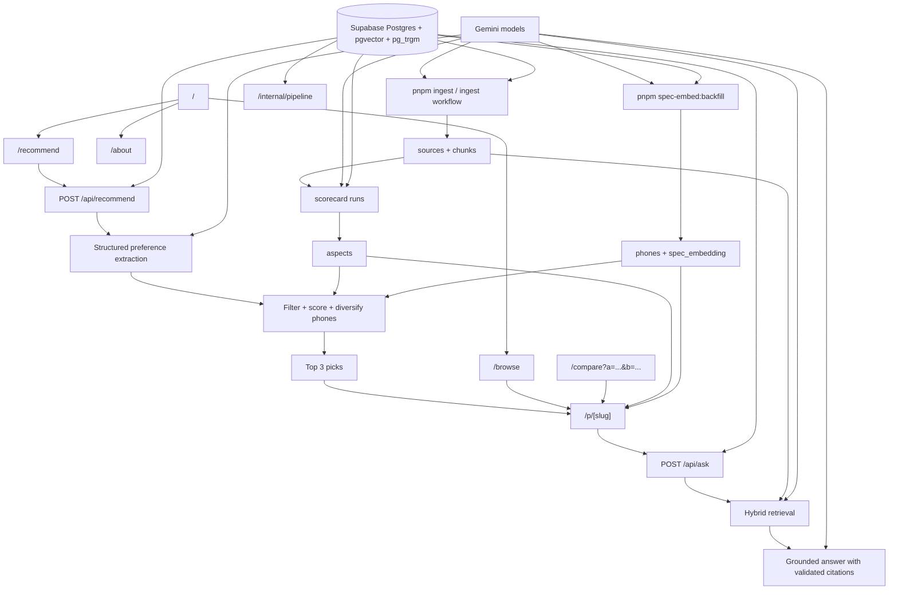
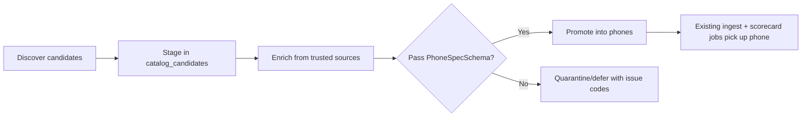
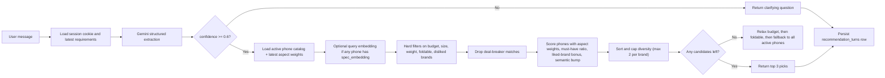
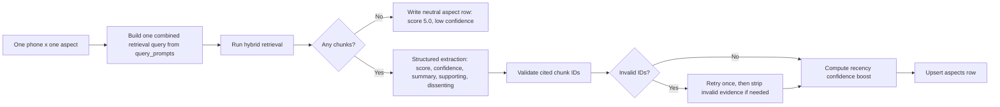
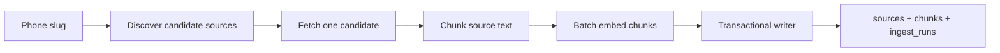

# RECSY v2 - Project Guide

This document is the explainer-first companion to
`docs/RECSY_V2_PROJECT_CONTEXT.md`.

Use this file when you want to understand:

- what RECSY is trying to do
- who it is for
- how the product works end to end
- how the recommendation, retrieval, scorecard, and ingestion systems fit together
- where the important code and docs live

Keep using `docs/RECSY_V2_PROJECT_CONTEXT.md` as the living implementation
plan, backlog, phase tracker, change log, and issues log. This guide is meant
to make the project understandable before someone dives into that planning
document.

This guide intentionally ignores `legacy/`, which contains the old Flutter
codebase and is not part of the current system.

## Table of Contents

1. [Project In One Page](#1-project-in-one-page)
2. [What Exists Today Vs What Is Still Planned](#2-what-exists-today-vs-what-is-still-planned)
3. [Users, Non-Users, and Product Boundaries](#3-users-non-users-and-product-boundaries)
4. [Product Surfaces and User Journeys](#4-product-surfaces-and-user-journeys)
5. [System Overview](#5-system-overview)
6. [Repository Map](#6-repository-map)
7. [Core Data Model and Domain Concepts](#7-core-data-model-and-domain-concepts)
8. [Recommendation System](#8-recommendation-system)
9. [Phone Q-and-A and Hybrid Retrieval](#9-phone-q-and-a-and-hybrid-retrieval)
10. [Aspect Scorecard System](#10-aspect-scorecard-system)
11. [Ingestion Pipeline](#11-ingestion-pipeline)
12. [LLM Infrastructure, Caching, Rate Limits, and Security](#12-llm-infrastructure-caching-rate-limits-and-security)
13. [Frontend, Design System, SEO, PWA, and Analytics](#13-frontend-design-system-seo-pwa-and-analytics)
14. [Testing, CI, and Deployment](#14-testing-ci-and-deployment)
15. [Current Project State, Open Questions, and Known Limits](#15-current-project-state-open-questions-and-known-limits)
16. [Companion Docs and Recommended Reading Order](#16-companion-docs-and-recommended-reading-order)

## 1. Project In One Page

RECSY v2 is a web-first smartphone recommendation and research product built
around one promise:

> Ask what matters, get phone guidance grounded in real reviews, and be able to
> trace claims back to the source.

The product has two main user experiences, plus an internal presentation layer:

| Experience                    | What it does                                                                                                    | Why it matters                                                       |
| ----------------------------- | --------------------------------------------------------------------------------------------------------------- | -------------------------------------------------------------------- |
| Conversational recommender    | Takes plain-English user preferences, extracts structured requirements, ranks phones, and returns up to 3 picks | Helps overwhelmed buyers get to a shortlist quickly                  |
| Per-phone consensus engine    | Shows key specs, a 7-axis scorecard, and a cited Q-and-A for a specific phone                                   | Helps skeptical users verify trade-offs and ask follow-up questions  |
| Internal Pipeline Observatory | An internal dashboard visualizing the entire data lifecycle via live metrics and pipeline replays               | Helps reviewers and collaborators understand the system architecture |

The 7 scorecard aspects are:

- `camera`
- `battery`
- `performance`
- `display`
- `build`
- `software`
- `value`

The project is intentionally built as a portfolio and learning project, not as
an attempt to out-compete general-purpose assistants. The real value is in the
engineering and product discipline:

- hybrid retrieval over a grounded corpus
- structured-output LLM pipelines
- transparent methodology
- citations and evidence validation
- clear separation between live product logic and planned future work

### Origin

RECSY started as a 2020 Flutter app with a bespoke ML model and a static CSV
of phones. v2 replaces that with a web-first system that uses:

- a living review corpus instead of a static spreadsheet
- retrieval and structured generation instead of a hand-built recommender model
- modern web delivery instead of app-store-first distribution

### Product Philosophy

RECSY does not want to be:

- a marketplace
- a deal tracker
- a social network
- a full specs database that tries to beat specialist review sites

RECSY does want to be:

- a shortlist generator
- an honest explainer of trade-offs
- a grounded answer engine with receipts

### Tech Stack At A Glance

| Layer           | Current choice                                                           |
| --------------- | ------------------------------------------------------------------------ |
| Frontend        | Next.js 16, React 19, TypeScript strict, Tailwind CSS v4                 |
| UI/theme        | semantic OKLCH tokens, `next-themes`, `lucide-react`, `motion`, `sonner` |
| Database        | Supabase Postgres                                                        |
| Search          | `pgvector` for cosine search, Postgres FTS, `pg_trgm` fallback           |
| ORM/driver      | Drizzle ORM plus `postgres` driver                                       |
| LLM provider    | Gemini via `@ai-sdk/google` and Vercel AI SDK                            |
| Embeddings      | `gemini-embedding-001` truncated to 768 dimensions                       |
| Background jobs | Node.js scripts plus GitHub Actions                                      |
| Observability   | `pino` logs, optional Sentry, Vercel analytics/speed insights            |
| Test stack      | Vitest, Playwright, fixture-driven retrieval eval                        |

## 2. What Exists Today Vs What Is Still Planned

This section matters because some older planning material is intentionally more
aspirational than the current code.

| Area                       | Implemented now                                                                                                                                         | Deferred / planned / scaffolded                                                                     |
| -------------------------- | ------------------------------------------------------------------------------------------------------------------------------------------------------- | --------------------------------------------------------------------------------------------------- |
| Home page                  | `/` is a landing hero with CTAs to `/recommend` and `/browse`                                                                                           | The home page is not itself a live chat intake                                                      |
| Recommender ranking        | Deterministic ranking using aspect scores, filters, must-have and deal-breaker heuristics, liked-brand bonus, and optional `spec_embedding` cosine bump | Gemini Pro tie-break is documented but not wired into the live pipeline                             |
| Scorecard extraction model | Uses the same `LLM_CHAT_MODEL` path as other structured calls by default                                                                                | `LLM_REASONING_MODEL` exists in env but is not currently routed in live scorecard code              |
| Compare                    | `/compare?a=<slug>&b=<slug>` plus direct slug entry and pickers                                                                                         | A path like `/compare/<a>-vs-<b>` is not the live implementation                                    |
| PWA                        | Manifest and icons are shipped; the app is installable where supported                                                                                  | No service worker, no offline shell yet                                                             |
| Feedback loop              | `recommendation_feedback` table exists in the schema                                                                                                    | Feedback capture UI and evaluation loop are not yet wired                                           |
| Catalog refresh            | Automated staged catalog refresh with Wikidata discovery, optional MobileAPI, OEM enrichment, Wikipedia/GSMArena enrichment, and strict promotion gates | More brand-specific OEM extractors and an internal candidate review UI                              |
| Streaming chat             | `/api/ask` returns NDJSON and the client replays it incrementally                                                                                       | The answer is generated and citation-validated first, then replayed; it is not token-true streaming |
| Middleware / edge logic    | Mentioned in planning docs as future boundary                                                                                                           | No current `middleware.ts` in the live app                                                          |
| Forms library              | Some docs mention `react-hook-form` as a future/possible choice                                                                                         | Current recommend and ask UIs use plain React client state                                          |

The safest mental model is:

- trust the code for what is live
- trust `RECSY_V2_PROJECT_CONTEXT.md` for planning, change history, and backlog
- use this guide to bridge the two

## 3. Users, Non-Users, and Product Boundaries

### Primary users

| Persona               | What they need                                                           | Best RECSY entry point |
| --------------------- | ------------------------------------------------------------------------ | ---------------------- |
| Overwhelmed buyer     | "I know my budget and priorities, but I do not want to read 20 reviews." | `/recommend`           |
| Skeptical researcher  | "I already have a shortlist. Show me grounded evidence and trade-offs."  | `/p/[slug]`            |
| Casual browser        | "Let me browse the catalog by price, brand, or form factor."             | `/browse`              |
| Reviewer/Collaborator | "I want to inspect the system architecture and data pipelines."          | `/internal/pipeline`   |

### Non-users RECSY explicitly declines to serve

- people looking for used-phone valuations
- people expecting a checkout flow
- people needing broad regional coverage at the very low end of the market

### Core product boundaries

- no auth in the MVP
- no raw PII stored
- no attempt to be a full commerce platform
- no claim that the app is better than the general LLMs themselves

## 4. Product Surfaces and User Journeys

### User-facing routes

| Route                | Purpose                                                                | Depends on                                                                                                         |
| -------------------- | ---------------------------------------------------------------------- | ------------------------------------------------------------------------------------------------------------------ |
| `/`                  | Landing hero, “What you can do” cards, and navigation into the product | static UI                                                                                                          |
| `/recommend`         | Conversational intake and result cards                                 | `POST /api/recommend`, phones, aspects, optional `spec_embedding`                                                  |
| `/browse`            | Server-rendered catalog list with filters                              | `phones` table and parsed `spec_json`                                                                              |
| `/p/[slug]`          | Phone detail page with image, specs, scorecard, and Q-and-A            | `phones`, `aspects`, `POST /api/ask`                                                                               |
| `/compare`           | Side-by-side compare for two active phones                             | `phones.spec_json`, `phones.image_url`, `phones.msrp_usd`                                                          |
| `/about`             | Product framing and guided links into the main flows                   | static UI                                                                                                          |
| `/settings`          | Client-side preference toggles (e.g. Enter-to-send)                    | `localStorage` via `useClientSetting`; [ADR 0013](adr/0013-recommender-summary-context-tie-honesty-settings.md)    |
| `/api/health`        | Liveness/config probe                                                  | env validation only                                                                                                |
| `/internal/pipeline` | Internal dashboard visualizing data lifecycle and pipeline metrics     | `INTERNAL_DASHBOARD_ENABLED` env, DB metrics, mock fixtures; [ADR 0016](adr/0016-internal-pipeline-observatory.md) |

### API routes

| Route                 | Purpose                                | Key behavior                                                                                                             |
| --------------------- | -------------------------------------- | ------------------------------------------------------------------------------------------------------------------------ |
| `POST /api/recommend` | Run the recommender pipeline           | creates/loads anonymous session, rate limits by IP hash, persists turn history                                           |
| `POST /api/ask`       | Ask grounded questions about one phone | phone-scoped hybrid retrieval, citation-validated answer, NDJSON response (includes optional `retrievalTrace` on `done`) |
| `GET /api/health`     | Health endpoint                        | does not touch DB or LLM                                                                                                 |

### Main user journeys

1. Recommender flow
   User opens `/recommend`, describes needs, gets a clarifying question or a
   ranked set of up to 3 picks, then clicks into a phone page or compare view.

2. Phone research flow
   User opens `/p/[slug]`, reads specs and consensus scorecard, asks a question,
   and opens cited sources for verification.

3. Browse-and-compare flow
   User filters the catalog on `/browse`, opens a phone, or compares two phones
   through `/compare`.

4. System architecture presentation
   A reviewer or collaborator opens `/internal/pipeline`, views live DB metrics, inspects phone evidence, and uses the guided walkthrough to understand the retrieval and recommender pipelines.

### Feature Inventory

| Feature                                     | State      | Notes                                                                                                                                                                        |
| ------------------------------------------- | ---------- | ---------------------------------------------------------------------------------------------------------------------------------------------------------------------------- |
| Landing hero, feature cards, and navigation | shipped    | `/` — hero + “What you can do” (Recommend, Browse, Compare); [ADR 0011](adr/0011-phone-qa-scope-images-home-ask-trace.md)                                                    |
| Conversational recommender                  | shipped    | `/recommend` plus `POST /api/recommend`                                                                                                                                      |
| Per-phone grounded Q-and-A                  | shipped    | `/p/[slug]` plus `POST /api/ask` — see scope prompt, in-UI copy, and collapsible retrieval trace [ADR 0011](adr/0011-phone-qa-scope-images-home-ask-trace.md)                |
| 7-axis scorecard                            | shipped    | rendered when aspect rows exist                                                                                                                                              |
| Browse list and filters                     | shipped    | brand, MSRP, and foldable filters                                                                                                                                            |
| Compare                                     | shipped    | direct `/compare` page with pickers and slug form                                                                                                                            |
| About page                                  | shipped    | product framing and navigation                                                                                                                                               |
| Product images and MSRP in UI               | shipped    | `PhoneImage` uses `` + `referrerPolicy="no-referrer"` for external URLs; seed `image_url` via `db:setup` — [ADR 0011](adr/0011-phone-qa-scope-images-home-ask-trace.md) |
| SEO shell                                   | shipped    | metadata, sitemap, robots, OG shell                                                                                                                                          |
| Installable PWA shell                       | shipped    | manifest and icons only                                                                                                                                                      |
| Offline PWA behavior                        | planned    | no service worker yet                                                                                                                                                        |
| Retrieval eval in CI                        | optional   | gated on a real Gemini key                                                                                                                                                   |
| Feedback loop training                      | scaffolded | table exists, UI is not wired                                                                                                                                                |
| Internal Pipeline Observatory               | shipped    | gated by `INTERNAL_DASHBOARD_ENABLED`, features live DB metrics, mock replays, and a guided walkthrough                                                                      |

## 5. System Overview

### High-level architecture



### Runtime boundaries

| Layer              | Runtime                 | What lives there                                                             |
| ------------------ | ----------------------- | ---------------------------------------------------------------------------- |
| Browser            | React client components | recommend UI, phone chat UI, compare pickers, theme toggle                   |
| Next.js server     | Node.js                 | App Router pages, route handlers, Drizzle queries, LLM orchestration         |
| Database           | Supabase Postgres       | phones, sources, chunks, aspects, sessions, cache, telemetry                 |
| Background scripts | Node.js CLI             | `db:setup`, ingest, scorecard runs, retrieval smoke, spec embedding backfill |
| GitHub Actions     | Ubuntu runners          | CI, scheduled/manual ingest, optional retrieval eval                         |

### Why the system is split this way

- the web app serves users in real time
- ingestion builds the evidence corpus offline
- the scorecard is a batch process that turns evidence into reusable aspect rows
- the recommender and phone Q-and-A sit on top of those stored artifacts instead
  of recomputing everything from scratch

## 6. Repository Map

### Root-level structure

| Path        | Role                                                                               |
| ----------- | ---------------------------------------------------------------------------------- |
| `src/`      | All application and service code                                                   |
| `docs/`     | ADRs, operator guides, project context, and this guide                             |
| `scripts/`  | Operational CLIs for setup, ingestion, scorecard runs, evaluation, and smoke tests |
| `drizzle/`  | SQL migrations plus extension, FTS, and RLS helpers                                |
| `fixtures/` | Evaluation fixtures, seed-like helper data, and internal dashboard mock replays    |
| `e2e/`      | Playwright tests                                                                   |
| `test/`     | Test setup                                                                         |
| `public/`   | Static assets                                                                      |
| `legacy/`   | Old Flutter codebase; not part of the live system                                  |

### `src/` structure

| Path                     | Role                                                                                              |
| ------------------------ | ------------------------------------------------------------------------------------------------- |
| `src/app/`               | App Router pages, layouts, metadata, and API routes (including `/internal`)                       |
| `src/components/`        | Shared UI components                                                                              |
| `src/features/`          | Feature-specific code such as phone spec schemas and browse state parsing                         |
| `src/services/`          | System logic: DB, LLMs, retrieval, chat, recommender, ingest, scorecard, logging, rate limiting   |
| `src/services/internal/` | Pipeline Observatory data helpers: snapshot, phone-evidence, retrieval-explain, recommend-explain |
| `src/lib/`               | Shared constants, helpers, error types, and the ask **retrieval trace** builder for `/api/ask`    |
| `src/styles/`            | Theme tokens                                                                                      |
| `src/env.ts`             | Type-safe environment contract                                                                    |

### Most important code locations by subsystem

| Subsystem       | Key files                                                                                 |
| --------------- | ----------------------------------------------------------------------------------------- |
| Recommender     | `src/services/recommender/*`, `src/app/api/recommend/route.ts`, `src/app/recommend/*`     |
| Retrieval       | `src/services/retrieval/*`                                                                |
| Phone Q-and-A   | `src/services/chat/*`, `src/app/api/ask/route.ts`, `src/app/p/[slug]/*`                   |
| Scorecard       | `src/services/scorecard/*`, `scripts/scorecard-auto.ts`, `scripts/scorecard-run.ts`       |
| Ingestion       | `src/services/ingest/*`, `scripts/{ingest,ingest-auto,creator-watch,ingest-report}.ts`    |
| Catalog refresh | `src/services/catalog/*`, `scripts/catalog-*.ts`, `.github/workflows/catalog-refresh.yml` |
| Database        | `src/services/db/schema.ts`, `src/services/db/client.ts`, `drizzle/*`                     |
| Seeds           | `scripts/seed/*`                                                                          |
| Browse          | `src/features/browse/*`, `src/app/browse/*`                                               |
| Compare         | `src/app/compare/*`                                                                       |

## 7. Core Data Model and Domain Concepts

### The most important domain concepts

| Concept                | Meaning                                                                                                  |
| ---------------------- | -------------------------------------------------------------------------------------------------------- |
| Phone                  | A catalog entity in `phones`, including brand, model, `spec_json`, status, and optional `spec_embedding` |
| Source                 | One ingested artifact about a phone: YouTube video, Reddit thread, or article                            |
| Chunk                  | A retrievable text segment derived from one source, with its own embedding                               |
| Aspect definition      | The methodology for one axis such as battery or camera, stored as data                                   |
| Aspect row             | The latest scorecard result for one phone and one aspect                                                 |
| Recommendation session | Anonymous browser session used to merge recommender turns over time                                      |
| Recommendation turn    | One user message and the system's response state for that recommender session                            |
| Chat query             | One grounded phone-page Q-and-A event, stored for analytics and debugging                                |
| LLM cache entry        | Cached chat or structured-output response keyed by a prompt hash                                         |
| Ingest run             | Telemetry row for one source-processing attempt                                                          |

### Main tables

| Table                     | What it stores                      | Important columns                                                                                         |
| ------------------------- | ----------------------------------- | --------------------------------------------------------------------------------------------------------- |
| `phones`                  | Current catalog of phones           | `slug`, `brand`, `model`, `spec_json`, `spec_embedding`, `status`, `region_availability`                  |
| `sources`                 | Source artifacts per phone          | `phone_id`, `type`, `url`, `content_hash`, `published_at`, `status`, `raw_json`                           |
| `chunks`                  | Retrieved text segments             | `source_id`, `phone_id`, `text`, `embedding`, `start_ts`, `anchor`, `tokens`                              |
| `aspect_definitions`      | Methodology definitions             | `aspect`, `version`, `description`, `query_prompts`, `default_weight`                                     |
| `aspects`                 | Stored scorecard output             | `phone_id`, `aspect_definition_id`, `score`, `raw_score`, `confidence`, evidence JSON                     |
| `recommendation_sessions` | Anonymous recommender sessions      | `session_cookie`, `ip_hash`, `status`                                                                     |
| `recommendation_turns`    | Session history for recommendations | `intent`, `user_message`, `extracted_requirements`, `candidate_phone_ids`, `picks`, `clarifying_question` |
| `recommendation_feedback` | Future user feedback loop           | `turn_id`, `phone_id`, `event`                                                                            |
| `chat_queries`            | Grounded Q-and-A logs               | `phone_id`, `query`, `answer`, `citations`, `retrieved_chunk_ids`, `latency_ms`, `model`                  |
| `llm_cache`               | Cached LLM outputs                  | `prompt_hash`, `model`, `response`, `hits`, `last_hit_at`                                                 |
| `ingest_runs`             | Ingestion telemetry                 | `adapter`, `phone_id`, `source_url`, `status`, `chunks_created`, `error`                                  |
| `catalog_runs`            | Catalog refresh telemetry           | `kind`, `status`, `stage`, request/LLM budgets, counts, checkpoint, error                                 |
| `catalog_candidates`      | Staged phone candidates             | source identity, normalized identity, claims JSON, decision/status, issue codes, retry window             |
| `catalog_snapshots`       | Durable source snapshots            | source key, canonical URL, content hash, headers/body refs, fetched timestamp                             |
| `phone_identities`        | External identities for phones      | phone ID, source key, external ID, identity type, confidence                                              |
| `phone_configurations`    | SKU/config variants                 | phone ID, region, model number, RAM/storage/color, market/network variants                                |
| `rate_limits`             | Sliding-window counters             | `key`, `window_start`, `count`                                                                            |

### Enums

The main enums are:

- `phone_status`
- `source_type`
- `source_status`
- `aspect`
- `recommendation_intent`
- `session_status`
- `feedback_event`
- `ingest_status`

### Why `spec_json` exists

Phone specs live in a `jsonb` blob validated by `PhoneSpecSchema` at the
application layer. This is a deliberate trade-off:

- it avoids schema migrations every time the shape of phone specs evolves
- it keeps feature code safe because reads and writes still go through Zod
- it allows the recommender and browse pages to reason over structured specs

### What lives inside `spec_json`

The validated phone spec shape includes:

- display details such as size, resolution, refresh rate, panel type, and brightness
- chipset and process node
- RAM and storage options
- rear and front camera arrays/details
- battery and charging
- weight and optional dimensions
- OS and update policy
- connectivity
- IP rating
- colors
- foldable flag
- highlight strings used by the recommender and UI

### Automated Catalog Refresh

The catalog refresh pipeline keeps `phones` updated without letting weak source
data corrupt the canonical catalog. It deliberately uses a staged workflow:



The issue this solves is that discovery sources are uneven. Wikidata is good at
finding that a phone exists but does not carry the full spec contract.
MobileAPI's free by-year endpoint can return listing-level records, not complete
spec sheets. OEM pages are authoritative but many templates omit fields in a
machine-readable way. If any of these sources wrote directly to `phones`, the app
would get duplicate phones, incomplete specs, unreleased devices, and noisy
recommendation results.

The fix is a strict staged promotion gate:

- `catalog:refresh` discovers recent phone-like Wikidata entities with no LLM
  calls and stages them as `pending_review`.
- `catalog:sync-mobileapi` optionally fetches licensed structured records under
  the free-plan budget of 50 requests/month and 5 requests/minute.
- `catalog:enrich-oem` fetches official OEM product pages and promotes only
  complete T0 records.
- `catalog:enrich-gsmarena` can use Gemini only after it finds a real Wikipedia
  phone infobox or GSMArena page; it converts the result through the same
  projection and validation gate before promotion.
- `catalog:promote` writes valid phones, identities, aliases, configurations,
  source claims, and media metadata.

Candidate ordering is centralized in `src/services/catalog/candidate-policy.ts`.
This was added because each script previously had its own partial filtering,
which allowed bad queue shape: unreleased phones, tablets, combined titles, and
long-tail brands could consume enrichment slots before released mainstream
phones. The shared policy prioritizes mainstream brands first, newest released
phones second, filters obvious non-phones and combined multi-phone titles, and
defers known future-dated phones with `unreleased_candidate` plus `retry_after`
instead of quarantining them as failed specs. The MobileAPI sync also skips
incomplete non-priority records before staging, so a weak licensed-API page
cannot fill the quarantine list with low-value rows when it has no complete
mainstream specs to offer.

This is the best shape for the pipeline because it keeps source discovery broad
while keeping promotion conservative. The database remains rich and auditable,
but the user-facing catalog changes only when a trusted source satisfies
`PhoneSpecSchema` and dedupe rules.

### Indexing strategy

| Index type                               | Where it is used                                          | Why                                      |
| ---------------------------------------- | --------------------------------------------------------- | ---------------------------------------- |
| HNSW cosine on `chunks.embedding`        | retrieval                                                 | fast vector search over evidence chunks  |
| HNSW cosine on `phones.spec_embedding`   | recommender                                               | semantic bump against phone specs        |
| B-tree on phone and source foreign keys  | joins/filtering                                           | normal relational performance            |
| Generated `tsvector` + GIN on chunk text | retrieval                                                 | full-text search path                    |
| `gin_trgm_ops` on chunk text             | retrieval fallback                                        | handles short or awkward keyword queries |
| Unique constraints                       | phone slugs, source URLs, aspect rows, rate-limit windows | correctness and idempotency              |

### RLS and access posture

- tables default to deny
- public/anon reads are only allowed where the product needs them
- service-role access is used in server routes and background jobs
- no raw IP addresses are stored; only hashes are persisted

### Seeded starting corpus

The starter setup seeds:

- 20 phones
- 7 aspect definitions
- budget to flagship coverage
- multiple major brands
- one foldable

This gives the app enough variety to exercise browse filters, the recommender,
and phone-page rendering before any real ingestion has run.

## 8. Recommendation System

The recommender answers one question:

> Given what this user says they want, which active phones in the catalog are
> the best matches right now?

### End-to-end flow



### Stage A: structured requirement extraction

The recommender does not rank directly from free text. First, it converts user
language into a `UserRequirements` object.

That object captures:

- budget range in USD
- weighted aspect priorities
- must-haves
- deal-breakers
- use cases
- form-factor constraints such as foldable, screen size, and max weight
- liked and disliked brands
- confidence score
- optional clarifying question

Important implementation details:

- extraction is multi-turn
- the latest saved requirements for the session are fed back into the next turn
- low-confidence extraction returns `kind: "clarify"` instead of forcing a weak result
- the Zod schema is intentionally tolerant of common LLM output quirks, then
  normalized before ranking

### Stage B: candidate generation and filtering

The current implementation loads all active phones plus stored aspect rows, then
filters and scores in code.

Hard filters:

- budget minimum and maximum
- foldable requirement
- screen-size range
- max weight
- disliked brands

Soft or heuristic filters:

- deal-breakers: substring-based exclusion over a compact phone/spec haystack
- must-haves: overlap ratio that reduces score instead of hard-failing the set
- liked-brand bonus: small additive bump if a preferred brand appears

### How aspect weighting works

Each phone has up to 7 stored aspect scores. The user may care more about some
than others.

The ranker:

1. loads the latest `aspect_definitions`
2. builds default aspect weights from those rows
3. overrides defaults with the user's explicit priorities
4. renormalizes the final weights to sum to 1
5. computes a weighted sum over the phone's aspect scores

If an aspect score is missing for a phone, the scoring code falls back to a
neutral value of 5.

### The `spec_embedding` semantic bump

There are two semantic embeddings in the project:

- chunk embeddings for retrieval
- phone spec embeddings for the recommender

`phones.spec_embedding` is optional. It is populated by
`pnpm spec-embed:backfill`, which turns validated `spec_json` into a compact
natural-language document and embeds it.

At recommendation time:

- if at least one active phone has a `spec_embedding`, the pipeline embeds a
  short query representation of the user's needs
- it computes cosine similarity against each phone's stored `spec_embedding`
- it adds a small bounded bonus to the phone's score

This is intentionally a bump, not the whole recommender.

### Diversity rule

The recommender returns up to 3 phones and caps the list to at most 2 phones
per brand where possible. This keeps results from collapsing into three near-
identical devices from the same manufacturer. The UI labels the returned picks
explicitly — **Top pick**, **Runner-up**, **3rd** — and states the actual count
("Showing 2 picks, ranked") so the user is never misled into thinking a short
list is a partial list.

### Refine over prior picks

A short follow-up like "which of these is best for performance?" or "rank them
for battery" should **not** re-run the full catalog — that tends to produce the
same three slugs and makes the recommender feel stateless. The pipeline now:

1. Runs `detectRefineIntent(userMessage)` from
   `src/services/recommender/refine-intent.ts`. The detector is conservative:
   it needs refine-style language (of these, between the top two, rank them,
   which of the three, …) and it rejects messages that carry **new-query
   hints** (under $X, instead of these, forget those, show me something else,
   start over).
2. If refine intent is detected and the session has a most-recent `recommend`
   turn with pick ids (loaded via `getLatestRecommendPickIds`), the catalog is
   filtered to those ids before ranking.
3. If the narrowed ranking returns at least one pick, the result carries
   `refined: true` and the UI says "Re-ranked your earlier picks." If the
   narrowed ranking is empty (e.g. the user's new budget excluded all prior
   picks), the pipeline falls back to the full-catalog path and clears the
   flag, so the user still gets useful picks.

No schema change: refine turns are stored as `intent: 'recommend'` rows whose
`candidatePhoneIds` reflect the re-ranked subset.

### Context-aware summaries and tie honesty

Introduced by [ADR 0013](adr/0013-recommender-summary-context-tie-honesty-settings.md).
`rankCandidates` returns a richer result alongside `picks` + `relaxed`:

- `scoresTied: boolean` — every pick is within `SCORE_TIE_EPSILON` (0.05) of
  the top score. Almost always means the scorecard is missing or the user's
  priorities do not differentiate the picks.
- `scorecardMissing: boolean` — none of the returned picks has any real
  aspect data (`aspects` table empty or every row at the neutral 5.0
  fallback). A fresh install without ingestion hits this reliably.
- `weights` — the normalised aspect weights that drove the ranking; the
  pipeline exposes the top two as `topAspects` on the API for the UI.

`pickSummaryLine(entry, { weights, refined, corpusScorecardMissing })` picks
one of four strings so the per-card summary reflects reality (refined turns
with real data name both the primary and secondary priority axes; refined
turns without data say so; fresh turns fall back to the existing single-axis
line). `/recommend` renders a banner between the list header and the pick
cards when ties or missing data are detected, and appends an honest chat
bubble to the conversation so the signal is visible to anyone reading the
chat back.

### Relaxation ladder

When strict filtering returns nothing, the recommender progressively relaxes:

1. widen `budget_max` once
2. ignore foldable-only if the user requested foldable and still got nothing
3. fall back to all active phones that still survive deal-breakers

The API returns `relaxed` codes so the UI can be honest about any adjustments.

### Persistence and API behavior

`POST /api/recommend` does all of the following:

- rate limits by hashed client IP
- creates or loads an anonymous `recsy_rec_session` cookie
- loads prior turn state for that session
- runs the pipeline
- persists a `recommendation_turns` row

The two response shapes are:

- `{ "kind": "clarify", "clarifyingQuestion": "..." }`
- `{ "kind": "results", "picks": [...], "relaxed": [...], "refined": boolean, "scoresTied": boolean, "scorecardMissing": boolean, "topAspects": string[] }`

`refined: true` means this turn re-ranked the previous turn's picks instead of
the full catalog. The client uses that to show the "Re-ranked your earlier
picks" label. `scoresTied` / `scorecardMissing` / `topAspects` let the UI
explain a flat ranking honestly (see the previous section).

## 9. Phone Q-and-A and Hybrid Retrieval

The phone-page Q-and-A answers one question:

> Given one specific phone and one user question, which review excerpts best
> support an answer, and how do we answer without inventing evidence?

### End-to-end flow



```mermaid
flowchart LR
  A["POST /api/ask"] --> B["Validate body and rate limit"]
  B --> C["Resolve phone slug to phone_id"]
  C --> D["Embed user query once"]
  D --> E["Vector search (cosine, HNSW)"]
  D --> F["FTS search (tsvector, trigram fallback)"]
  E --> G["RRF fusion"]
  F --> G
  G --> H["MMR rerank"]
  H --> I["Optional LLM rerank"]
  I --> J["Source-coverage clamp"]
  J --> K["Prompt Gemini with source excerpts"]
  K --> L["Validate inline [c:chunkId] citations"]
  L --> M{"Valid?"}
  M -- No --> N["Retry once with stricter prompt"]
  N --> O["Fail if citations are still invalid"]
  M -- Yes --> P["Resolve citations to URLs and anchors"]
  P --> Q["Replay answer as NDJSON stream"]
  Q --> R["Persist chat_queries row"]
```

### Why retrieval is phone-scoped

Every retrieval call is scoped to one `phone_id`. RECSY is not doing a global
web search or a cross-phone semantic search at this layer. That keeps the
problem smaller and the results more trustworthy:

- the phone page only answers about the current phone
- every chunk in the result set belongs to that phone
- source diversity can be reasoned about cleanly

**Cross-model, budget, or “which phone should I buy” questions** are _not_ something a single
phone-scoped retrieval pass can answer if the **excerpts do not mention the other product or
prices**. The system prompt in `src/services/chat/answer.ts` tells the model to say that
plainly and to point users to **Recommend** or **Browse** for catalog-wide or comparative
picks. The phone ask UI explains the same above the text box (`phone-chat.tsx`). Full
decision record: [ADR 0011](adr/0011-phone-qa-scope-images-home-ask-trace.md).

### Hybrid retrieval pipeline

The hybrid retriever combines several techniques because each one catches a
different class of relevance.

| Step                | What it does                                      | Why it exists                                            |
| ------------------- | ------------------------------------------------- | -------------------------------------------------------- |
| Query embedding     | embeds the user query once                        | powers vector search                                     |
| Vector search       | cosine similarity over `chunks.embedding`         | catches paraphrases and semantic similarity              |
| FTS search          | `websearch_to_tsquery` over generated `text_tsv`  | catches explicit keywords and exact phrasing             |
| Trigram fallback    | `pg_trgm similarity()` when FTS returns nothing   | helps with short terms, model names, and awkward queries |
| RRF                 | fuses ranked vector and FTS outputs               | avoids score-scale calibration problems                  |
| MMR                 | reranks for diversity                             | avoids near-duplicate chunks dominating context          |
| Source coverage     | enforces multiple distinct sources where possible | aligns with RECSY's "many voices" promise                |
| Optional LLM rerank | structured rerank after MMR                       | experimental quality bump behind a flag                  |

Default live tuning:

- `kPerRetriever = 30`
- `targetResults = 8`
- `rrfK = 60`
- `mmrLambda = 0.6`
- `minDistinctSources = 3`

### Answer generation and citations

The answerer is designed around citation fidelity.

The prompt says (paraphrased; see `SYSTEM_PREAMBLE` in code for the exact text):

- use only the retrieved source excerpts
- be explicit that excerpts are about **one phone**; if the user asks for comparisons
  or prices the excerpts do not support, give a short honest limitation and **suggest**
  the recommender or browse (no obligation to show URLs in the model output)
- every substantive factual claim must carry an inline `[c:<chunkUuid>]` tag
- do not invent chunk IDs

Then RECSY:

1. parses the generated answer
2. validates every cited chunk ID against the retrieved set
3. retries once if the model used an invalid ID
4. resolves citations to source URLs, titles, and anchors

For YouTube sources, citations deep-link to the relevant timestamp using
`?t=<seconds>`.

### Why `/api/ask` uses NDJSON instead of raw token streaming

The system needs the whole answer before it can validate citations. So the live
behavior is:

- generate the answer first
- validate citations
- split the validated answer into small chunks
- replay those chunks as NDJSON events

That is a pragmatic trade-off between UX and correctness.

**`done` line payload (client contract):** besides `citations`, `usage`, `model`, and
`retrievalMs`, the server always includes **`retrievalTrace`** — a JSON summary of hybrid
stages and deduplicated source links, built by `buildAskRetrievalTrace` in
`src/lib/ask-retrieval-trace.ts`. The phone page renders it inside a **collapsed** `<details>`
("Show retrieval pipeline & sources") by default. `phone-chat.tsx` must forward `retrievalTrace`
into its `meta` state — a regression where the client dropped that field silently is covered
by [ADR 0012](adr/0012-recommender-refine-rank-ui-and-empty-corpus-honesty.md).
See also [ADR 0011](adr/0011-phone-qa-scope-images-home-ask-trace.md) and
[Retrieval doc §9](retrieval/README.md#9-ask-trace-in-the-phone-ui).

### Empty-corpus short-circuit

`runPhoneQna` short-circuits when hybrid retrieval returns **zero chunks**. With automated
tiered ingestion (ADR 0014), this state is rare: new phones bootstrap on the next scheduled
cron and refreshes keep the corpus warm. When it does happen:

- **No LLM call.** The function returns a deterministic message produced by
  `buildNoContextMessage(phoneMeta)` in `src/services/chat/answer.ts`. The message is
  **time-aware** — it names brand + model, mentions days-since-last-ingest, and surfaces
  the next scheduled refresh window (e.g. "Next refresh is scheduled in about 12h"). No
  developer-oriented `pnpm ingest --phone <slug>` in user-facing text.
- **Sentinel model.** `model: 'no-context@v1'` (exported as `NO_CONTEXT_MODEL`) makes it
  trivial to query for affected turns in `chat_queries`. `usage.tokensIn` / `usage.tokensOut`
  are both 0.
- **Phone metadata comes free.** `POST /api/ask` already loads the phone row; it now
  pulls `brand`, `model`, `lastIngestAt`, `nextIngestAt` in the same query and passes
  them as `phoneMeta` to `runPhoneQna`.
- **Trace still renders.** `RetrievalResult.debug` is still produced and serialized, so
  the client's pipeline panel shows every stage with `count: 0` — operators can see at a
  glance that ingestion, not retrieval or the model, is the thing to fix. `pnpm ingest:report`
  surfaces "overdue" phones + Curator rejection histograms to correlate.

This is a product decision: an honest empty-corpus message is strictly better than paying
for a generic model refusal that reads like a bug. Once a phone has at least one chunk the
normal hybrid + LLM path takes over with no code change. Full rationale in
[ADR 0012](adr/0012-recommender-refine-rank-ui-and-empty-corpus-honesty.md) (original
short-circuit) and [ADR 0014](adr/0014-automated-ingestion-curation.md) (user-friendly,
time-aware copy + tiered scheduler).

### What gets stored

Successful phone-page Q-and-A calls are logged to `chat_queries` with:

- the phone ID
- the query
- the final answer
- structured citations
- retrieved chunk IDs
- latency
- token counts
- model name

## 10. Aspect Scorecard System

The scorecard answers a different question from live Q-and-A:

> Across many reviews, what is the current consensus on this phone's camera,
> battery, display, and other major dimensions?

### Why the scorecard exists

The scorecard gives the recommender and the phone page a reusable, structured,
cheap-to-read summary of a phone's strengths and weaknesses.

Instead of asking an LLM to re-derive consensus on every page load, RECSY runs a
batch pipeline that writes rows into `aspects`.

### Scorecard flow



### What one scorecard row contains

Each `aspects` row stores:

- `score`
- `raw_score`
- `confidence`
- `n_sources`
- `n_supporting`
- `n_dissenting`
- `summary`
- `supporting_quotes`
- `dissenting_quotes`

### Important current design choices

1. Aspects are data, not hard-coded logic

   `aspect_definitions` owns the methodology for each axis, including:
   - natural-language description
   - retrieval prompts
   - default recommender weight
   - versioning

2. One retrieval per aspect

   The MVP combines multiple query prompts into one byte-capped retrieval query
   to keep cost under control.

3. Confidence is slightly recency-aware

   Recent cited evidence can raise confidence a bit, but it does not alter the
   headline 0-10 score.

4. Calibration is deferred

   `score` and `raw_score` are the same today. There is no price-bracket or
   peer-group calibration yet.

### UI behavior

If a phone has scorecard rows, `/p/[slug]` renders a "Consensus scorecard"
section above the Q-and-A panel. If not, that section is omitted.

## 11. Ingestion Pipeline

The ingestion pipeline builds the evidence base the rest of RECSY relies on.

Without ingestion:

- retrieval has nothing to search
- phone-page Q-and-A has no evidence
- the scorecard has no review corpus

### Core idea

Every source type implements the same adapter contract:

```ts
interface SourceAdapter {
  readonly type: 'youtube' | 'reddit' | 'article';
  discover(phone: PhoneRef, opts: DiscoverOpts): Promise<SourceCandidate[]>;
  fetch(candidate: SourceCandidate): Promise<RawSource>;
  chunk(raw: RawSource): RawChunk[];
}
```

This keeps source-specific logic isolated from the generic pipeline.

### End-to-end ingestion flow



### Adapters

#### YouTube

What it does:

- discovers videos using `youtubei.js`
- fetches metadata and transcripts
- preserves timestamps for deep-link citations

Discovery queries typically include:

- `"{brand} {model} review"`
- `"{brand} {model} camera test"`
- `"{brand} {model} long term review"`

Transcript fallback chain:

1. `info.getTranscript()`
2. caption tracks already exposed on the `Info` object
3. watch-page HTML scrape -> `captionTracks` -> `timedtext?fmt=json3`

Important property:

- chunks carry `start_ts` and `?t=<sec>` anchors, so later citations can open
  the exact part of the video

#### Reddit

What it does:

- searches an allowlist of phone-relevant subreddits through Reddit's public
  JSON endpoints
- fetches thread text plus top comments
- chunks that text with the shared text chunker

Important property:

- no OAuth required; it uses public JSON with a custom `User-Agent`

#### Article

What it does:

- fetches a given URL
- parses HTML with `linkedom`
- extracts reader-friendly text with `@mozilla/readability`
- chunks that text with the shared text chunker

Important property:

- discovery automatically queries DuckDuckGo for `[brand] [model] review`
- it limits results to domains explicitly trusted in `domain_profiles` (e.g., TechRadar, TheVerge)
- it can still accept explicit URLs through the CLI for manual overrides

### Shared chunking

The generic chunker:

- splits by paragraphs and sentence-like boundaries
- targets roughly 400-token chunks
- includes overlap between chunks
- is pure and unit-testable

YouTube uses a timestamp-aware variant that chunks transcript segments while
keeping time anchors intact.

### Embedding

The embedder:

- batches texts in groups of 50
- keeps concurrency low by default
- retries transient failures with exponential backoff

### Writing and idempotency

The writer is one of the most important parts of the ingestion design.

For each source:

1. upsert the `sources` row by `(phone_id, url)`
2. compare the new `content_hash` against the stored one
3. if the hash is unchanged, skip re-embedding and chunk replacement
4. if the hash changed, replace the source's chunks inside one transaction
5. always record telemetry in `ingest_runs`

This means re-running ingestion is safe and cheap.

### CLI and workflows

Two entrypoints:

```bash
# Manual, single phone (operator / debugging)
pnpm ingest --phone <slug> [--adapter youtube|reddit|article|gsmarena] [--url <url>] [--limit N] [--dry-run]

# Automated, tiered (GitHub Actions daily cron)
pnpm ingest:auto --tier hot|warm|cold|all --shard K --total-shards N --limit N --dry-run

# Metadata-only RSS poll (GitHub Actions every 6h)
pnpm creator:watch --max-candidates 5

# Weekly audit
pnpm ingest:report --days 7
```

Four GitHub Actions workflows:

- `.github/workflows/ingest.yml` — manual `workflow_dispatch` only (single phone).
- `.github/workflows/ingest-tiered.yml` — daily 02:17 UTC. Matrix `tier × shard[0..3]`.
  Hot runs daily; warm on Mon/Wed/Fri/Sat; cold on Sunday.
- `.github/workflows/creator-watch.yml` — every 6h metadata-only RSS poll from
  `creator_profiles`; enqueues hot-tier rows into `crawl_queue`.
- `.github/workflows/ingest-on-new-phone.yml` — manual bootstrap for admin-added phones
  that shouldn't wait for the next cron.

### Scheduler, tiers, and agents (ADR 0014)

- **Tiers** (`src/services/ingest/scheduler/tiers.ts`) — `hot` (≤60d, ~3.5d cadence),
  `warm` (60–365d, 7d), `cold` (>365d, 14d). Driven off `phones.launchDate`.
- **Scheduler** (`scheduler/pick-phones.ts`) — picks phones where `next_ingest_at` is
  null or past; filters by tier; shards via FNV-32 on phone id; orders hot → warm → cold.
- **CuratorAgent** (`agents/curator.ts`) — Gemini Flash gatekeeper between `chunk()` and
  `embed()`. Scores `relevance` / `quality` (0–10), extracts `aspectsCovered`, emits
  `sentimentSummary`. Dropped sources skip embedding; `rejectedReason` lands in
  `ingest_runs` for audit via `pnpm ingest:report`.
- **DisambiguatorAgent** (`agents/disambiguator.ts`) — only fires on ≥2 alias matches
  (longest-match-wins). Picks primary + secondaries; writes `source_phone_links` rows
  with `role='primary' | 'secondary'`. Orchestrator can reassign the primary phone when
  the LLM's pick differs from the ingesting phone.
- **Polite HTTP** (`http.ts` + `rate-limit.ts`) — per-host token bucket persisted in
  `rate_limit_state` (parallel GH Actions shards cooperate via UPSERT); UA pool;
  robots.txt cache; `Retry-After` honored on 429/503; timeout + `p-retry` exp backoff.

### Biggest current external limitation

YouTube transcript access is the main non-code constraint in the system.

Known behavior:

- YouTube's `timedtext` endpoint may return HTTP 200 with an empty body from
  datacenter or otherwise throttled IPs
- this affects local dev machines and CI runners
- RECSY handles it by skipping the source cleanly instead of crashing ingestion

This is a product/data coverage limitation, not a schema or pipeline bug.

## 12. LLM Infrastructure, Caching, Rate Limits, and Security

### Provider abstraction

All LLM usage goes through `LlmProvider`.

That interface supports:

- `chat`
- `chatStream`
- `structured`
- `embed`

Current provider stack:

- `GeminiProvider` for real model calls
- `CachedLlmProvider` as a decorator for cacheable calls

### Actual model usage today

| Task                              | Current code path                                      | Notes                                                            |
| --------------------------------- | ------------------------------------------------------ | ---------------------------------------------------------------- |
| Phone-page answer generation      | `LLM_CHAT_MODEL` (default `gemini-2.5-flash`)          | used by `/api/ask`                                               |
| Recommender structured extraction | `LLM_CHAT_MODEL`                                       | used by `/api/recommend`                                         |
| Scorecard structured extraction   | `LLM_CHAT_MODEL`                                       | `LLM_REASONING_MODEL` exists but is not the live routed path yet |
| Query/spec embeddings             | `LLM_EMBEDDING_MODEL` (default `gemini-embedding-001`) | truncated to 768 dimensions to match DB schema                   |
| Optional retrieval rerank         | `LLM_CHAT_MODEL`                                       | only when `RETRIEVAL_LLM_RERANK=true`                            |

### Cache policy

The Postgres-backed LLM cache stores:

- `chat` results
- `structured` results

It does not cache:

- `chatStream`
- `embed`

Cache keys are based on a canonicalized request hash and include model and
prompt shape. Cached structured outputs are revalidated on read so schema
changes do not silently accept stale data.

### Rate limiting

Current live limits:

- `/api/ask`: 30 requests per minute per hashed client IP
- `/api/recommend`: 24 requests per minute per hashed client IP

Implementation details:

- rate limits are enforced with atomic upserts into `rate_limits`
- raw IPs are never stored
- the recommender also stores a separately salted session IP hash in
  `recommendation_sessions`

### Logging and tracing

The app uses `pino`:

- pretty output in development
- JSON in production
- request-scoped child loggers
- trace IDs in API responses via `X-Trace-Id`

Logs are designed to expose:

- model choice
- token usage
- latency
- retrieval stage timings
- pipeline outcomes

### Security posture

The live app already includes:

- strict security headers in `next.config.ts`
- RLS default-deny on database tables
- service-role secrets only on the server
- no raw PII storage
- no auth surface in the MVP

## 13. Frontend, Design System, SEO, PWA, and Analytics

### Frontend stack

The live app is built with:

- Next.js 16
- React 19
- TypeScript strict mode
- Tailwind CSS v4
- `next-themes`
- `lucide-react`
- `motion`
- `sonner`

### Design system

Important design choices:

- semantic color tokens instead of ad hoc color literals
- OKLCH-based theme variables
- dark mode as the default posture
- Inter for body text and JetBrains Mono for code/data
- a focus on accessible contrast and minimal visual ambiguity

### Product UX surfaces

Notable UX pieces:

- `PhoneImage` loads remote `image_url` with a native `` and
  `referrerPolicy="no-referrer"`; see [ADR 0011](adr/0011-phone-qa-scope-images-home-ask-trace.md). It
  falls back to a letter tile when the URL is missing.
- the compare page works on a direct visit, not only through deep links
- the phone page shows key specs, not just a long prose description
- the recommender can jump straight into compare for the top two picks
- the landing page includes a “What you can do” block (Recommend, Browse, Compare) under the hero

### SEO and PWA

Phase 7 polish already shipped:

- `manifest.ts`
- `robots.ts`
- `sitemap.ts`
- default Open Graph image
- installable app shell metadata

What is not shipped yet:

- offline service worker
- dynamic per-phone OG cards beyond the default shell

### Analytics

The root layout mounts:

- Vercel Analytics
- Vercel Speed Insights

These are lightweight and effectively no-op off Vercel.

## 14. Testing, CI, and Deployment

### Local commands that matter most

| Command                    | Purpose                                     |
| -------------------------- | ------------------------------------------- |
| `pnpm dev`                 | run the web app locally                     |
| `pnpm typecheck`           | strict TypeScript verification              |
| `pnpm lint`                | ESLint                                      |
| `pnpm test`                | Vitest unit suite                           |
| `pnpm build`               | production build check                      |
| `pnpm db:setup`            | extensions, migrations, FTS, RLS, and seeds |
| `pnpm db:smoke`            | DB sanity checks                            |
| `pnpm ingest`              | run ingestion for one phone                 |
| `pnpm retrieval:smoke`     | one live retrieval sanity check             |
| `pnpm scorecard:run`       | generate scorecard rows                     |
| `pnpm spec-embed:backfill` | populate `phones.spec_embedding`            |
| `pnpm eval:retrieval`      | fixture-driven retrieval evaluation         |
| `pnpm e2e`                 | Playwright browser tests                    |

### What `pnpm db:setup` actually does

The DB bootstrap script is intentionally more than just "run migrations". It:

1. enables required extensions
2. applies Drizzle migrations
3. applies FTS SQL helpers and indexes
4. applies RLS SQL
5. seeds aspect definitions and the starter phone corpus

### What CI does

`.github/workflows/ci.yml` currently has three main lanes:

1. `quality`

   Runs:
   - format check
   - lint
   - typecheck
   - unit tests
   - production build

2. `e2e`

   Runs Playwright against a local Postgres service container after `db:setup`.

3. `retrieval-eval` (optional)

   Runs only when a real `GEMINI_API_KEY` secret is available, because retrieval
   eval needs live embeddings.

### Deployment model

- host: Vercel Hobby
- database: one Supabase project for MVP
- schema changes: forward-only migrations
- code rollback: Vercel deployment rollback

### Environment model

| Environment | Shape                          |
| ----------- | ------------------------------ |
| development | local app + Supabase-backed DB |
| preview     | Vercel preview deployment      |
| production  | Vercel production deployment   |

## 15. Current Project State, Open Questions, and Known Limits

### Phase/status snapshot

| Phase | Scope                                               | Current state                                                                                              |
| ----- | --------------------------------------------------- | ---------------------------------------------------------------------------------------------------------- |
| 0     | scaffold, strict TS, design system, CI skeleton     | shipped                                                                                                    |
| 1     | DB schema, migrations, RLS, seeds                   | shipped                                                                                                    |
| 2     | ingestion adapters and workflows                    | shipped; hardened with tiered automation (ADR 0014) and resumability (ADR 0017)                            |
| 3     | retrieval and phone-page Q-and-A                    | shipped                                                                                                    |
| 4     | aspect scorecard                                    | shipped; automated daily batch (ADR 0015)                                                                  |
| 5     | conversational recommender                          | shipped                                                                                                    |
| 6     | browse and filters                                  | shipped                                                                                                    |
| 7     | polish: compare, about, images, PWA, SEO, analytics | mostly shipped; Internal Pipeline Observatory (ADR 0016) shipped; offline PWA service worker still pending |

### Biggest open questions

- when should RECSY introduce a true model-based tie-break in the recommender?
- when should score calibration become bracket-relative instead of absolute?
- how much evaluation is enough before enabling more expensive retrieval tricks?
- when is it worth paying for better YouTube coverage or broader corpus freshness?

### Main current risks and limitations

| Area                              | Current state                                            |
| --------------------------------- | -------------------------------------------------------- |
| Recommender tie-break             | still deterministic only                                 |
| Must-have / deal-breaker matching | heuristic substring logic, not deep semantic reasoning   |
| Score calibration                 | no z-score or price-bracket normalization yet            |
| YouTube coverage                  | constrained by transcript throttling from some IP ranges |
| Offline PWA                       | not implemented                                          |
| Feedback learning loop            | schema exists, UI loop does not                          |

### Important known external limitations

1. YouTube transcript availability can fail for reasons outside the codebase.

2. Gemini free-tier limits are acceptable for development and modest use, but
   the project is still built under zero-budget constraints and must continue to
   use caching and bounded workflows carefully.

### Where the detailed live history lives

If you need:

- phase-by-phase acceptance details
- backlog and roadmap notes
- risk register updates
- detailed change history
- issue-by-issue development lessons

go to `docs/RECSY_V2_PROJECT_CONTEXT.md`.

## 16. Companion Docs and Recommended Reading Order

### Companion docs

| Document                           | Use it for                                                            |
| ---------------------------------- | --------------------------------------------------------------------- |
| `docs/RECSY_V2_PROJECT_CONTEXT.md` | live plan, status, backlog, change log, issues log                    |
| `docs/deployment/README.md`        | deployment runbook, status snapshot, and missing automation templates |
| `docs/ingest/README.md`            | operating or extending ingestion                                      |
| `docs/retrieval/README.md`         | tuning and debugging hybrid retrieval                                 |
| `docs/recommender/README.md`       | recommender semantics and operator notes                              |
| `docs/scorecard/README.md`         | scorecard operator notes                                              |
| `docs/browse/README.md`            | browse/filter contract                                                |
| `docs/compare/README.md`           | compare behavior                                                      |
| `docs/eval/README.md`              | evaluation tiers and commands                                         |
| `docs/adr/*.md`                    | why key decisions were made                                           |

### Recommended reading order for a new engineer or AI

1. Read this guide front to back once.
2. Read `docs/RECSY_V2_PROJECT_CONTEXT.md` for the living status and issue history.
3. Read the subsystem doc for the area you are changing:
   - recommender
   - retrieval
   - scorecard
   - ingest
4. Read the relevant ADRs:
   - `0001` for stack
   - `0003` for ingestion architecture
   - `0004` for retrieval
   - `0005` for evaluation strategy
   - `0006` for scorecard MVP
   - `0007` for recommender MVP
   - `0008` for browse filters
   - `0009` and `0010` for polish, compare, PWA, SEO, and analytics
   - `0011` for phone Q&A scope, `PhoneImage` delivery, landing cards, and ask retrieval trace
   - `0012` for recommender refine-over-prior-picks, rank UI, and empty-corpus honesty
   - `0013` for context-aware recommender summaries, tie/no-data honesty, and the client settings surface
   - `0014` for automated tiered ingestion with Curator + Disambiguator agents, polite HTTP, GSMArena + YouTube-channel adapters, and the time-aware empty-corpus message
   - `0015` for automated aspect scorecard generation with staleness guards and telemetry
   - `0016` for the Internal Pipeline Observatory dashboard
   - `0017` for ingestion resumability and intelligent retry
5. Open the corresponding service code in `src/services/`.

### One-sentence mental model

RECSY is a smartphone recommendation product where background ingestion builds a
review corpus, batch scorecard runs turn that corpus into reusable aspect
signals, and the live app uses those stored signals plus grounded retrieval to
give users ranked picks and cited answers.
