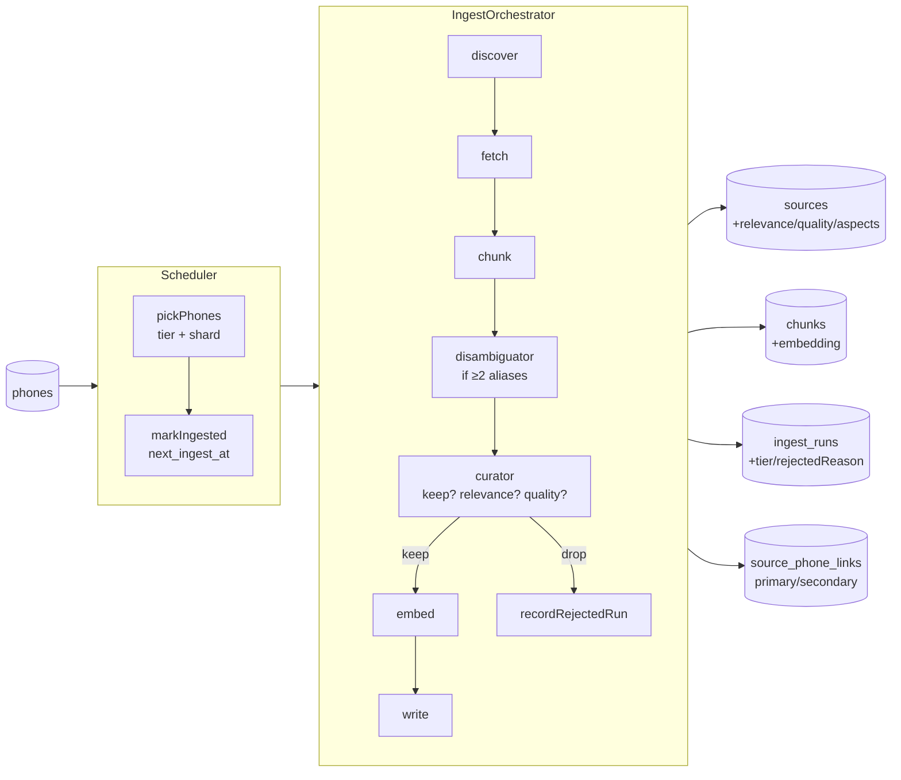

# Ingestion

> How RECSY v2 turns review content from YouTube, Reddit, articles, and
> GSMArena into curated, vectorised chunks that back every retrieval call.

This doc is the practical operator's guide. For rationale:

- [ADR 0003](../adr/0003-ingestion-typescript.md) — why TypeScript, not a Python sidecar.
- [ADR 0014](../adr/0014-automated-ingestion-curation.md) — why tiers, curator, disambiguator, and polite HTTP.

---

## TL;DR

```bash
# One-shot, per-phone (interactive / manual)
pnpm ingest --phone pixel-9-pro-xl
pnpm ingest --phone pixel-9-pro-xl --adapter youtube --limit 3
pnpm ingest --phone pixel-9-pro-xl --adapter article \
  --url https://www.gsmarena.com/google_pixel_9_pro_xl-review-xxxx.php
pnpm ingest --phone pixel-9-pro-xl --dry-run

# Automated (tiered) — the one GitHub Actions runs
pnpm ingest:auto --tier hot --limit 15
pnpm ingest:auto --tier warm --shard 0 --total-shards 4
pnpm ingest:auto --dry-run               # discover + curate only

# Metadata-only RSS poll (hourly-ish)
pnpm creator:watch --max-candidates 5

# Weekly audit digest
pnpm ingest:report --days 7
```

Every run produces structured `pino` logs and an aggregate summary table.

---

## Two entrypoints

| Script                     | When it runs                | What it does                                                                                                                   |
| -------------------------- | --------------------------- | ------------------------------------------------------------------------------------------------------------------------------ |
| `scripts/ingest.ts`        | Manual, one phone at a time | Interactive CLI for targeted runs (`--phone <slug>`, `--adapter`, `--url`, `--dry-run`). Great for debugging a single source.  |
| `scripts/ingest-auto.ts`   | GitHub Actions daily cron   | Picks phones by freshness tier + shard, wires the full agent stack (Curator + Disambiguator), updates `phones.next_ingest_at`. |
| `scripts/creator-watch.ts` | GitHub Actions every 6h     | RSS-only poll of `creator_profiles`. Matches entries against `phone_aliases` and enqueues `crawl_queue` rows. No embedding.    |
| `scripts/ingest-report.ts` | Manual or weekly cron       | Audit digest: runs by adapter/tier/status, top rejected reasons, overdue phones, avg relevance/quality.                        |

---

## Architecture



All adapters implement the same `SourceAdapter` interface
(`src/services/ingest/types.ts`). The orchestrator doesn't know anything
source-specific — new source types plug in by adding a class.

| Stage        | Module                                               | Purity       | Retried?                     |
| ------------ | ---------------------------------------------------- | ------------ | ---------------------------- |
| discover     | `adapters/*.ts::discover`                            | Network-only | Per-query                    |
| fetch        | `adapters/*.ts::fetch`                               | Network      | Per-URL                      |
| chunk        | `chunking.ts`, `adapters/youtube.ts`                 | **Pure**     | N/A                          |
| disambiguate | `agents/disambiguator.ts` (only on ≥2 phone aliases) | LLM          | No (falls back to heuristic) |
| curate       | `agents/curator.ts`                                  | LLM          | No (falls back to keep)      |
| embed        | `embedder.ts` → `LlmProvider.embed`                  | Network      | `p-retry`                    |
| write        | `writer.ts` (transactional)                          | DB           | Per-source                   |

Because `chunk` and both agents' fallback paths are deterministic, adapters
remain unit-testable against fixture data without a network or LLM.

---

## Freshness tiers

Launch-date driven, defined in `src/services/ingest/scheduler/tiers.ts`:

| Tier | Criterion                                      | Cadence   |
| ---- | ---------------------------------------------- | --------- |
| hot  | Launched ≤ 60 days ago, or `status='upcoming'` | ~3.5 days |
| warm | Launched 60–365 days ago                       | 7 days    |
| cold | Launched > 365 days ago                        | 14 days   |

- `classifyTier(launchDate)` → `'hot' | 'warm' | 'cold'`.
- `computeNextIngestAt(tier)` → next `Date` to refresh.
- `pickPhones({ tiers, shard, totalShards, limit })` → due phones, ordered
  hot → warm → cold, shard-deterministic (FNV-32 on phone id).
- `markIngested({ phoneId, tier })` — sets `last_ingest_at=now`,
  `next_ingest_at=now + interval(tier)`.

New phones bootstrap automatically: `next_ingest_at = null` is treated as
"immediately due", so the next scheduled run picks them up.

---

## Adapters

### YouTube transcripts (`adapters/youtube.ts`)

- `youtubei.js` (Innertube); no API key required.
- Chunking is **timestamp-aware**: every chunk carries `startTs` and an
  `anchor=?t=<sec>` so citations deep-link into the video.
- Fallback chain (first non-empty wins): Innertube `getTranscript()` →
  caption tracks on the `Info` object → watch-page HTML scrape.
- **Known limitation:** YouTube throttles the `timedtext` endpoint on
  datacenter IPs (including GitHub Actions). Every track empties out →
  `NotFoundError: no transcript available` → skipped cleanly.

### YouTube channel RSS (`adapters/youtube-channel.ts`) — **new**

Primary discovery path for the tiered pipeline:

- Polls `https://www.youtube.com/feeds/videos.xml?channel_id=<UC...>` for
  each active `creator_profiles` row. No API key, no Innertube.
- Matches entry titles+descriptions against `phone_aliases` (longest-match-wins).
- Only emits candidates where the target phone is mentioned. Reuses
  `YouTubeAdapter.fetch/chunk` for transcripts.
- Per-run RSS cache so processing phone B after phone A doesn't re-fetch
  the same MKBHD feed.

Creator allowlist (seeded in `scripts/seed/creator-profiles.ts`): MKBHD,
Mrwhosetheboss, TheTechChap, SuperSaf, TheUnlockr, MrMobile.

### Article (`adapters/article.ts`)

- Discovery is a no-op — supply URLs via `--url` or let `crawl_queue` feed them.
- Fetch via polite HTTP → `linkedom` + `@mozilla/readability`. Paywalls /
  JS-only pages return short bodies → `NotFoundError`, skipped.

### GSMArena (`adapters/gsmarena.ts`) — **new**

- **Discovery combines:**
  1. `phones.raw_json.gsmarenaUrl` override (manual curation for renames).
  2. `res.php3?sSearch=<brand> <model>` → device page → in-site
     `*-review-*.php` links.
- **Fetch** reuses the article Readability pipeline, via `http.ts` (the
  per-host 4s limit applies).
- Never calls `res.php3` more than once per phone per run; never recurses
  into unrelated device pages.

### Reddit (`adapters/reddit.ts`) — **extended**

- Still the public JSON API, custom `User-Agent`, no OAuth.
- Subreddit allowlist is now **DB-driven** from `subreddit_profiles` (with a
  hardcoded fallback for tests).
- Two discovery paths per run:
  - `/r/<sub>/search.json?q="{brand} {model}"` — always.
  - `/r/<sub>/new.json` — for `scope='device'` subs, or general-scope when
    the phone launched recently.
- Filters by `minScore` (per-profile), NSFW, stickied, age.

---

## Agents

### Heuristic alias matcher (`agents/alias-match.ts`)

- Loads `phone_aliases` once per orchestrator run (cached).
- `matchAliases(text, aliases)` returns hits with position and alias length.
- **Longest-match-wins:** if "Galaxy S25 Ultra" matches, "S25" is suppressed
  for that span. Prevents false multi-phone matches on comparison titles.

### DisambiguatorAgent (`agents/disambiguator.ts`)

Only invoked when heuristic matching finds **≥2 distinct phones** in a
title/description. Gemini Flash picks the primary with confidence and
reason, plus secondaries with relevance. Writes:

- `source_phone_links` rows — `role='primary'` + N×`role='secondary'`.
- If primary resolves to a different phone (via `phoneLookup` of
  `phones.slug`), the orchestrator **reassigns** the source to that phone
  and demotes the originating phone to a secondary link.

Fallback: on LLM error, returns the top heuristic match as primary (safe
default, never stalls the pipeline).

### CuratorAgent (`agents/curator.ts`)

Gatekeeper between `chunk()` and `embed()`. Takes title + first 3 chunks,
asks Gemini Flash for:

- `keep: boolean` + `rejectedReason` if dropping.
- `relevance: 0..10`, `quality: 0..10` — persisted on `sources`.
- `aspectsCovered: string[]` — feeds the aspect scorecard.
- `sentimentSummary: 'positive' | 'mixed' | 'negative' | 'neutral'`.

Dropped sources are **not embedded**; a `recordRejectedRun` row is written
so we can audit false negatives in `pnpm ingest:report`.

Fallback: on LLM error, keep the source un-enriched. Better to have raw
content than lose it.

---

## Polite HTTP

`src/services/ingest/http.ts` (`makePoliteHttp`) wraps every outgoing fetch.
Non-negotiable:

- **Per-host token bucket.** State persisted in `rate_limit_state` so
  parallel GitHub Actions shards cooperate via UPSERT.
- **User-Agent pool.** Three self-identifying variants pointing at the repo
  — rotated, not spoofed.
- **robots.txt respect.** Cached 24h per host; disallowed URLs raise
  `NotFoundError` and the orchestrator skips them.
- **`Retry-After`** on 429/503, capped at 30s.
- **Timeout + retry** via `p-retry` (exp backoff, jitter).

Default limits (see `DEFAULT_RATE_LIMIT_OPTIONS`):

| Host              | Min interval |
| ----------------- | ------------ |
| `gsmarena.com`    | 4s           |
| `reddit.com`      | 2s           |
| `www.youtube.com` | 1s           |
| (everything else) | 3s           |

Exception: the `YouTubeAdapter` transcript path uses `youtubei.js` and not
`PoliteHttp.get`; it's YouTube-only, so host-level throttling still holds.

---

## Idempotency

Re-running ingest on a phone is **safe** and **cheap**:

1. Writer upserts `sources` by `(phone_id, url)`.
2. Compares new `content_hash` (sha256 of normalised body) to stored one.
3. If unchanged → bumps `last_fetched_at`, skips embedding + chunk
   replacement, records `ingest_runs.status='skipped'`.
4. If changed → deletes old chunks, inserts new ones in the same
   transaction. No half-written state.
5. `source_phone_links` are replaced atomically per source.

Safe to schedule nightly re-ingests without burning embedding tokens on
unchanged sources.

---

## Configuration

Reads from `src/env.ts`. Relevant knobs:

| Var                   | Purpose                                           |
| --------------------- | ------------------------------------------------- |
| `DATABASE_URL`        | Postgres (service_role permissions).              |
| `LLM_EMBEDDING_MODEL` | Embedding model (default `gemini-embedding-001`). |
| `LLM_CACHE_ENABLED`   | Caches LLM responses — not applied to embeddings. |
| `LOG_LEVEL`           | `info` for dev; `debug` for per-segment tracing.  |

Profile tables (DB-driven, no code changes needed to expand coverage):

| Table                | What it controls                                                     | Seed                                 |
| -------------------- | -------------------------------------------------------------------- | ------------------------------------ |
| `phone_aliases`      | Names used to detect phone mentions in text                          | `scripts/seed/phone-aliases.ts`      |
| `creator_profiles`   | YouTube channels we poll (`platform`, `external_id`, `trust_weight`) | `scripts/seed/creator-profiles.ts`   |
| `subreddit_profiles` | Subreddits we poll (`scope`, `minScore`)                             | `scripts/seed/subreddit-profiles.ts` |
| `domain_profiles`    | Per-host trust + robots cache                                        | `scripts/seed/domain-profiles.ts`    |

---

## GitHub Actions

Four workflows, narrowly-scoped:

| File                                        | Trigger                           | What it does                                                                                                                    |
| ------------------------------------------- | --------------------------------- | ------------------------------------------------------------------------------------------------------------------------------- |
| `.github/workflows/ingest.yml`              | `workflow_dispatch` only          | Manual single-phone run. Inputs: phone, adapter, limit.                                                                         |
| `.github/workflows/ingest-tiered.yml`       | `cron: '17 2 * * *'` + dispatch   | Daily tiered run, matrix `tier × shard[0..3]`. Plan job picks tiers by day-of-week (hot daily, warm Mon/Wed/Fri/Sat, cold Sun). |
| `.github/workflows/creator-watch.yml`       | `cron: '23 */6 * * *'` + dispatch | Metadata-only RSS poll. Enqueues hot-tier `crawl_queue` rows.                                                                   |
| `.github/workflows/ingest-on-new-phone.yml` | `workflow_dispatch`               | Bootstrap ingestion when an admin adds a phone that shouldn't wait for the next cron.                                           |

Concurrency key is per-phone on the manual dispatch so operator + scheduled
runs never fight.

---

## Adding a new adapter

1. Add a class in `src/services/ingest/adapters/<name>.ts` implementing
   `SourceAdapter`. All network calls **must** go through `PoliteHttp.get`.
2. If it introduces a new source type, add to the `source_type` enum in
   `src/services/db/schema.ts` and generate a migration.
3. If it's a per-source profile (creator/subreddit/domain), add a row to
   the relevant profile table seed.
4. Wire it into the adapter list in `scripts/ingest.ts` (manual) and
   `scripts/ingest-auto.ts` (tiered).
5. Add unit tests against fixture data.
6. If it's a trusted, high-volume source, consider adding an alias loader
   so the Curator's context mentions known phones by name.

---

## Adding a new creator or subreddit

No code edit required: add a row to `creator_profiles` / `subreddit_profiles`
with `status='active'`. The next `ingest-auto.ts` run will pick it up.

---

## Troubleshooting

| Symptom                                   | Likely cause / fix                                                                                                                            |
| ----------------------------------------- | --------------------------------------------------------------------------------------------------------------------------------------------- |
| `NotFoundError: no transcript available`  | Captions disabled, live stream, or datacenter-IP throttling. Skipped cleanly.                                                                 |
| `NotFoundError: robots.txt disallowed`    | The host's robots.txt forbids our UA on that path. Expected for login-walled URLs. Skipped.                                                   |
| `NotFoundError: Article body too short`   | Paywalled / JS-rendered / bot-blocked — normal, skipped.                                                                                      |
| `IntegrationError: HTTP 429`              | Source rate-limited us; `p-retry` + `Retry-After` will back off. Investigate `rate_limit_state` if it persists.                               |
| `curator rejected source; skipping`       | Normal. Check `pnpm ingest:report` to see the `rejected_reason` distribution — sustained false-negatives indicate tuning.                     |
| `disambiguator reassigned primary phone`  | Normal on comparison videos. The source's primary `phone_id` is the one the agent identified; the originating phone becomes a secondary link. |
| `alias loader failed; proceeding without` | DB blip or missing seed. Pipeline falls back to heuristic-less behaviour (Curator still runs, no disambiguation).                             |
| `embed batch failed, retrying`            | Gemini transient. Retries exhaust → run fails cleanly, phone will retry next cron.                                                            |
| `phone not found: <slug>`                 | `pnpm db:setup` first, then `pnpm db:seed`.                                                                                                   |
| Gemini `ByteString`/non-ASCII error       | Env var or User-Agent contains non-ASCII. Node's `fetch` is strict about header bytes.                                                        |
| `outputDimensionality: expected number`   | You changed `LLM_EMBEDDING_DIMS`. Dimension is hardcoded (768) — remove the env var.                                                          |
