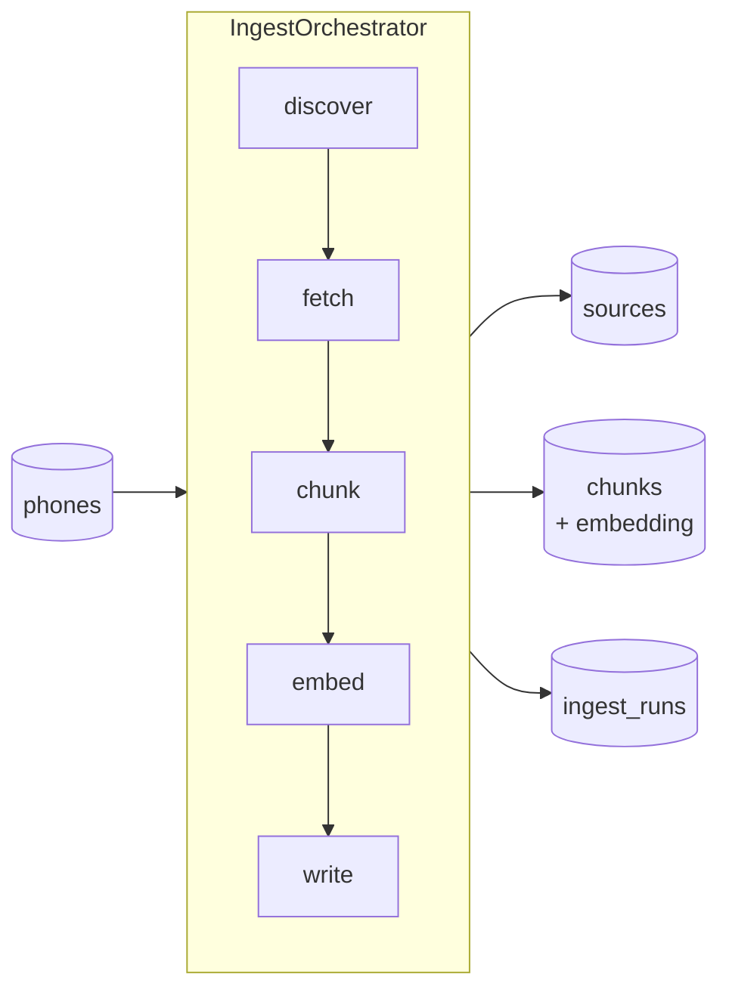

# Ingestion

> How RECSY v2 turns review content from YouTube, Reddit, and editorial sites
> into the vectorised chunks that back every retrieval call.

This doc is the practical operator's guide. For the architecture rationale
(why TypeScript, why these three source types) see
[ADR 0003](../adr/0003-ingestion-typescript.md).

---

## TL;DR

```bash
# One-shot, per-phone
pnpm ingest --phone pixel-9-pro-xl

# Scoped to one adapter
pnpm ingest --phone pixel-9-pro-xl --adapter youtube --limit 3

# Manual URL (discovery bypass)
pnpm ingest --phone pixel-9-pro-xl --adapter article \
  --url https://www.gsmarena.com/google_pixel_9_pro_xl-review-xxxx.php

# Pipeline dry run (no embeddings, no writes)
pnpm ingest --phone pixel-9-pro-xl --dry-run
```

Every run produces structured `pino` logs and an aggregate summary table.

---

## Architecture



All adapters implement the same `SourceAdapter` interface
(`src/services/ingest/types.ts`). The orchestrator doesn't know anything
source-specific — new source types (e.g. "podcast transcripts",
"manufacturer press release") plug in by adding a class.

| Stage    | Module                                       | Purity       | Retried?   |
| -------- | -------------------------------------------- | ------------ | ---------- |
| discover | `adapters/*.ts::discover`                    | Network-only | Per-query  |
| fetch    | `adapters/*.ts::fetch`                       | Network      | Per-URL    |
| chunk    | `chunking.ts`, `adapters/youtube.ts` (timed) | **Pure**     | N/A        |
| embed    | `embedder.ts` → `LlmProvider.embed`          | Network      | `p-retry`  |
| write    | `writer.ts` (transactional)                  | DB           | Per-source |

Because `chunk` is pure, you can unit-test adapter output against fixture
HTML / transcripts without a network or an LLM.

---

## Adapters

### YouTube (`adapters/youtube.ts`)

- Uses `youtubei.js` (Innertube); no API key required.
- Discovery queries: `"{brand} {model} review"`, `"camera test"`,
  `"long term review"` — deduped by video id.
- Fetch: metadata + transcript (human-captioned if available; falls back to
  auto-generated).
- Chunking is **timestamp-aware**: every chunk carries a `startTs` and an
  `anchor` of `?t=<sec>` so retrieval citations deep-link into the video.

### Article (`adapters/article.ts`)

- Discovery is a no-op on the free tier — supply URLs via `--url`.
- Fetch: `linkedom` + `@mozilla/readability` (same algorithm as Firefox
  Reader View). Paywalls / JS-rendered pages → `NotFoundError`, skipped.
- Chunking: the shared sentence-aligned chunker.

### Reddit (`adapters/reddit.ts`)

- Reddit's public JSON endpoints, no OAuth, custom `User-Agent`.
- Discovery: search an allowlist of subreddits (`r/Android`,
  `r/GooglePixel`, `r/apple`, etc.) for `"{brand} {model}"`, last year,
  score ≥ `MIN_THREAD_SCORE`.
- Fetch: title + selftext + top-N comments above `MIN_COMMENT_SCORE`.
- Chunking: shared chunker.

---

## Idempotency

Re-running ingest on a phone is **safe** and **cheap**:

1. The writer upserts the `sources` row by `(phone_id, url)`.
2. It compares the new `content_hash` (sha256 of normalised body) to the
   stored one.
3. If the hash matches → bumps `last_fetched_at`, skips embedding +
   chunk replacement entirely, and records `ingest_runs.status = skipped`.
4. If the hash differs → deletes old chunks for that source and inserts
   the new ones in the same transaction. No half-written state ever.

This means: you can schedule a nightly re-ingest of every phone without
burning embedding tokens on unchanged sources.

---

## Configuration

Reads from `src/env.ts`. Relevant knobs:

| Var                   | Purpose                                           |
| --------------------- | ------------------------------------------------- |
| `DATABASE_URL`        | Postgres (service_role permissions).              |
| `LLM_EMBEDDING_MODEL` | Embedding model (default `text-embedding-004`).   |
| `LLM_CACHE_ENABLED`   | Caches LLM responses — not applied to embeddings. |
| `LOG_LEVEL`           | `info` for dev; `debug` for per-segment tracing.  |

---

## GitHub Actions

`.github/workflows/ingest.yml` provides:

- **Manual** (`workflow_dispatch`) — run any phone + adapter on demand from
  the GitHub UI. Accepts `phone`, `adapter`, `limit` inputs.
- **Scheduled** (`cron: '17 3 * * *'`) — nightly run across a hand-curated
  phone roster. Will be swapped for a `phones WHERE status='active'` query
  in Phase 3.

Concurrency key is per-phone so manual + nightly never fight.

---

## Adding a new adapter

1. Add a class in `src/services/ingest/adapters/<name>.ts` implementing
   `SourceAdapter`.
2. Add a matching value to the `source_type` enum in
   `src/services/db/schema.ts` (requires a migration).
3. Wire it into the CLI in `scripts/ingest.ts` (and the orchestrator
   construction inside it).
4. Add unit tests against fixture data (HTML, JSON, transcript JSON).
5. Update the allowlist in `.github/workflows/ingest.yml` if it should run
   in the nightly roster.

---

## Troubleshooting

| Symptom                                  | Likely cause / fix                                       |
| ---------------------------------------- | -------------------------------------------------------- |
| `NotFoundError: no transcript available` | Video has captions disabled — normal, skipped.           |
| `NotFoundError: Article body too short`  | Paywalled / JS-rendered / bot-blocked — normal, skipped. |
| `IntegrationError: HTTP 429`             | Source rate-limited us. `p-retry` will back off.         |
| `embed batch failed, retrying`           | Gemini transient. Retries exhaust → run fails.           |
| `source upsert returned no row`          | Schema drift — regenerate migrations.                    |
| `phone not found: <slug>`                | `pnpm db:setup` first (seeds 20 phones).                 |
